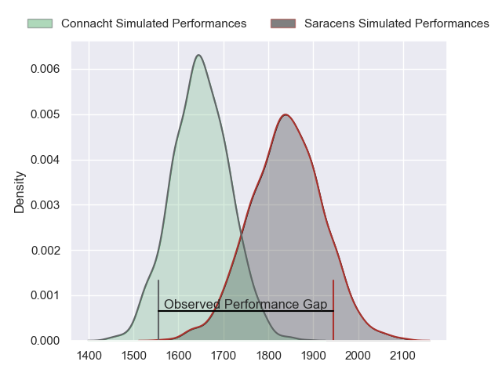
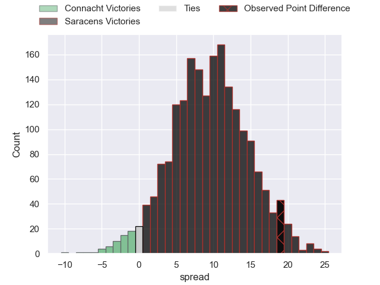
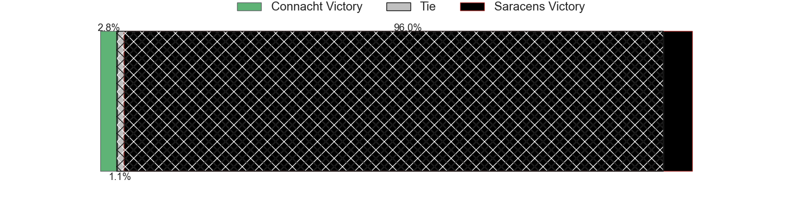
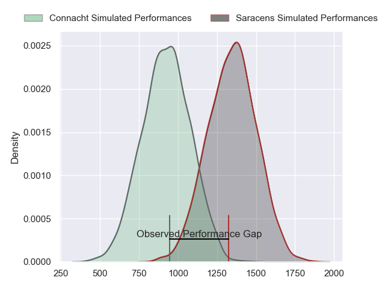
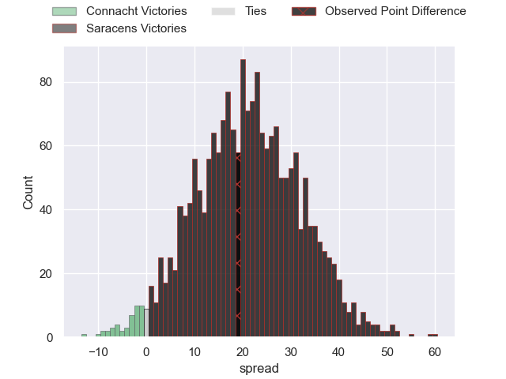
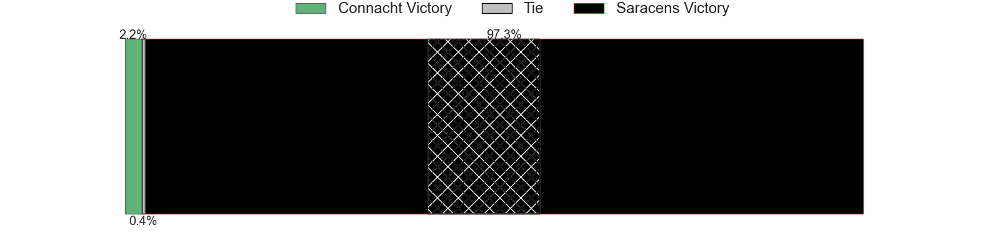
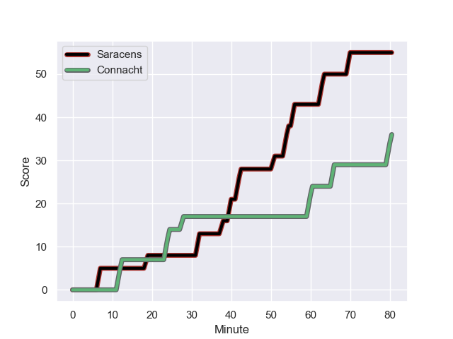
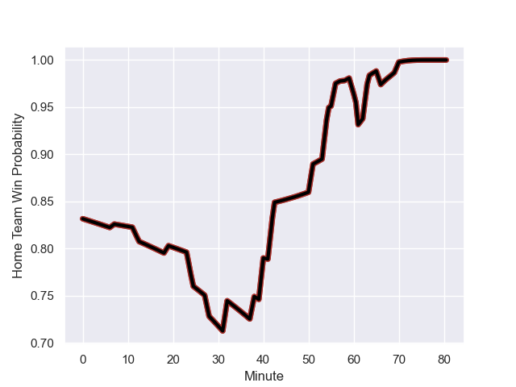

---  
layout: page  
title: Connacht at Saracens; 36-55  
date: 2023-12-16 18:00:00 -0500  
categories: "European Rugby Champions Cup 2023" match review  
---
# Connacht at Saracens; 36-55

# Club Level Predictions

The first set of predictions treats a club as the smallest object, as the club develops its members, organizes a gameplan, and deploys its players as needed for each match. This club model has a prediction of 0.746, which translates to predicting Saracens to win by 9.6.

Each club has a rating and a rating deviation (similar to a Glicko rating), and expected performances can be generated. This allows for simulated matches and spreads like the ones below.
## Projected Performances - Club Model

## Projected Spreads - Club Model

## Projected Results - Club Model

# Player Level Predictions - Version 2

Treating teams instead as an entity made up of the currently active players, I have ratings for each player in an altogether different system. These can be combined to form team ratings once teamsheets are announced, weighting starters a bit higher than the reserves. After the match is played, players can be weighted by their minutes on the field, allowing for an accurate measure of the team's composition. With these compiled team ratings, we can make predictions, measure inaccuracy, and update the individual player ratings.
## Prediction with Player Minutes: Saracens by 17.5

Saracens by 12.8 on a neutral field
## Prediction without Player Minutes: Saracens by 19.0

Saracens by 14.3 on a neutral pitch

## Projected Performances - Player Model

## Projected Spreads - Player Model

## Projected Results - Player Model

## Scores over Time

## Win Probability over Time

There were 6 large changes in win probability in this match

|   Away Minutes | Away Player          |   Away elo |   Number |   Home elo | Home Player          |   Home Minutes |
|---------------:|:---------------------|-----------:|---------:|-----------:|:---------------------|---------------:|
|             47 | Jordan Duggan        |      35.34 |        1 |     122.77 | Mako Vunipola        |             58 |
|             61 | Dave Heffernan       |      44.78 |        2 |     114.94 | Jamie George         |             55 |
|             47 | Jack Aungier         |      59.69 |        3 |      43.79 | Alec Clarey          |             68 |
|             80 | Darragh Murray       |      50.55 |        4 |     113.05 | Maro Itoje           |             80 |
|             47 | Gavin Thornbury      |      69.86 |        5 |      47.92 | Theo McFarland       |             80 |
|             80 | Cian Prendergast     |      47.43 |        6 |      93.28 | Juan Martin Gonzalez |             64 |
|             55 | Conor Oliver         |      62.23 |        7 |      50.94 | Andy Christie        |             80 |
|             80 | Paul Boyle           |      53.83 |        8 |     130.67 | Billy Vunipola       |             59 |
|             59 | Caolin Blade         |      50.92 |        9 |      61.34 | Aled Davies          |             55 |
|             58 | Jack Carty           |      78.82 |       10 |     138.45 | Owen Farrell         |             80 |
|             80 | Shayne Bolton        |      44.63 |       11 |      95.62 | Sean Maitland        |             58 |
|             80 | Bundee Aki           |     116.97 |       12 |      32.58 | Olly Hartley         |             80 |
|             80 | Tom Farrell          |      48.92 |       13 |     115.09 | Nick Tompkins        |             80 |
|             80 | Byron Ralston        |      39.16 |       14 |      59.83 | Lucio Cinti          |             80 |
|             58 | John Porch           |      93.34 |       15 |      87.81 | Alex Goode           |             71 |
|             33 | Denis Buckley        |      64.75 |       16 |      47.94 | Tom West             |             22 |
|             33 | Finlay Bealham       |      86.74 |       17 |      51.4  | Theo Dan             |             25 |
|             19 | Dylan Tierney-Martin |      53.31 |       18 |      32.62 | Toby Knight          |             16 |
|             33 | Joe Joyce            |      95.1  |       19 |      85.26 | Logovi'i Mulipola    |             12 |
|             25 | Jarrad Butler        |      73.51 |       20 |      48.3  | Hugh Tizard          |             21 |
|             21 | Michael McDonald     |      43.64 |       21 |      72.57 | Ivan van Zyl         |             25 |
|             22 | JJ Hanrahan          |      84.77 |       22 |      55.73 | Alex Lewington       |             22 |
|             22 | Diarmuid Kilgallen   |      53.35 |       23 |      96.07 | Tom Parton           |              9 |

