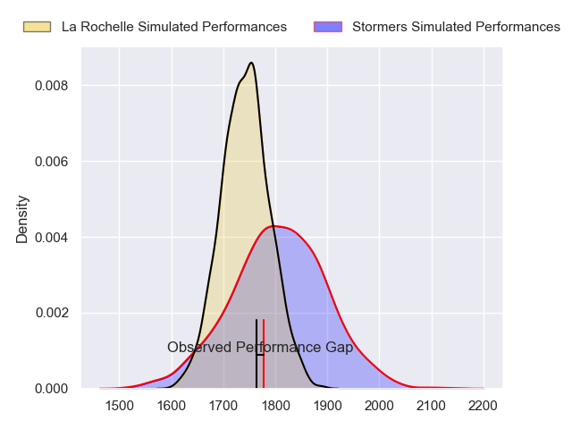
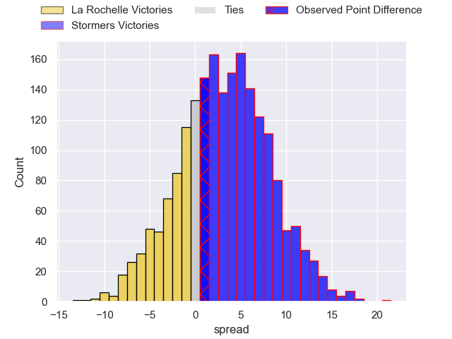
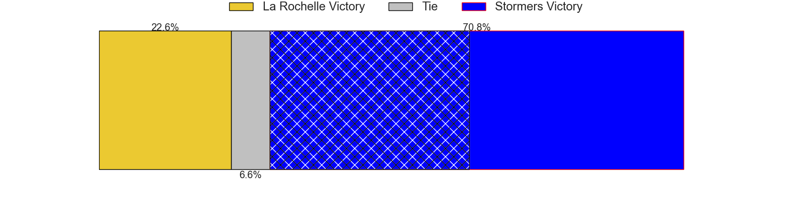
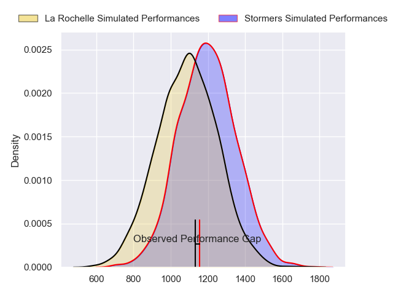
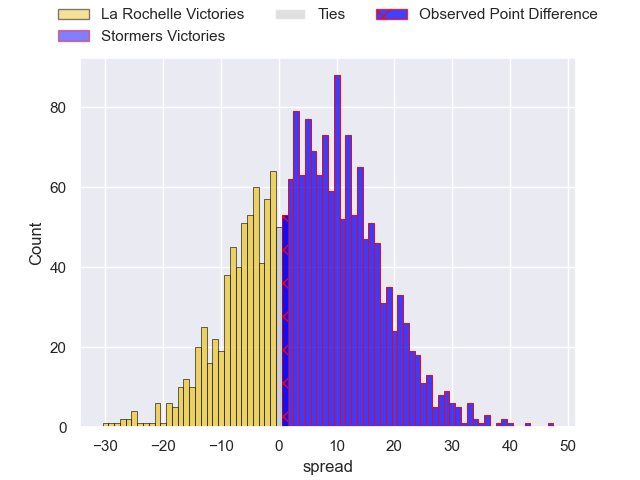
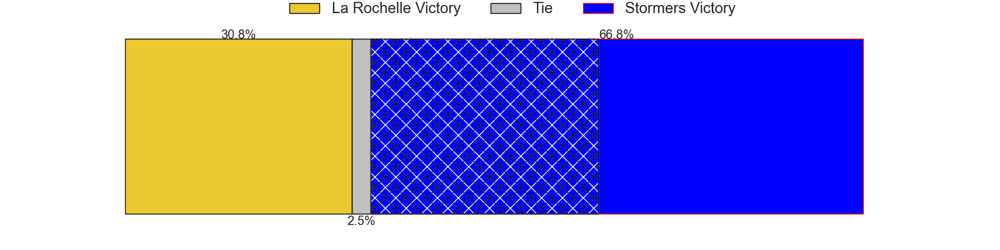
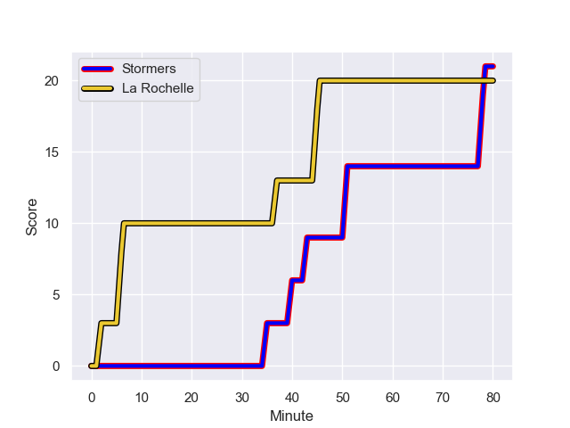
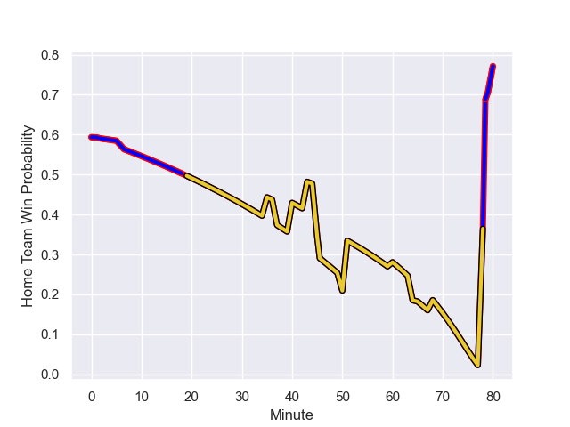

---  
layout: page  
title: La Rochelle at Stormers; 20-21  
date: 2023-12-16 18:00:00 -0500  
categories: "European Rugby Champions Cup 2023" match review  
---
# La Rochelle at Stormers; 20-21

# Club Level Predictions

The first set of predictions treats a club as the smallest object, as the club develops its members, organizes a gameplan, and deploys its players as needed for each match. This club model has a prediction of 0.59, which translates to predicting Stormers to win by 3.2.

Each club has a rating and a rating deviation (similar to a Glicko rating), and expected performances can be generated. This allows for simulated matches and spreads like the ones below.
## Projected Performances - Club Model

## Projected Spreads - Club Model

## Projected Results - Club Model

# Player Level Predictions - Version 2

Treating teams instead as an entity made up of the currently active players, I have ratings for each player in an altogether different system. These can be combined to form team ratings once teamsheets are announced, weighting starters a bit higher than the reserves. After the match is played, players can be weighted by their minutes on the field, allowing for an accurate measure of the team's composition. With these compiled team ratings, we can make predictions, measure inaccuracy, and update the individual player ratings.
## Prediction with Player Minutes: Stormers by 4.2

Stormers by 0.3 on a neutral field
## Prediction without Player Minutes: Stormers by 4.6

Stormers by 0.7 on a neutral pitch

## Projected Performances - Player Model

## Projected Spreads - Player Model

## Projected Results - Player Model

## Scores over Time

## Win Probability over Time

There were 13 large changes in win probability in this match

|   Away Minutes | Away Player           |   Away elo |   Number |   Home elo | Home Player       |   Home Minutes |
|---------------:|:----------------------|-----------:|---------:|-----------:|:------------------|---------------:|
|             65 | Reda Wardi            |      77.21 |        1 |      73.1  | Alistair Vermaak  |             40 |
|             40 | Pierre Bourgarit      |      68.53 |        2 |      51.29 | Joseph Dweba      |             50 |
|             57 | Uini Atonio           |     119.95 |        3 |      55.16 | Neethling Fouche  |             60 |
|             64 | Thomas Lavault        |      56.24 |        4 |      71.4  | Adre Smith        |             54 |
|             80 | Will Skelton          |      93.45 |        5 |      47.56 | Ruben van Heerden |             80 |
|             80 | Paul Boudehent        |      27.11 |        6 |      88.63 | Deon Fourie       |             60 |
|             80 | Levani Botia          |      93.69 |        7 |      96.6  | Hacjivah Dayimani |             50 |
|             64 | Yoan Tanga            |      49.95 |        8 |      71.99 | Evan Roos         |             80 |
|             68 | Tawera Kerr-Barlow    |     103.87 |        9 |      85.66 | Herschel Jantjies |             63 |
|             80 | Antoine Hastoy        |      42.21 |       10 |      73.83 | Manie Libbok      |             80 |
|             80 | Jules Favre           |      63.59 |       11 |      76.53 | Leolin Zas        |             80 |
|             80 | Jonathan Danty        |     106.98 |       12 |     108.29 | Damian Willemse   |             80 |
|             72 | Ulupano Seuteni       |      42.47 |       13 |      45.43 | Ruhan Nel         |             80 |
|             80 | Dillyn Leyds          |      98.83 |       14 |      77.14 | Ben Loader        |             53 |
|             68 | Brice Dulin           |     111.89 |       15 |     111.22 | Warrick Gelant    |             80 |
|             15 | Joel Sclavi           |      60.01 |       16 |      50.66 | Sti Sithole       |             40 |
|             40 | Sacha Idoumi          |      50.4  |       17 |     122.09 | Brok Harris       |             20 |
|             23 | Georges-Henri Colombe |      15.87 |       18 |      53.63 | Andre-Hugo Venter |             30 |
|             16 | Judicael Cancoriet    |      29.7  |       19 |      41.2  | Connor Evans      |             26 |
|             16 | Ultan Dillane         |      51.53 |       20 |      38.79 | Marcel Theunissen |             20 |
|             12 | Teddy Iribaren        |      61.55 |       21 |      39.35 | Ben-Jason Dixon   |             30 |
|              8 | Remi Picquette        |      42.67 |       22 |      69.61 | Paul de Wet       |             17 |
|             12 | Hugo Reus             |      42.25 |       23 |      95.89 | Courtnall Skosan  |             27 |

