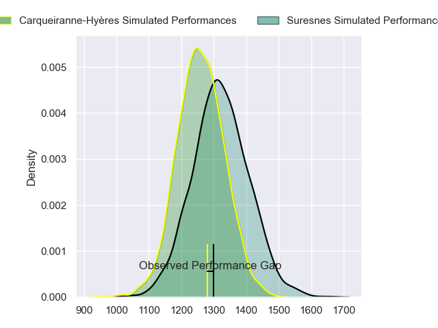
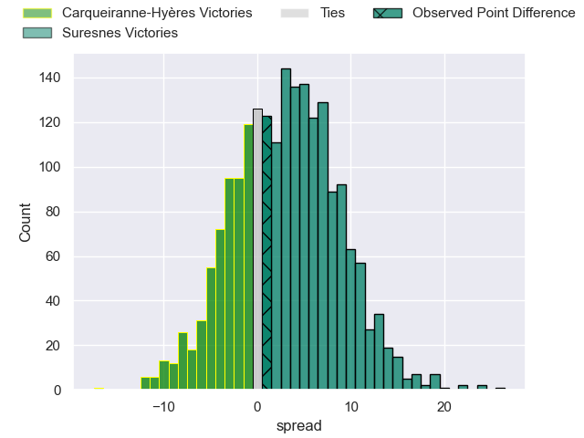
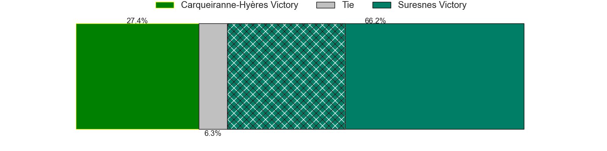
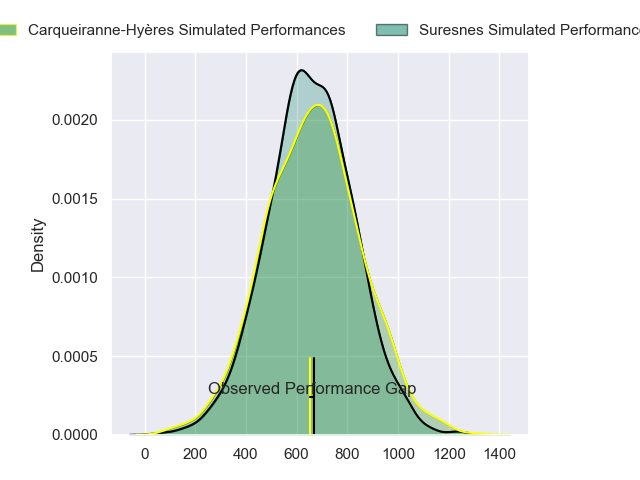
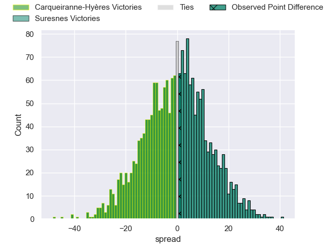
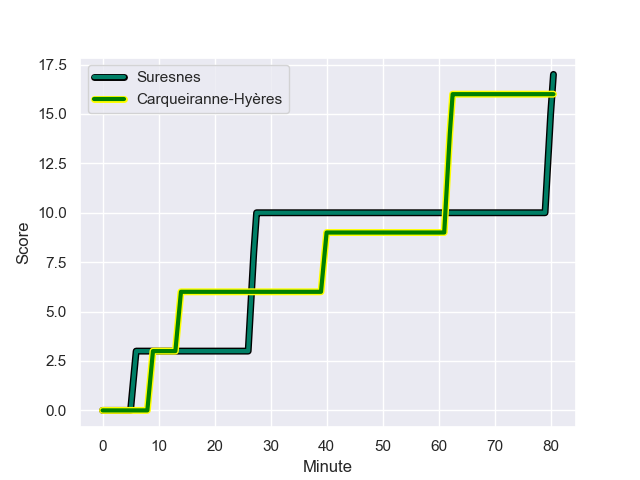
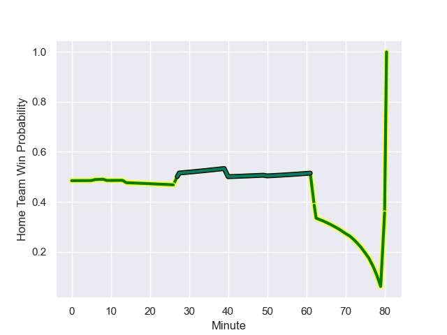

---  
layout: page  
title: Carqueiranne-Hyeres at Suresnes; 16-17  
date: 2023-12-16 18:00:00 -0500  
categories: "Nationale 2023" match review  
---
# Carqueiranne-Hyeres at Suresnes; 16-17

# Club Level Predictions

The first set of predictions treats a club as the smallest object, as the club develops its members, organizes a gameplan, and deploys its players as needed for each match. This club model has a prediction of 0.582, which translates to predicting Suresnes to win by 2.9.

Each club has a rating and a rating deviation (similar to a Glicko rating), and expected performances can be generated. This allows for simulated matches and spreads like the ones below.
## Projected Performances - Club Model

## Projected Spreads - Club Model

## Projected Results - Club Model

# Player Level Predictions - Version 2

Treating teams instead as an entity made up of the currently active players, I have ratings for each player in an altogether different system. These can be combined to form team ratings once teamsheets are announced, weighting starters a bit higher than the reserves. After the match is played, players can be weighted by their minutes on the field, allowing for an accurate measure of the team's composition. With these compiled team ratings, we can make predictions, measure inaccuracy, and update the individual player ratings.
## Prediction with Player Minutes: Carqueiranne-Hyères by 0.7

Carqueiranne-Hyères by 4.0 on a neutral field
## Prediction without Player Minutes: Suresnes by 0.3

Carqueiranne-Hyères by 3.0 on a neutral pitch

## Projected Performances - Player Model

## Projected Spreads - Player Model

## Projected Results - Player Model

## Scores over Time

## Win Probability over Time

There were 9 large changes in win probability in this match

|   Away Minutes | Away Player      |   Away elo |   Number |   Home elo | Home Player           |   Home Minutes |
|---------------:|:-----------------|-----------:|---------:|-----------:|:----------------------|---------------:|
|             80 | Sti Sithole      |      50.66 |        1 |      56.74 | Elias Coulibaly       |             64 |
|             80 | Yan Tabarot      |      46.24 |        2 |      47.21 | Hayam El Bibouji      |             80 |
|             80 | Lasha Mchelidze  |      53.88 |        3 |      44.02 | Leandro Mario Assi    |             50 |
|             80 | Nathan Gendre    |      31.39 |        4 |      40.07 | Youssouf Yatera       |             80 |
|             80 | Lucas Cazac      |      24.44 |        5 |      30.66 | Yakine Djebarri       |             80 |
|             80 | Nicolas Baquer   |      36.49 |        6 |      36.83 | Florian Desbordes     |             80 |
|             80 | Joachim Beaumont |      58.68 |        7 |      53.09 | Damien Bozic          |             50 |
|             80 | Andre Gorin      |      55.18 |        8 |      35.56 | Louis-Mathieu Jazeix  |             76 |
|             80 | Rémi Dubié       |      36.29 |        9 |      38.06 | Thomas Lacroix        |             80 |
|             80 | Juan Kotze       |      48.07 |       10 |      59.8  | Jean Chezeau          |             71 |
|             80 | Paul Gadea       |      55.33 |       11 |      25.58 | Alexis Clement        |             66 |
|             80 | Dylan Sage       |      42.76 |       12 |       7.93 | JJ Taulagi            |             80 |
|             80 | Charles Brousse  |      41.55 |       13 |      52.56 | Petero Tuwai          |             80 |
|             80 | Quentin Bourdieu |      51.28 |       14 |      14.68 | Ervin Muric           |             80 |
|             80 | Josselyn Bouchon |      39.19 |       15 |      27.21 | Thomas Baudy          |             80 |
|            nan | nan              |     nan    |       16 |      38.17 | Victor Damian Arias   |             30 |
|            nan | nan              |     nan    |       17 |      51.01 | Sacha Yahi            |             30 |
|            nan | nan              |     nan    |       18 |      54.27 | Tanguy Lacoste        |              9 |
|            nan | nan              |     nan    |       19 |      74.81 | Victor Barnier        |             14 |
|            nan | nan              |     nan    |       20 |      57.53 | Sébastien Lafrancesca |             16 |
|            nan | nan              |     nan    |       21 |      46.65 | Brandon Dayoro        |              4 |

