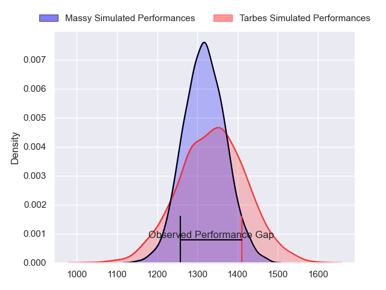
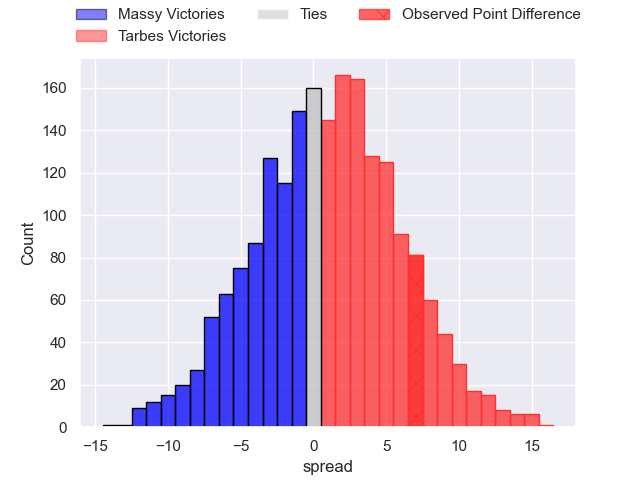
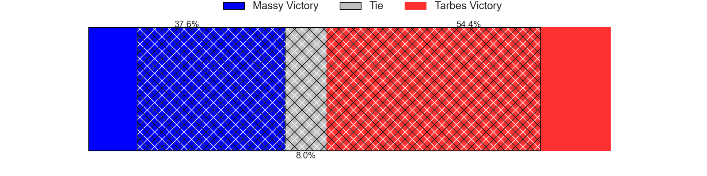
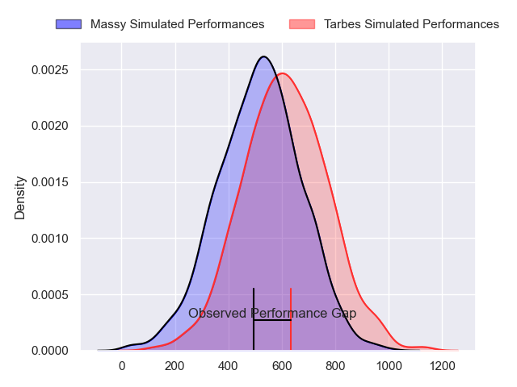
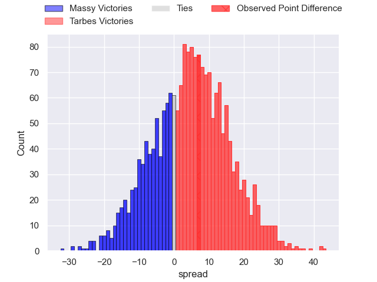
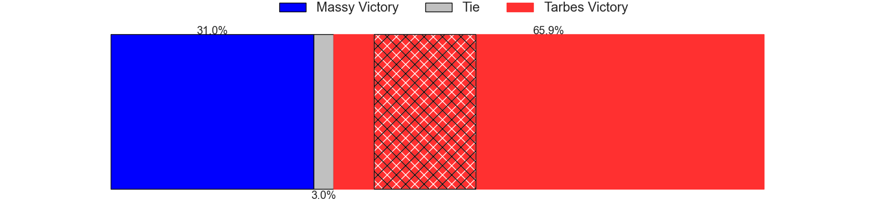
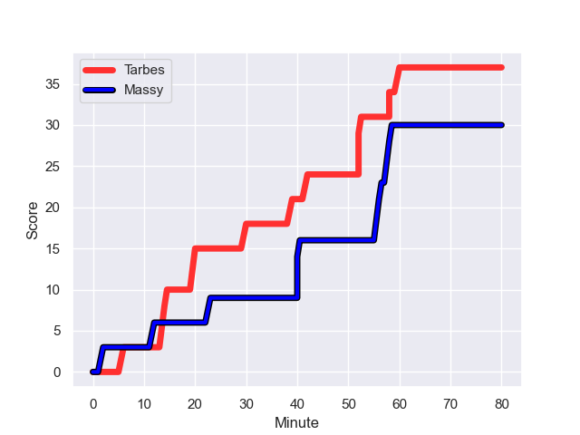
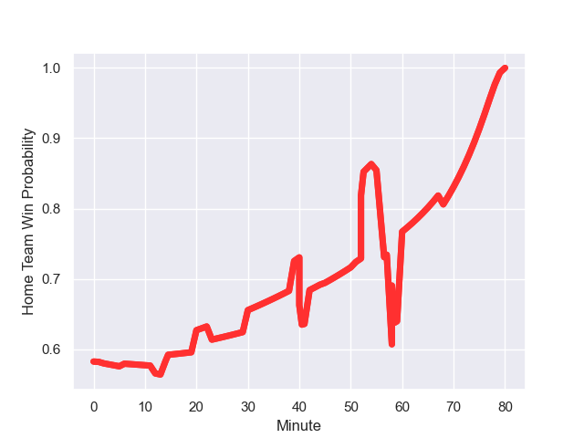

---  
layout: page  
title: Massy at Tarbes; 30-37  
date: 2023-12-16 18:00:00 -0500  
categories: "Nationale 2023" match review  
---
# Massy at Tarbes; 30-37

# Club Level Predictions

The first set of predictions treats a club as the smallest object, as the club develops its members, organizes a gameplan, and deploys its players as needed for each match. This club model has a prediction of 0.527, which translates to predicting Tarbes to win by 0.9.

Each club has a rating and a rating deviation (similar to a Glicko rating), and expected performances can be generated. This allows for simulated matches and spreads like the ones below.
## Projected Performances - Club Model

## Projected Spreads - Club Model

## Projected Results - Club Model

# Player Level Predictions - Version 2

Treating teams instead as an entity made up of the currently active players, I have ratings for each player in an altogether different system. These can be combined to form team ratings once teamsheets are announced, weighting starters a bit higher than the reserves. After the match is played, players can be weighted by their minutes on the field, allowing for an accurate measure of the team's composition. With these compiled team ratings, we can make predictions, measure inaccuracy, and update the individual player ratings.
## Prediction with Player Minutes: Tarbes by 3.7

Massy by 0.6 on a neutral field
## Prediction without Player Minutes: Tarbes by 3.8

Massy by 0.5 on a neutral pitch

## Projected Performances - Player Model

## Projected Spreads - Player Model

## Projected Results - Player Model

## Scores over Time

## Win Probability over Time

There were 14 large changes in win probability in this match

|   Away Minutes | Away Player          |   Away elo |   Number |   Home elo | Home Player        |   Home Minutes |
|---------------:|:---------------------|-----------:|---------:|-----------:|:-------------------|---------------:|
|             80 | Fernandez Correa     |       4.31 |        1 |      44.32 | Antoine Palisse    |             60 |
|             55 | Mike Tadjer          |      12.58 |        2 |      36.94 | Enzo Mondon        |             60 |
|             45 | Nolan Pienaar        |      50.75 |        3 |      31.25 | Alexandre Duny     |             60 |
|             45 | Lilian Rousset       |      48.34 |        4 |      37.21 | Antoine Bousquet   |             51 |
|             68 | Koen Bloemen         |      21.34 |        5 |      42.82 | Baptiste Peytavi   |             80 |
|             80 | Abongile Nonkontwana |       3.34 |        6 |      62.67 | Alexis Armary      |             80 |
|             80 | Alexandre Loubiere   |      54.32 |        7 |      38.94 | Léo Saint-Guilhem  |             80 |
|             80 | Samuel Nollet        |      26.98 |        8 |       1.4  | Filipe Manu        |             79 |
|             80 | Benjamin Prier       |      32.98 |        9 |      32.91 | Thibaut Dulucq     |             80 |
|             55 | Hugo Verdu           |      22.37 |       10 |      19.58 | Anthony Fuertes    |             80 |
|             63 | Giorgi Gogoladze     |      38.19 |       11 |      10.12 | Jone Tuva          |             80 |
|             58 | Victorien Jacomme    |      55.72 |       12 |      31.59 | Savenaca Rawaca    |             80 |
|             80 | Arthur Seigneuret    |      50.56 |       13 |      46.59 | Pierre Descoubet   |             63 |
|             80 | Martin Carre         |      59.54 |       14 |      36.8  | Clement Latorre    |             80 |
|             80 | Tom Deleuze          |      36.01 |       15 |      30.95 | Mathieu Berbizier  |             45 |
|             25 | Pierre Trassoudaine  |      69.88 |       16 |      30.96 | Alexandre Combier  |             20 |
|             35 | Tijde Visser         |      44.21 |       17 |      48.13 | Florian Lamothe    |             20 |
|             35 | Saba Pesvianidze     |      58.75 |       18 |      38.6  | Johan Mees Erasmus |             20 |
|             12 | Clément Vidoni       |      44.07 |       19 |      43.22 | Francis Rolland    |             17 |
|             25 | Lucas Rubio          |      21.25 |       20 |      46.65 | Jean Guicherd      |             12 |
|             17 | Yanis Dit Robaglia   |      25.23 |       21 |      27.2  | Julien Cantan      |              1 |
|             22 | Kimami Sitauti       |     -13.24 |       22 |      21.29 | Johan Paulet       |             17 |
|            nan | nan                  |     nan    |       23 |      32.46 | Thibaut Trotta     |             35 |

