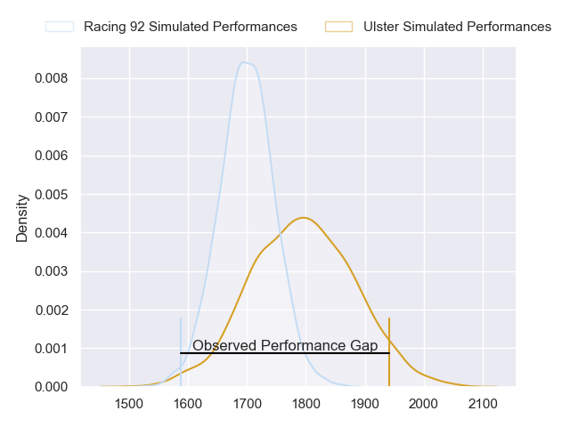
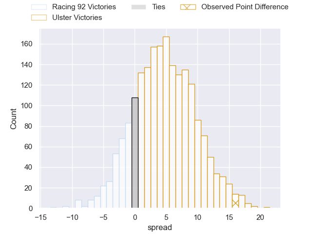
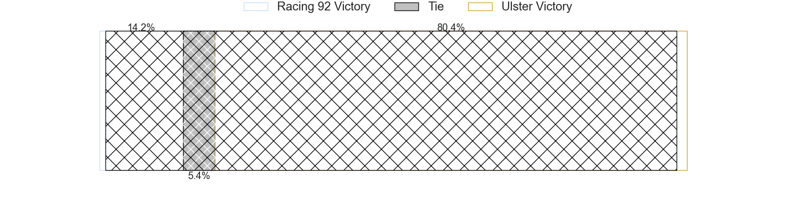
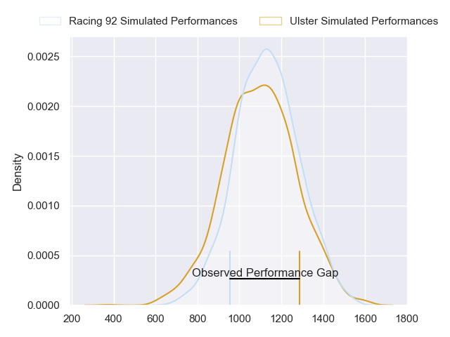
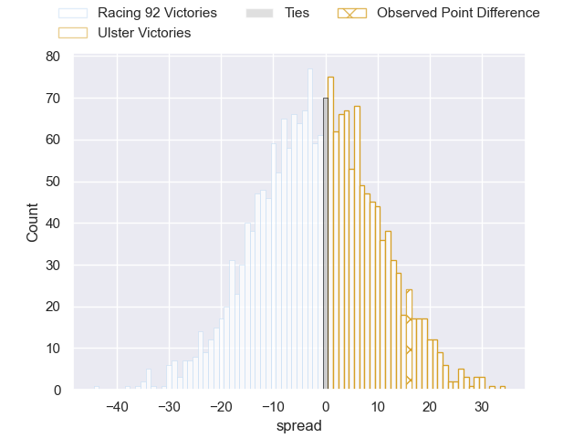
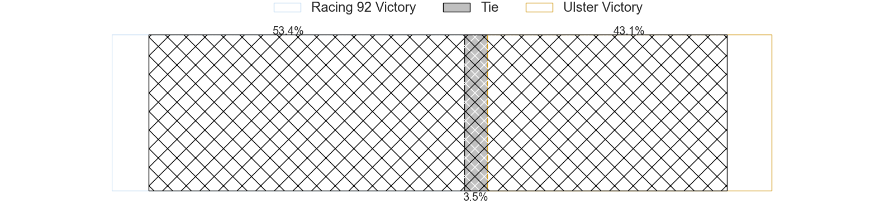
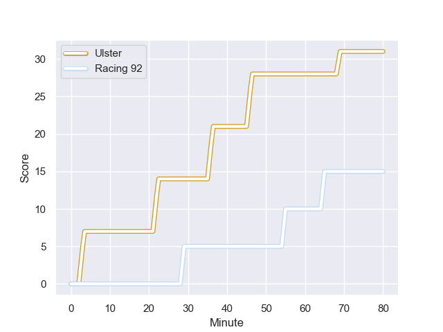
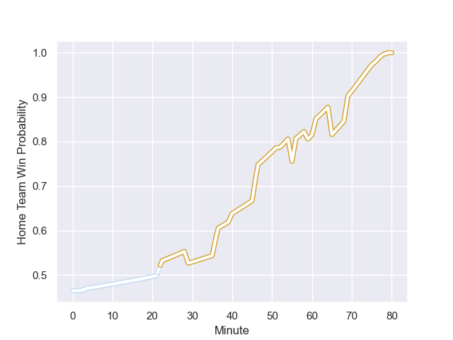

---  
layout: page  
title: Racing 92 at Ulster; 15-31  
date: 2023-12-16 18:00:00 -0500  
categories: "European Rugby Champions Cup 2023" match review  
---
# Racing 92 at Ulster; 15-31

# Club Level Predictions

The first set of predictions treats a club as the smallest object, as the club develops its members, organizes a gameplan, and deploys its players as needed for each match. This club model has a prediction of 0.631, which translates to predicting Ulster to win by 4.7.

Each club has a rating and a rating deviation (similar to a Glicko rating), and expected performances can be generated. This allows for simulated matches and spreads like the ones below.
## Projected Performances - Club Model

## Projected Spreads - Club Model

## Projected Results - Club Model

# Player Level Predictions - Version 2

Treating teams instead as an entity made up of the currently active players, I have ratings for each player in an altogether different system. These can be combined to form team ratings once teamsheets are announced, weighting starters a bit higher than the reserves. After the match is played, players can be weighted by their minutes on the field, allowing for an accurate measure of the team's composition. With these compiled team ratings, we can make predictions, measure inaccuracy, and update the individual player ratings.
## Prediction with Player Minutes: Racing 92 by 1.5

Racing 92 by 5.8 on a neutral field
## Prediction without Player Minutes: Racing 92 by 1.9

Racing 92 by 6.2 on a neutral pitch

## Projected Performances - Player Model

## Projected Spreads - Player Model

## Projected Results - Player Model

## Scores over Time

## Win Probability over Time

There were 8 large changes in win probability in this match

|   Away Minutes | Away Player         |   Away elo |   Number |   Home elo | Home Player       |   Home Minutes |
|---------------:|:--------------------|-----------:|---------:|-----------:|:------------------|---------------:|
|             52 | Hassane Kolingar    |      45.16 |        1 |      93.15 | Steven Kitshoff   |             76 |
|             70 | Janick Tarrit       |      57.11 |        2 |      72.33 | Rob Herring       |             55 |
|             61 | Trevor Nyakane      |      56.95 |        3 |      49.31 | Tom O'Toole       |             76 |
|             40 | Baptiste Chouzenoux |      77.79 |        4 |      86.95 | Alan O'Connor     |             59 |
|             80 | Will Rowlands       |      39.02 |        5 |      66.6  | Iain Henderson    |             80 |
|             56 | Cameron Woki        |      70.79 |        6 |     100.59 | Dave Ewers        |             80 |
|             56 | Siya Kolisi         |     113.65 |        7 |      69.08 | Nick Timoney      |             80 |
|             80 | Wenceslas Lauret    |     111.32 |        8 |      53.26 | Matthew Rea       |             59 |
|             80 | Nolann Le Garrec    |      69.93 |        9 |      75.13 | John Cooney       |             78 |
|             80 | Antoine Gibert      |      79.03 |       10 |      70.07 | Billy Burns       |             52 |
|             80 | Juan Imhoff         |     126.29 |       11 |      58.72 | Jacob Stockdale   |             80 |
|             61 | Henry Chavancy      |     118.1  |       12 |      76.02 | Stuart McCloskey  |             80 |
|             80 | Gael Fickou         |     112.13 |       13 |      55.4  | James Hume        |             78 |
|             61 | Henry Arundell      |      51.61 |       14 |      48.14 | Robert Baloucoune |             80 |
|             80 | Max Spring          |      55.04 |       15 |      44.14 | Michael Lowry     |             80 |
|             28 | Guram Gogichashvili |      51.86 |       16 |      39.21 | Tom Stewart       |             25 |
|             10 | Eddy Ben Arous      |     100.07 |       17 |      58.86 | Eric O'Sullivan   |              4 |
|             24 | Ibrahim Diallo      |      38.02 |       18 |      58.42 | Kieran Treadwell  |             21 |
|             24 | Maxime Baudonne     |      43.05 |       19 |      45.05 | Scott Wilson      |              4 |
|             19 | Gia Kharaishvili    |      54.66 |       20 |      55.17 | Harry Sheridan    |             21 |
|             19 | Inia Tabuavou       |      50.06 |       21 |      46.69 | Nathan Doak       |              2 |
|             19 | Tristan Tedder      |      74.82 |       22 |      44.94 | Jake Flannery     |             28 |
|             40 | Fabien Sanconnie    |      40.95 |       23 |      83.54 | Stewart Moore     |              2 |

