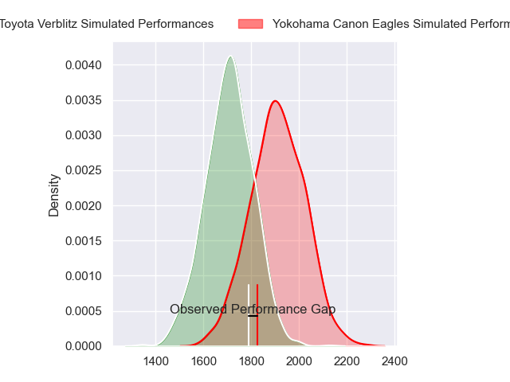
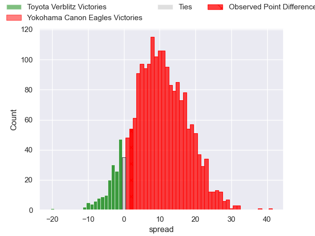
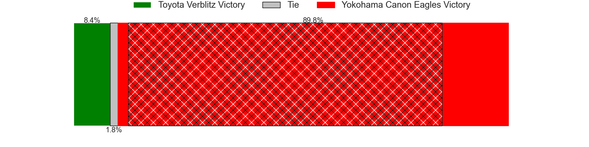
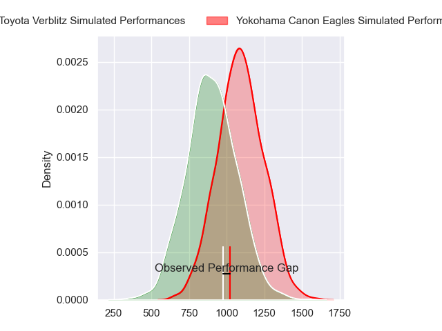
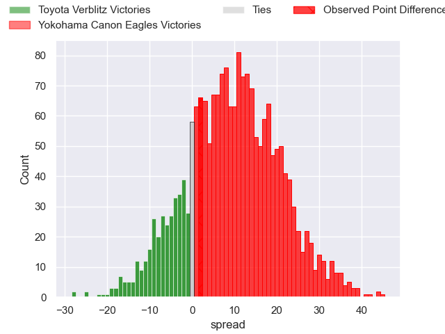
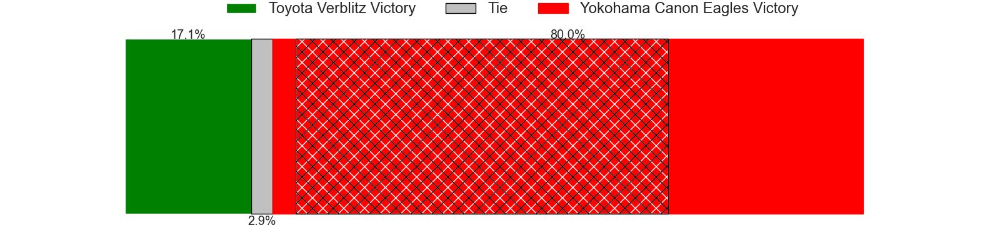
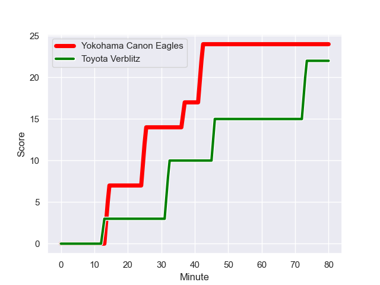
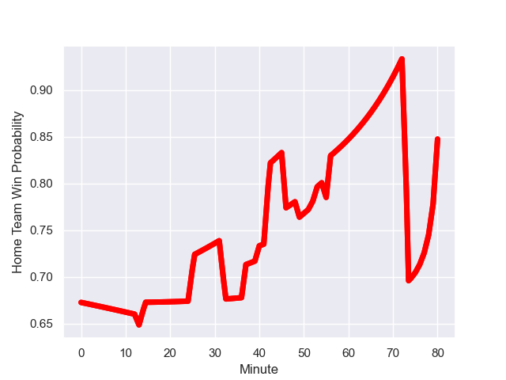

---  
layout: page  
title: Toyota Verblitz at Yokohama Canon Eagles; 22-24  
date: 2023-12-16 18:00:00 -0500  
categories: "Japan Rugby League One 2023" match review  
---
# Toyota Verblitz at Yokohama Canon Eagles; 22-24

# Club Level Predictions

The first set of predictions treats a club as the smallest object, as the club develops its members, organizes a gameplan, and deploys its players as needed for each match. This club model has a prediction of 0.753, which translates to predicting Yokohama Canon Eagles to win by 10.2.

Each club has a rating and a rating deviation (similar to a Glicko rating), and expected performances can be generated. This allows for simulated matches and spreads like the ones below.
## Projected Performances - Club Model

## Projected Spreads - Club Model

## Projected Results - Club Model

# Player Level Predictions - Version 2

Treating teams instead as an entity made up of the currently active players, I have ratings for each player in an altogether different system. These can be combined to form team ratings once teamsheets are announced, weighting starters a bit higher than the reserves. After the match is played, players can be weighted by their minutes on the field, allowing for an accurate measure of the team's composition. With these compiled team ratings, we can make predictions, measure inaccuracy, and update the individual player ratings.
## Prediction with Player Minutes: Yokohama Canon Eagles by 8.0

Yokohama Canon Eagles by 4.6 on a neutral field
## Prediction without Player Minutes: Yokohama Canon Eagles by 8.2

Yokohama Canon Eagles by 4.8 on a neutral pitch

## Projected Performances - Player Model

## Projected Spreads - Player Model

## Projected Results - Player Model

## Scores over Time

## Win Probability over Time

There were 10 large changes in win probability in this match

|   Away Minutes | Away Player         |   Away elo |   Number |   Home elo | Home Player        |   Home Minutes |
|---------------:|:--------------------|-----------:|---------:|-----------:|:-------------------|---------------:|
|             53 | Shogo Miura         |      56.73 |        1 |      88.71 | Takato Okabe       |             55 |
|             65 | Yoshikatsu Hikosaka |      77.85 |        2 |      60.65 | Shunta Nakamura    |             49 |
|             53 | Runya Choi          |      69.25 |        3 |      53.22 | Ryosuke Iwaihara   |             55 |
|             80 | Ryoma Nishimura     |      66.39 |        4 |      18.63 | Liaki Moli         |             80 |
|             56 | Tom Robinson        |      66.57 |        5 |      43.25 | Matt Philip        |             54 |
|             49 | Will Tupou          |      24.66 |        6 |      67.19 | Kobus Van Dyk      |             80 |
|             80 | Kazuki Himeno       |      46.76 |        7 |      45.02 | Naoto Shimada      |             80 |
|             78 | Isaiah Mapusua      |      66.63 |        8 |      65.09 | Sione Halasili     |             52 |
|             80 | Aaron Smith         |     109.51 |        9 |     104.49 | Faf de Klerk       |             80 |
|             80 | Beauden Barrett     |     150.78 |       10 |      28.33 | Yu Tamura          |             80 |
|             80 | Yuki Okada          |      63    |       11 |      62.37 | Chihito Matsui     |             40 |
|             80 | Charlie Lawrence    |      76.7  |       12 |      94.63 | Yusuke Kajimura    |             80 |
|             80 | Siosaia Fifita      |     -23.32 |       13 |     129.16 | Jesse Kriel        |             80 |
|             66 | Vatiliai Tuidraki   |      43.91 |       14 |      78.01 | Inoke Burua        |             63 |
|             80 | Dick Wilson         |      19.91 |       15 |      97.21 | Jumpei Ogura       |             63 |
|             31 | Ryusei Koike        |      46.65 |       16 |      89.87 | Viliame Takayawa   |             40 |
|             27 | Shunsuke Asaoka     |      47.08 |       17 |      35.47 | Yusuke Niwai       |             31 |
|             27 | Gaku Shimizu        |      49.36 |       18 |      76.65 | Amanaki Mafi       |             28 |
|             24 | Josh Dickson        |      38.27 |       19 |      66.37 | Max Douglas        |             26 |
|             15 | Ryuhei Arita        |      26.43 |       20 |      19.58 | Tatsuro Sugimoto   |             25 |
|             14 | Shuhei Yamaguchi    |      47.31 |       21 |      51.24 | Chang Ho Ahn       |             25 |
|              2 | Tiaan Falcon        |      68.54 |       22 |      33.69 | Masayoshi Takezawa |             17 |
|            nan | nan                 |     nan    |       23 |      44.19 | Toshiki Amano      |             17 |

