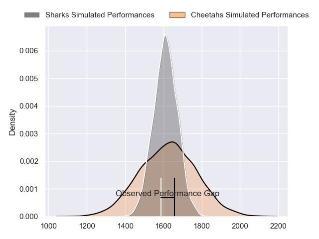
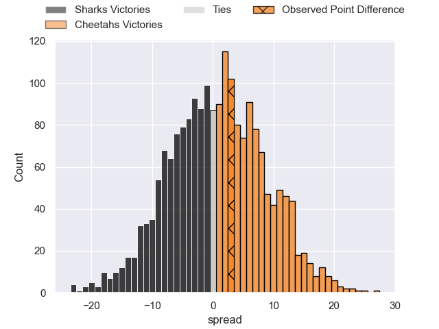
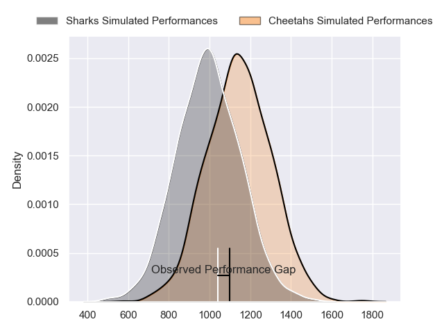
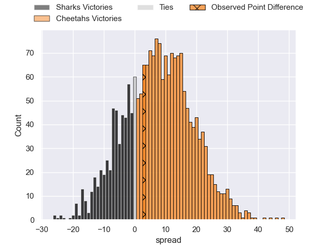
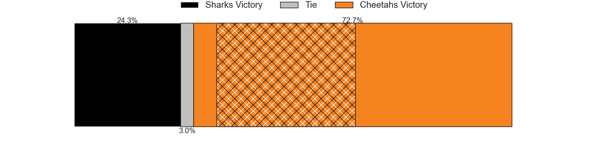
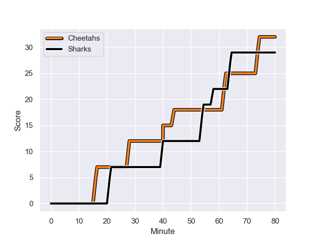
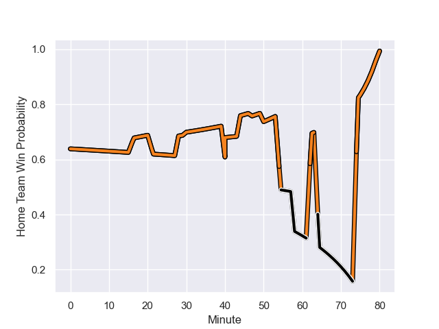

---  
layout: page  
title: Sharks at Cheetahs; 29-32  
date: 2023-12-17 18:00:00 -0500  
categories: "European Rugby Challenge Cup 2023" match review  
---
# Sharks at Cheetahs; 29-32

# Club Level Predictions

The first set of predictions treats a club as the smallest object, as the club develops its members, organizes a gameplan, and deploys its players as needed for each match. This club model has a prediction of 0.522, which translates to predicting Cheetahs to win by 0.8.

Each club has a rating and a rating deviation (similar to a Glicko rating), and expected performances can be generated. This allows for simulated matches and spreads like the ones below.
## Projected Performances - Club Model

## Projected Spreads - Club Model

## Projected Results - Club Model

# Player Level Predictions - Version 2

Treating teams instead as an entity made up of the currently active players, I have ratings for each player in an altogether different system. These can be combined to form team ratings once teamsheets are announced, weighting starters a bit higher than the reserves. After the match is played, players can be weighted by their minutes on the field, allowing for an accurate measure of the team's composition. With these compiled team ratings, we can make predictions, measure inaccuracy, and update the individual player ratings.
## Prediction with Player Minutes: Cheetahs by 6.2

Cheetahs by 2.6 on a neutral field
## Prediction without Player Minutes: Cheetahs by 4.7

Cheetahs by 1.1 on a neutral pitch

## Projected Performances - Player Model

## Projected Spreads - Player Model

## Projected Results - Player Model

## Scores over Time

## Win Probability over Time

There were 20 large changes in win probability in this match

|   Away Minutes | Away Player           |   Away elo |   Number |   Home elo | Home Player              |   Home Minutes |
|---------------:|:----------------------|-----------:|---------:|-----------:|:-------------------------|---------------:|
|             57 | Ox Nche               |     110.21 |        1 |      25.06 | Cameron Dawson           |             50 |
|             57 | Kerron van Vuuren     |      15.93 |        2 |      72.19 | Marnus van der Merwe     |             50 |
|             50 | Coenie Oosthuizen     |     114.22 |        3 |      55.77 | Hencus van Wyk           |             50 |
|             80 | Eben Etzebeth         |     118.18 |        4 |      61.15 | Rynier Bernardo          |             80 |
|             30 | Le Roux Roets         |      37.42 |        5 |      72.64 | Victor Kutlwano Sekekete |             68 |
|             80 | James Venter          |      40.99 |        6 |      92.12 | Gideon van der Merwe     |             47 |
|             80 | Phepsi Buthelezi      |      42.52 |        7 |      99.21 | Friedle Olivier          |             80 |
|             63 | Sikhumbuzo Notshe     |      82.5  |        8 |      65.51 | Jeandre Rudolph          |             68 |
|             57 | Grant Williams        |      52.32 |        9 |     135.62 | Ruan Pienaar             |             80 |
|             78 | Curwin Bosch          |      60.88 |       10 |      46.65 | George Lourens           |             63 |
|             80 | Makazole Mapimpi      |     120.28 |       11 |      69.52 | Cohen Jasper             |             80 |
|             63 | Francois Venter       |      56.19 |       12 |      79.15 | Reinhardt Fortuin        |             73 |
|             80 | Lukhanyo Am           |      67.79 |       13 |      15.09 | Evardi Boshoff           |             80 |
|             80 | Werner Kok            |      43.52 |       14 |      92.45 | Daniel Kasende           |             80 |
|             80 | Aphelele Fassi        |      80.98 |       15 |      67.96 | Tapiwa Lloyd Mafura      |             80 |
|             23 | Ntuthuko Mchunu       |      28.58 |       16 |      71.87 | Alulutho Tshakweni       |             30 |
|             23 | Daniel Viljoen Jooste |      47.77 |       17 |      77.74 | Louis van der Westhuizen |             30 |
|             30 | Hanro Jacobs          |      44.15 |       18 |      38.08 | Laurence Herbert Victor  |             30 |
|             50 | Corne Rahl            |      28.6  |       19 |      46.47 | Carl Wegner              |             12 |
|             17 | Jeandre Labuschagne   |      42.1  |       20 |      74.36 | Daniel Johannes Maartens |             33 |
|             23 | Jaden Hendrikse       |      67.96 |       21 |      64.81 | Sibabalo Qoma            |             12 |
|              2 | Lionel Cronje         |     113.46 |       22 |      78.54 | Rewan Kruger             |             17 |
|             17 | Ethan Hooker          |      46.62 |       23 |      57.54 | Ali Mgijima              |              7 |

