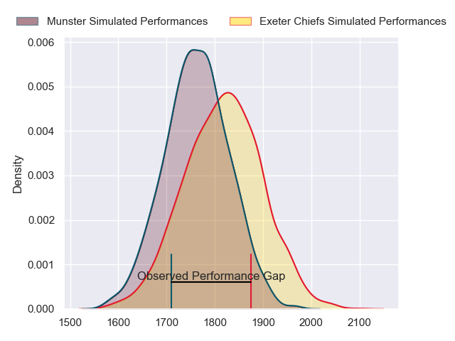
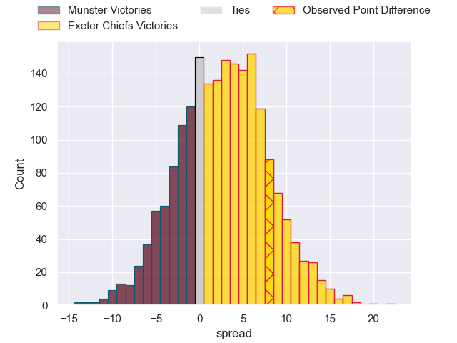
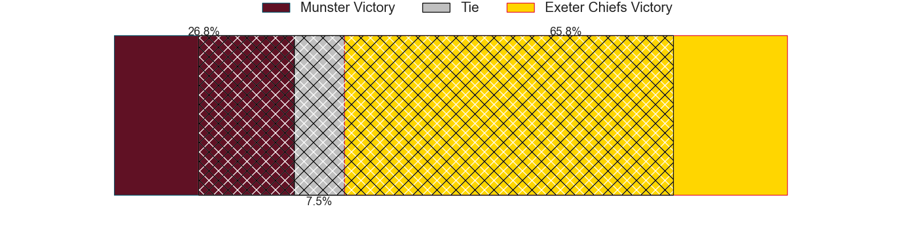
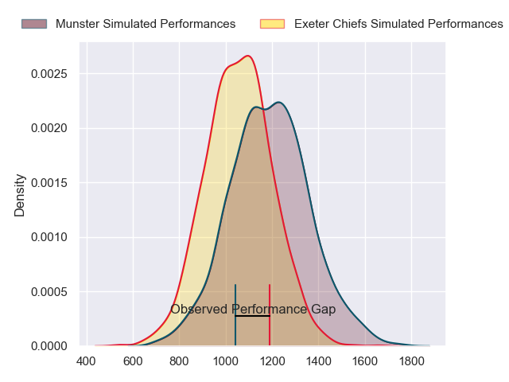
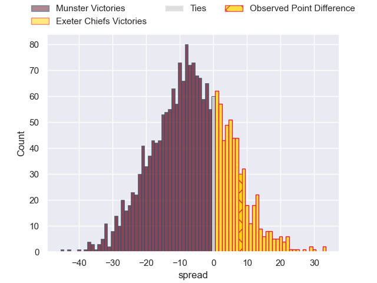
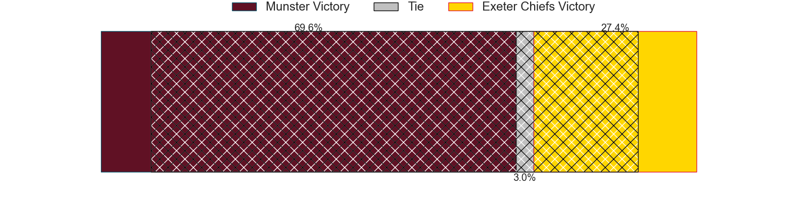
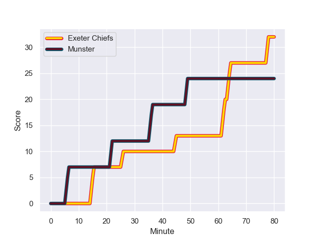
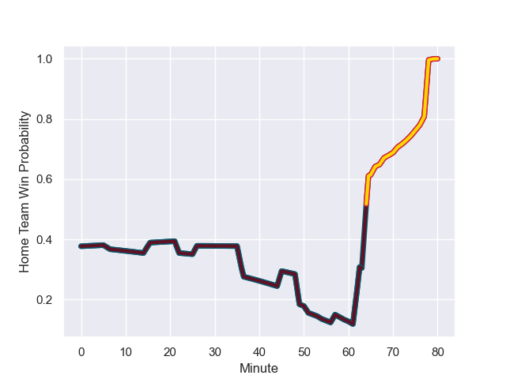

---  
layout: page  
title: Munster at Exeter Chiefs; 24-32  
date: 2023-12-17 18:00:00 -0500  
categories: "European Rugby Champions Cup 2023" match review  
---
# Munster at Exeter Chiefs; 24-32

# Club Level Predictions

The first set of predictions treats a club as the smallest object, as the club develops its members, organizes a gameplan, and deploys its players as needed for each match. This club model has a prediction of 0.578, which translates to predicting Exeter Chiefs to win by 2.8.

Each club has a rating and a rating deviation (similar to a Glicko rating), and expected performances can be generated. This allows for simulated matches and spreads like the ones below.
## Projected Performances - Club Model

## Projected Spreads - Club Model

## Projected Results - Club Model

# Player Level Predictions - Version 2

Treating teams instead as an entity made up of the currently active players, I have ratings for each player in an altogether different system. These can be combined to form team ratings once teamsheets are announced, weighting starters a bit higher than the reserves. After the match is played, players can be weighted by their minutes on the field, allowing for an accurate measure of the team's composition. With these compiled team ratings, we can make predictions, measure inaccuracy, and update the individual player ratings.
## Prediction with Player Minutes: Munster by 5.6

Munster by 9.8 on a neutral field
## Prediction without Player Minutes: Munster by 4.5

Munster by 8.7 on a neutral pitch

## Projected Performances - Player Model

## Projected Spreads - Player Model

## Projected Results - Player Model

## Scores over Time

## Win Probability over Time

There were 14 large changes in win probability in this match

|   Away Minutes | Away Player     |   Away elo |   Number |   Home elo | Home Player           |   Home Minutes |
|---------------:|:----------------|-----------:|---------:|-----------:|:----------------------|---------------:|
|             66 | Jeremy Loughman |      88.08 |        1 |      87.5  | Scott Sio             |             51 |
|             80 | Diarmuid Barron |      79.93 |        2 |      76.02 | Dan Frost             |             51 |
|             57 | Stephen Archer  |     105.71 |        3 |      60.4  | Ehren Painter         |             51 |
|             80 | Gavin Coombes   |      77.98 |        4 |      39.66 | Rusiate Tuima         |             54 |
|             80 | Tadhg Beirne    |     136.57 |        5 |      75.67 | Dafydd Jenkins        |             80 |
|             80 | Thomas Ahern    |      57.05 |        6 |      52.18 | Lewis Pearson         |             80 |
|             71 | John Hodnett    |      75.66 |        7 |      69.61 | Jacques Vermeulen     |             54 |
|             68 | Jack O'Donoghue |      80.95 |        8 |      62.69 | Greg Fisilau          |             80 |
|             57 | Craig Casey     |      70.51 |        9 |      46.65 | Tom Cairns            |             51 |
|             80 | Jack Crowley    |      52.87 |       10 |      46.34 | Harvey Skinner        |             80 |
|             76 | Sean O'Brien    |      29.1  |       11 |      46.65 | Ben Hammersley        |             80 |
|             80 | Alex Nankivell  |      85.7  |       12 |      37.2  | Joe Hawkins           |             60 |
|             80 | Antoine Frisch  |      74.03 |       13 |     113.32 | Henry Slade           |             80 |
|             80 | Calvin Nash     |      90.15 |       14 |      95.97 | Olly Woodburn         |             51 |
|             80 | Shane Daly      |      95.73 |       15 |      74.28 | Tom Wyatt             |             80 |
|             14 | Josh Wycherley  |      44.03 |       16 |      68.36 | Nika Abuladze         |             29 |
|             23 | Oli Jager       |      76.46 |       17 |      46.86 | Max Norey             |             29 |
|              9 | Alex Kendellen  |      52.93 |       18 |      32.99 | Marcus Street         |             29 |
|             12 | Brian Gleeson   |      46.29 |       19 |      30.86 | Jack Dunne            |             26 |
|             23 | Conor Murray    |     127.47 |       20 |      79.19 | Stu Townsend          |             29 |
|              4 | Ben O'Connor    |      46.52 |       21 |      44.12 | Ollie Devoto          |             20 |
|            nan | nan             |     nan    |       22 |      82.46 | Rory O'Loughlin       |             29 |
|            nan | nan             |     nan    |       23 |      50.85 | Ross Micheal Vintcent |             26 |

