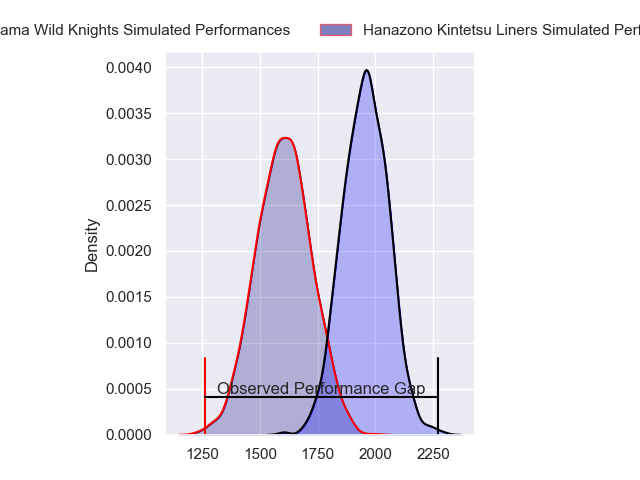
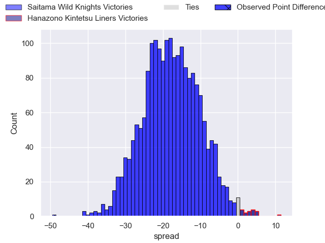
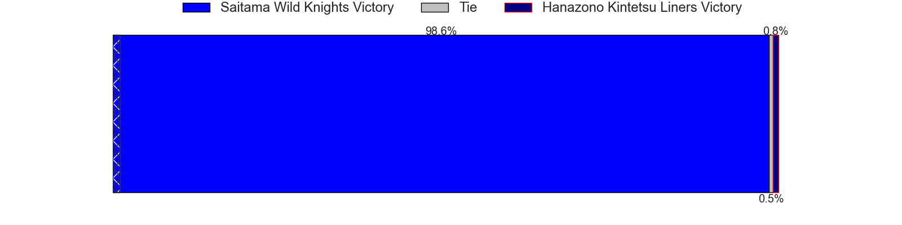
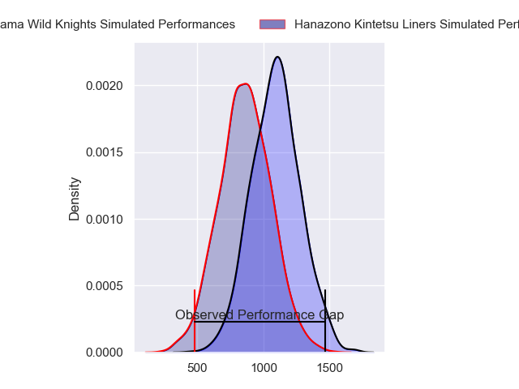
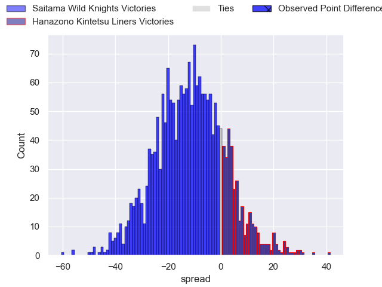
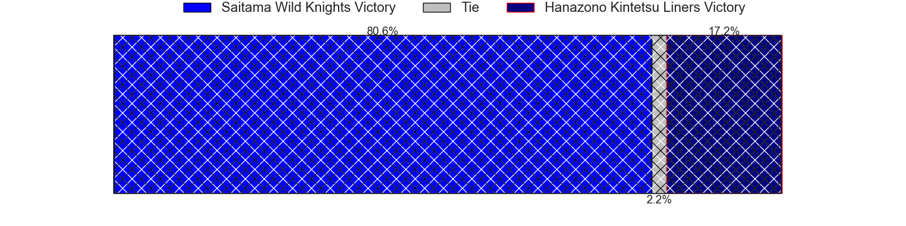

---  
layout: page  
title: Saitama Wild Knights at Hanazono Kintetsu Liners; 49-0  
date: 2023-12-17 18:00:00 -0500  
categories: "Japan Rugby League One 2023" match review  
---
# Saitama Wild Knights at Hanazono Kintetsu Liners; 49-0

# Club Level Predictions

The first set of predictions treats a club as the smallest object, as the club develops its members, organizes a gameplan, and deploys its players as needed for each match. This club model has a prediction of 0.124, which translates to predicting Saitama Wild Knights to win by 17.8.

Each club has a rating and a rating deviation (similar to a Glicko rating), and expected performances can be generated. This allows for simulated matches and spreads like the ones below.
## Projected Performances - Club Model

## Projected Spreads - Club Model

## Projected Results - Club Model

# Player Level Predictions - Version 2

Treating teams instead as an entity made up of the currently active players, I have ratings for each player in an altogether different system. These can be combined to form team ratings once teamsheets are announced, weighting starters a bit higher than the reserves. After the match is played, players can be weighted by their minutes on the field, allowing for an accurate measure of the team's composition. With these compiled team ratings, we can make predictions, measure inaccuracy, and update the individual player ratings.
## Prediction with Player Minutes: Saitama Wild Knights by 9.8

Saitama Wild Knights by 13.2 on a neutral field
## Prediction without Player Minutes: Saitama Wild Knights by 9.8

Saitama Wild Knights by 13.2 on a neutral pitch

## Projected Performances - Player Model

## Projected Spreads - Player Model

## Projected Results - Player Model

|   Away Minutes | Away Player       |   Away elo |   Number |   Home elo | Home Player      |   Home Minutes |
|---------------:|:------------------|-----------:|---------:|-----------:|:-----------------|---------------:|
|             80 | Keita Inagaki     |      83.11 |        1 |      32.35 | Shun Sasaki      |             80 |
|             80 | Atsushi Sakate    |      50.37 |        2 |      37.66 | Keiichi Kaneko   |             80 |
|             80 | Taiki Fujii       |      51.52 |        3 |      27.65 | Lata Tangimana   |             80 |
|             80 | Liam Mitchell     |      14.17 |        4 |      77.22 | Ben Toolis       |             80 |
|             80 | Esei Ha'angana    |      53.98 |        5 |      59    | Sanaila Waqa     |             80 |
|             80 | Ryota Hasegawa    |     105.08 |        6 |      62.09 | James Blackwell  |             80 |
|             80 | Shunsuke Nunomaki |      67.68 |        7 |      54.76 | Shohei Nonaka    |             80 |
|             80 | Jack Cornelsen    |      73.93 |        8 |      64.22 | Jose Seru        |             80 |
|             80 | Taiki Koyama      |      66.46 |        9 |      90.34 | Will Genia       |             80 |
|             80 | Rikiya Matsuda    |     100.66 |       10 |      29.5  | Daisuke Noguchi  |             80 |
|             80 | Marika Koroibete  |      69.81 |       11 |      60.53 | Ryosuke Kataoka  |             80 |
|             80 | Damian de Allende |      82.75 |       12 |      79.97 | Patrick Stehlin  |             80 |
|             80 | Dylan Riley       |      91.88 |       13 |      37.91 | Haruki Kanazawa  |             80 |
|             80 | Koki Takeyama     |      93.45 |       14 |      18.05 | Joshua Nohra     |             80 |
|             80 | Takuya Yamasawa   |      86.48 |       15 |      40.93 | Yoshizumi Takeda |             80 |

