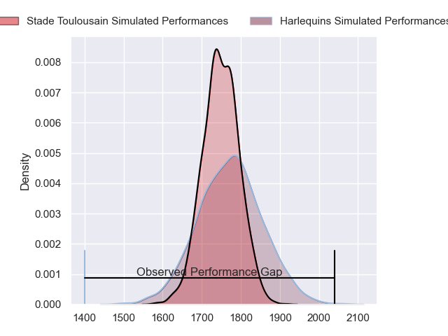
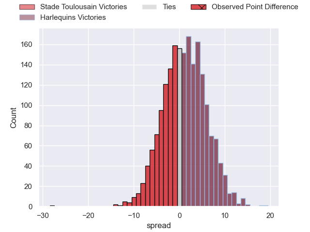
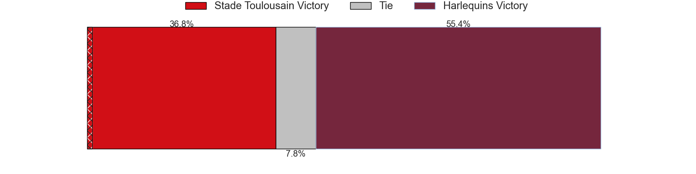
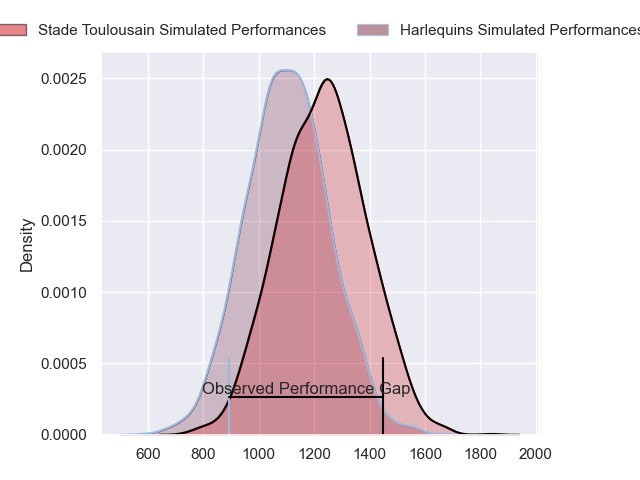
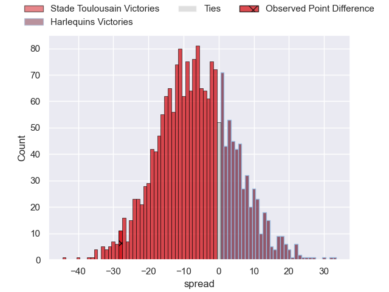
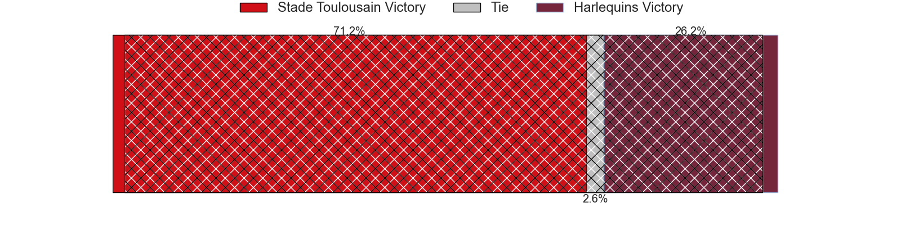
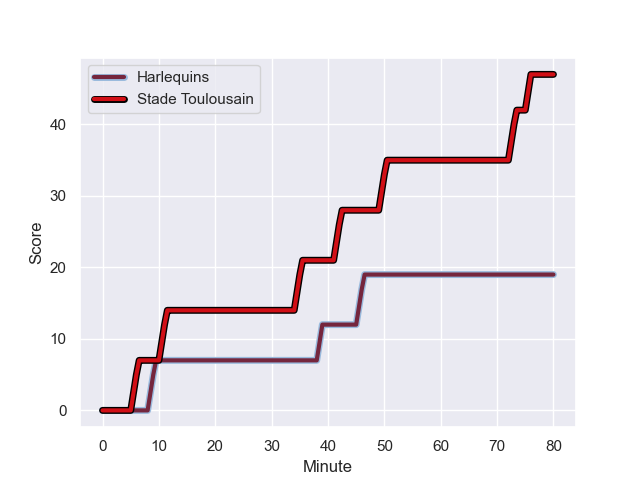
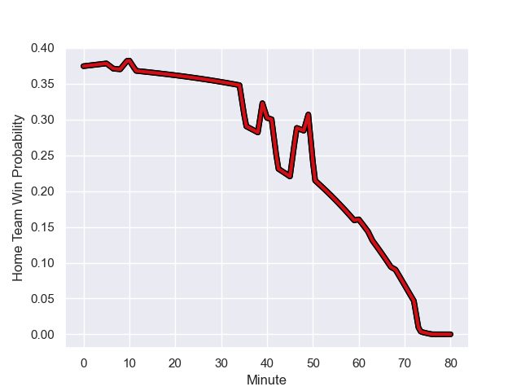

---  
layout: page  
title: Stade Toulousain at Harlequins; 47-19  
date: 2023-12-17 18:00:00 -0500  
categories: "European Rugby Champions Cup 2023" match review  
---
# Stade Toulousain at Harlequins; 47-19

# Club Level Predictions

The first set of predictions treats a club as the smallest object, as the club develops its members, organizes a gameplan, and deploys its players as needed for each match. This club model has a prediction of 0.536, which translates to predicting Harlequins to win by 1.3.

Each club has a rating and a rating deviation (similar to a Glicko rating), and expected performances can be generated. This allows for simulated matches and spreads like the ones below.
## Projected Performances - Club Model

## Projected Spreads - Club Model

## Projected Results - Club Model

# Player Level Predictions - Version 2

Treating teams instead as an entity made up of the currently active players, I have ratings for each player in an altogether different system. These can be combined to form team ratings once teamsheets are announced, weighting starters a bit higher than the reserves. After the match is played, players can be weighted by their minutes on the field, allowing for an accurate measure of the team's composition. With these compiled team ratings, we can make predictions, measure inaccuracy, and update the individual player ratings.
## Prediction with Player Minutes: Stade Toulousain by 5.7

Stade Toulousain by 10.4 on a neutral field
## Prediction without Player Minutes: Stade Toulousain by 4.9

Stade Toulousain by 9.7 on a neutral pitch

## Projected Performances - Player Model

## Projected Spreads - Player Model

## Projected Results - Player Model

## Scores over Time

## Win Probability over Time

There were 7 large changes in win probability in this match

|   Away Minutes | Away Player          |   Away elo |   Number |   Home elo | Home Player               |   Home Minutes |
|---------------:|:---------------------|-----------:|---------:|-----------:|:--------------------------|---------------:|
|             49 | Cyril Baille         |      92.96 |        1 |      98.2  | Joe Marler                |             40 |
|             69 | Peato Mauvaka        |      88.63 |        2 |      31.32 | Jack Walker               |             72 |
|             60 | Nepo Laulala         |      84.74 |        3 |      74.27 | Will Collier              |             49 |
|             60 | Richie Arnold        |      38.75 |        4 |     101.74 | Joe Launchbury            |             80 |
|             80 | Emmanuel Meafou      |      57.65 |        5 |      73.96 | Dino Lamb                 |             14 |
|             80 | Francois Cros        |     117.8  |        6 |      75.64 | James Chisholm            |             63 |
|             65 | Anthony Jelonch      |     102.21 |        7 |      51.87 | Will Evans                |             80 |
|             80 | Alexandre Roumat     |      85.69 |        8 |      68.18 | Alex Dombrandt            |             80 |
|             80 | Antoine Dupont       |     132.71 |        9 |      36.48 | Will Porter               |             49 |
|             80 | Thomas Ramos         |     117.74 |       10 |      72.69 | Marcus Smith              |             80 |
|             69 | Matthis Lebel        |     101.3  |       11 |      38.74 | Cadan Murley              |             40 |
|             68 | Pita Ahki            |      42.42 |       12 |     102.26 | Andre Esterhuizen         |             80 |
|             80 | Pierre-Louis Barassi |      58.37 |       13 |      57.53 | Will Joseph               |             80 |
|             80 | Dimitri Delibes      |      50.93 |       14 |      36.04 | Nick David                |             80 |
|             68 | Blair Kinghorn       |     128.11 |       15 |      62.94 | Tyrone Green              |             60 |
|             31 | Rodrigue Neti        |      39.94 |       16 |      32.87 | Fin Baxter                |             40 |
|             11 | Guillaume Cramont    |      50.49 |       17 |      80.56 | Dillon Lewis              |             31 |
|             20 | David Ainu'u         |      62.12 |       18 |      52.74 | Nathan Jibulu             |              8 |
|             20 | Alban Placines       |      35.52 |       19 |      57.78 | Irne Herbst               |             66 |
|             15 | Piula Faasalele      |      66.14 |       20 |      50.01 | Chandler Cunningham-South |             17 |
|             11 | Paul Costes          |      44.65 |       21 |     133.64 | Danny Care                |             31 |
|             12 | Santiago Chocobares  |      40.51 |       22 |      50.72 | Oscar Beard               |             40 |
|             12 | Baptiste Germain     |      14.64 |       23 |      82.91 | Jarrod Evans              |             20 |

