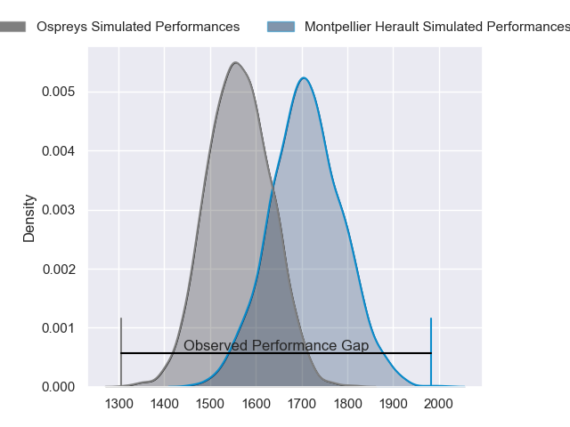
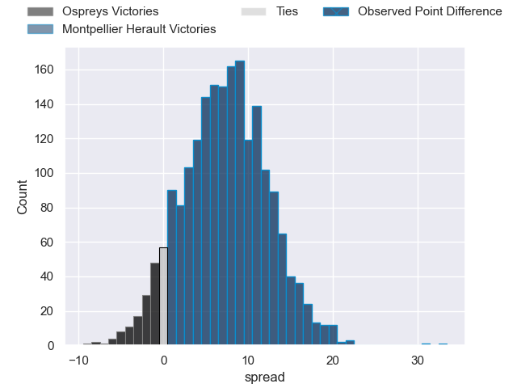
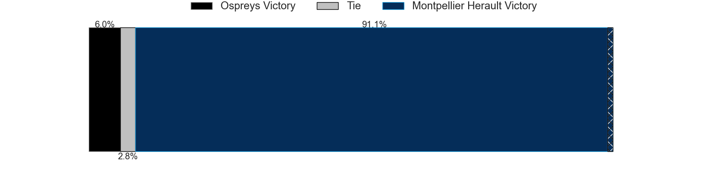
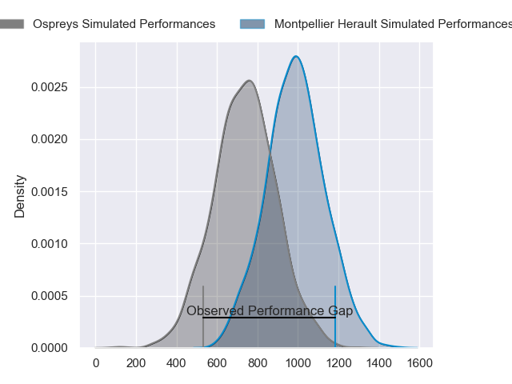
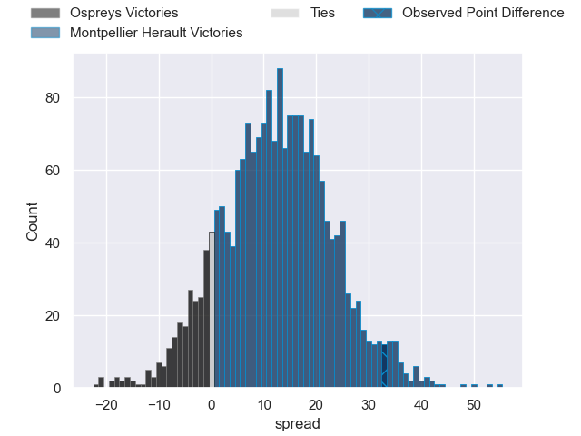
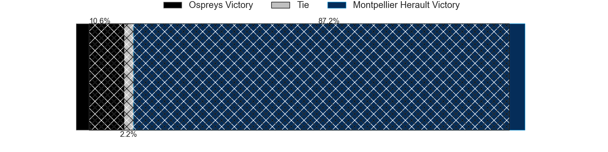
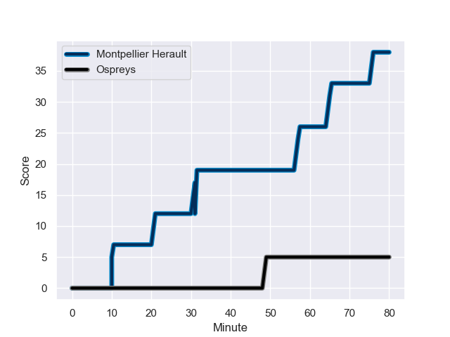
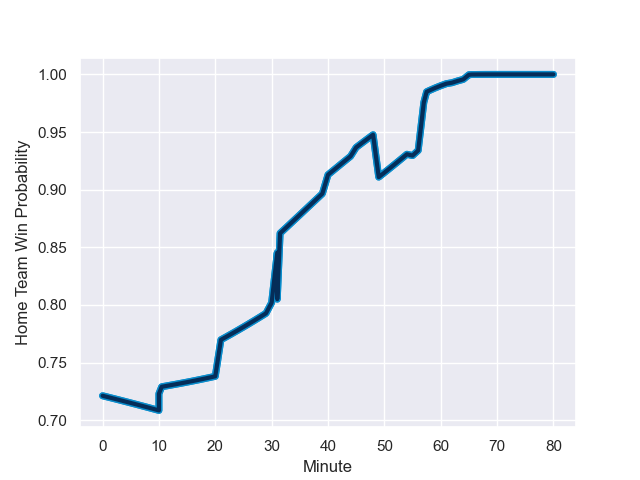

---  
layout: page  
title: Ospreys at Montpellier Herault; 5-38  
date: 2023-12-17 18:00:00 -0500  
categories: "European Rugby Challenge Cup 2023" match review  
---
# Ospreys at Montpellier Herault; 5-38

# Club Level Predictions

The first set of predictions treats a club as the smallest object, as the club develops its members, organizes a gameplan, and deploys its players as needed for each match. This club model has a prediction of 0.693, which translates to predicting Montpellier Herault to win by 7.3.

Each club has a rating and a rating deviation (similar to a Glicko rating), and expected performances can be generated. This allows for simulated matches and spreads like the ones below.
## Projected Performances - Club Model

## Projected Spreads - Club Model

## Projected Results - Club Model

# Player Level Predictions - Version 2

Treating teams instead as an entity made up of the currently active players, I have ratings for each player in an altogether different system. These can be combined to form team ratings once teamsheets are announced, weighting starters a bit higher than the reserves. After the match is played, players can be weighted by their minutes on the field, allowing for an accurate measure of the team's composition. With these compiled team ratings, we can make predictions, measure inaccuracy, and update the individual player ratings.
## Prediction with Player Minutes: Montpellier Herault by 10.5

Montpellier Herault by 5.7 on a neutral field
## Prediction without Player Minutes: Montpellier Herault by 8.8

Montpellier Herault by 4.0 on a neutral pitch

## Projected Performances - Player Model

## Projected Spreads - Player Model

## Projected Results - Player Model

## Scores over Time

## Win Probability over Time

There were 6 large changes in win probability in this match

|   Away Minutes | Away Player            |   Away elo |   Number |   Home elo | Home Player              |   Home Minutes |
|---------------:|:-----------------------|-----------:|---------:|-----------:|:-------------------------|---------------:|
|             30 | Nicky Smith            |      46.24 |        1 |      14.7  | Baptiste Erdocio         |             45 |
|             55 | Dewi Lake              |      37.02 |        2 |      48.75 | Brandon Paenga-Amosa     |             45 |
|             55 | Tom Botha              |      37.98 |        3 |      87.74 | Harry Williams           |             45 |
|             68 | James Fender           |      47.26 |        4 |      68.6  | Marco Tauleigne          |             80 |
|             80 | Adam Beard             |      57.21 |        5 |      33.7  | Tyler Duguid             |             45 |
|             80 | Tristan Davies         |      47.28 |        6 |      82.19 | Yacouba Camara           |             80 |
|             65 | Harri Deaves           |      48.39 |        7 |      32.21 | Clément Doumenc          |             80 |
|             80 | Morgan Morris          |       2.89 |        8 |      51.69 | Sam Simmonds             |             57 |
|             67 | Reuben Morgan-Williams |      36.44 |        9 |      30.02 | Léo Coly                 |             45 |
|             67 | Owen Williams          |      74.87 |       10 |      52.59 | Paolo Garbisi            |             62 |
|             80 | Keelan Giles           |      -1.4  |       11 |     104.59 | Ben Lam                  |             80 |
|             40 | Owen Watkin            |      86.88 |       12 |      74.44 | Jan Serfontein           |             59 |
|             80 | George North           |     110.7  |       13 |      28.93 | Pierre Lucas             |             80 |
|             80 | Matt Protheroe         |      72.99 |       14 |      95.12 | George Bridge            |             80 |
|             80 | Jack Walsh             |      51.87 |       15 |      56.4  | Anthony Bouthier         |             80 |
|             50 | Gareth Thomas          |      35.9  |       16 |      34.11 | Vano Karkadze            |             35 |
|             25 | Sam Parry              |      45.6  |       17 |      51.99 | Enzo Forletta            |             35 |
|             12 | Lewis Jones            |      46.85 |       18 |      46.58 | Titi Lamositele          |             35 |
|             25 | Rhys Henry             |      55.85 |       19 |      59.74 | Masivesi Dakuwaqa        |             23 |
|             15 | Lewis Lloyd            |      47.85 |       20 |      65.24 | Paul Willemse            |             35 |
|             13 | Luke Davies            |      44.51 |       21 |      37.81 | Louis Foursans-Bourdette |             18 |
|             40 | Luke Scully            |      49.52 |       22 |      80.86 | Cobus Reinach            |             35 |
|             13 | Dan Edwards            |      48.79 |       23 |      22.58 | Auguste Cadot            |             21 |

