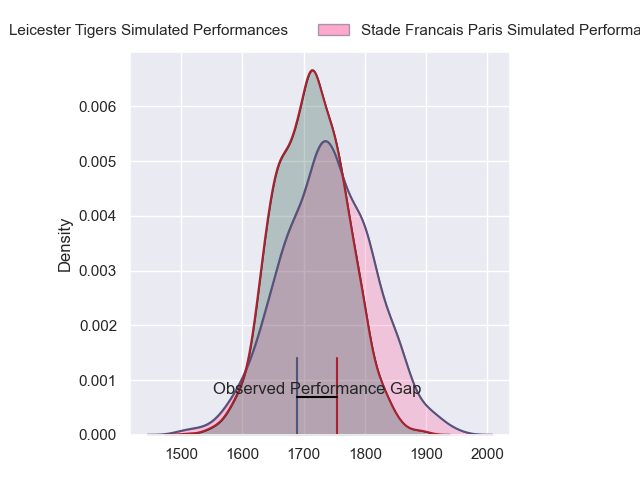
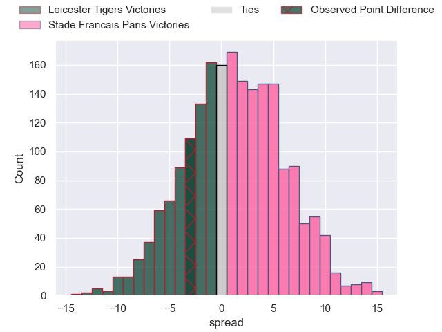
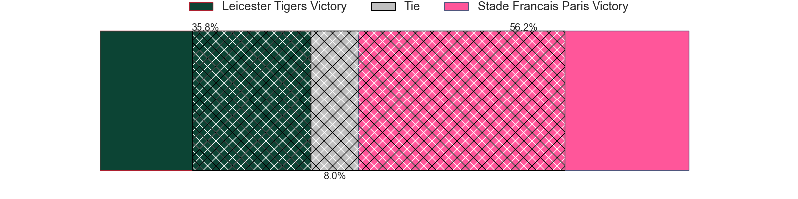
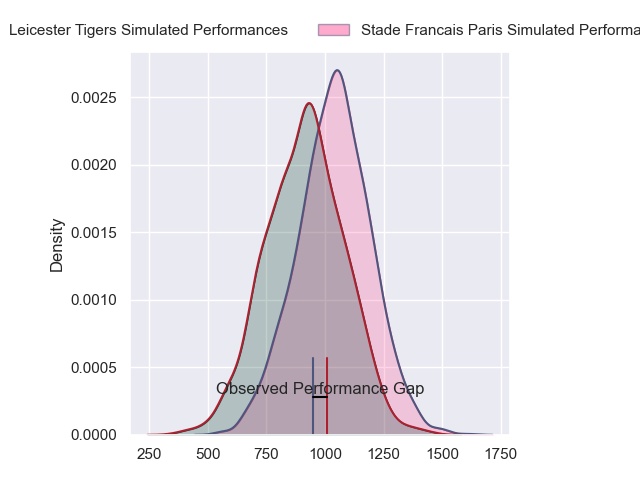
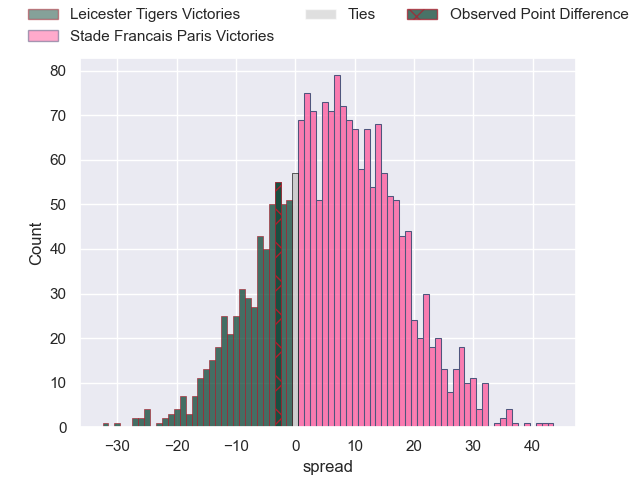
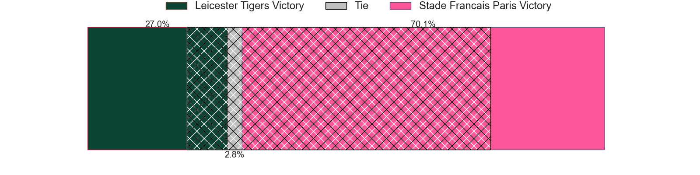
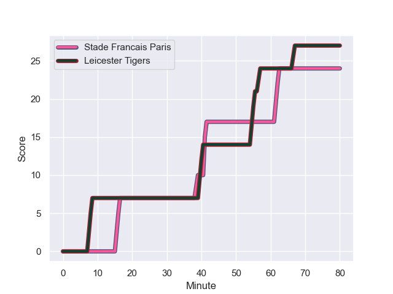
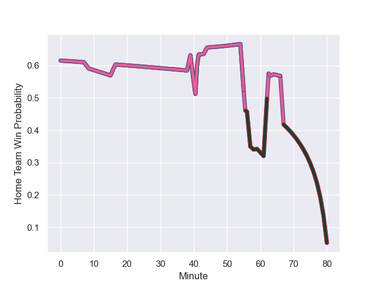

---  
layout: page  
title: Leicester Tigers at Stade Francais Paris; 27-24  
date: 2023-12-17 18:00:00 -0500  
categories: "European Rugby Champions Cup 2023" match review  
---
# Leicester Tigers at Stade Francais Paris; 27-24

# Club Level Predictions

The first set of predictions treats a club as the smallest object, as the club develops its members, organizes a gameplan, and deploys its players as needed for each match. This club model has a prediction of 0.534, which translates to predicting Stade Francais Paris to win by 1.2.

Each club has a rating and a rating deviation (similar to a Glicko rating), and expected performances can be generated. This allows for simulated matches and spreads like the ones below.
## Projected Performances - Club Model

## Projected Spreads - Club Model

## Projected Results - Club Model

# Player Level Predictions - Version 2

Treating teams instead as an entity made up of the currently active players, I have ratings for each player in an altogether different system. These can be combined to form team ratings once teamsheets are announced, weighting starters a bit higher than the reserves. After the match is played, players can be weighted by their minutes on the field, allowing for an accurate measure of the team's composition. With these compiled team ratings, we can make predictions, measure inaccuracy, and update the individual player ratings.
## Prediction with Player Minutes: Stade Francais Paris by 5.2

Stade Francais Paris by 0.2 on a neutral field
## Prediction without Player Minutes: Stade Francais Paris by 5.8

Stade Francais Paris by 0.8 on a neutral pitch

## Projected Performances - Player Model

## Projected Spreads - Player Model

## Projected Results - Player Model

## Scores over Time

## Win Probability over Time

There were 16 large changes in win probability in this match

|   Away Minutes | Away Player          |   Away elo |   Number |   Home elo | Home Player            |   Home Minutes |
|---------------:|:---------------------|-----------:|---------:|-----------:|:-----------------------|---------------:|
|             44 | James Cronin         |      73.67 |        1 |      45.54 | Clement Castets        |             57 |
|             63 | Archie Vanes         |      34.84 |        2 |      84.04 | Mickael Ivaldi         |             57 |
|             59 | Joe Heyes            |      70.54 |        3 |      71.9  | Paul Alo-Emile         |             57 |
|             64 | George Martin        |      75.26 |        4 |      62.46 | Paul Gabrillagues      |             80 |
|             80 | Sam Carter           |      92.81 |        5 |      71.22 | Baptiste Pesenti       |             57 |
|             80 | Hanro Liebenberg     |      86.68 |        6 |      95.48 | Sekou Macalou          |             80 |
|             80 | Matt Rogerson        |      85.92 |        7 |       7.3  | Ryan Chapuis           |             74 |
|             64 | Kyle Hatherell       |      -5.99 |        8 |      21.73 | Mathieu Hirigoyen      |             80 |
|             80 | Tom Whiteley         |      43.91 |        9 |      38.84 | Hugo Zabalza           |             59 |
|             80 | James Shillcock      |      36.89 |       10 |      75.16 | Joris Segonds          |             71 |
|             80 | Mike Brown           |     102.23 |       11 |      52.13 | Charles Laloi          |             74 |
|             80 | Solomone Kata        |      50.23 |       12 |      89.35 | Jeremy Ward            |             80 |
|             80 | Dan Kelly            |      73.36 |       13 |      82.26 | Joe Marchant           |             80 |
|             80 | Anthony Watson       |      51.32 |       14 |      53.33 | Kylan Hamdaoui         |             80 |
|             80 | Charlie Atkinson     |      51.69 |       15 |      63.62 | Leo Barre              |             80 |
|             16 | Harry Wells          |      62.65 |       16 |      44.86 | Lucas Peyresblanques   |             23 |
|             36 | James Whitcombe      |      44.32 |       17 |      57.64 | Moses Alo-Emile        |             23 |
|             17 | Finn Theobald-Thomas |      46.65 |       18 |      83.96 | Francisco Gomez Kodela |             23 |
|             21 | Will Hurd            |      44.16 |       19 |      81.63 | JJ van der Mescht      |             23 |
|             16 | Emeka Ilione         |      46.65 |       20 |      45.87 | Pierre-Henri Azagoh    |              6 |
|            nan | nan                  |     nan    |       21 |      37.43 | Jules Gimbert          |             21 |
|            nan | nan                  |     nan    |       22 |      77.37 | Lester Etien           |              9 |
|            nan | nan                  |     nan    |       23 |      77.44 | Stéphane Ahmed         |              6 |

