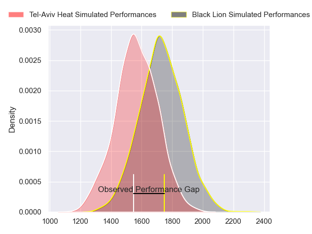
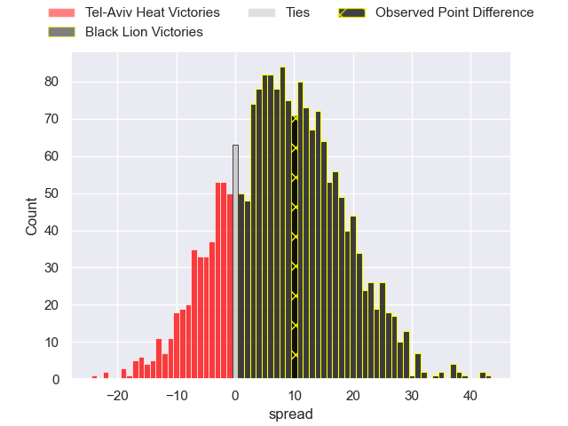
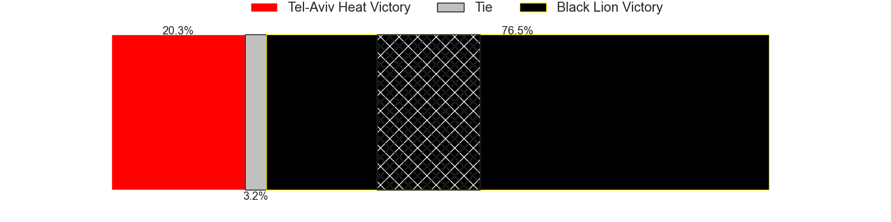

---  
layout: page  
title: Tel-Aviv Heat at Black Lion; 17-27  
date: 2023-12-22 18:00:00 -0500  
categories: "Rugby Europe Super Cup 2023" match review  
---
# Tel-Aviv Heat at Black Lion; 17-27

# Club Level Predictions

The first set of predictions treats a club as the smallest object, as the club develops its members, organizes a gameplan, and deploys its players as needed for each match. This club model has a prediction of 0.696, which translates to predicting Black Lion to win by 7.8.

Each club has a rating and a rating deviation (similar to a Glicko rating), and expected performances can be generated. This allows for simulated matches and spreads like the ones below.
## Projected Performances - Club Model

## Projected Spreads - Club Model

## Projected Results - Club Model

