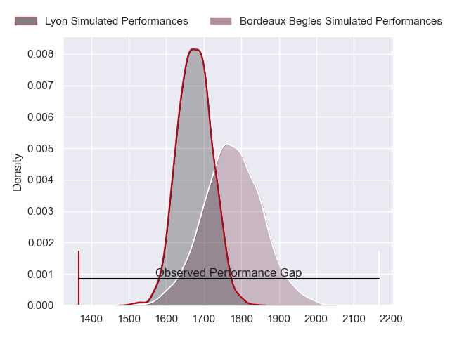
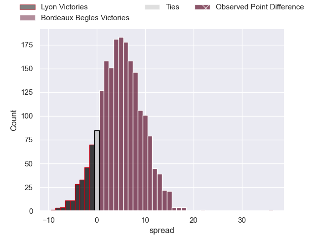
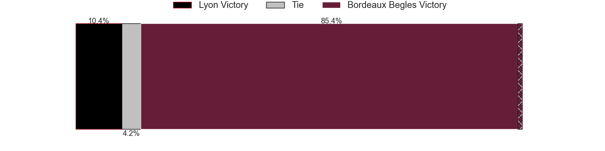
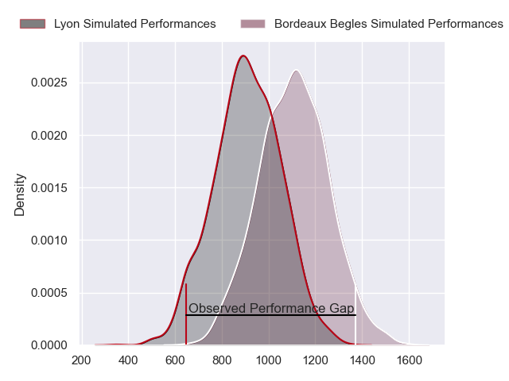
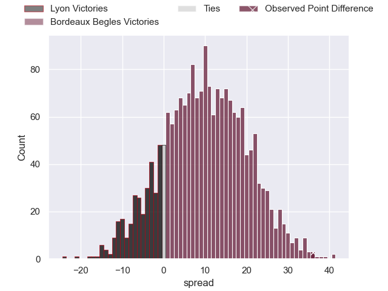
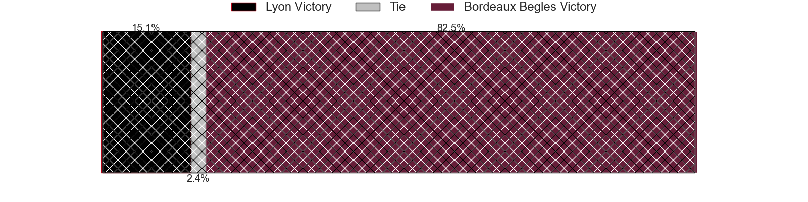
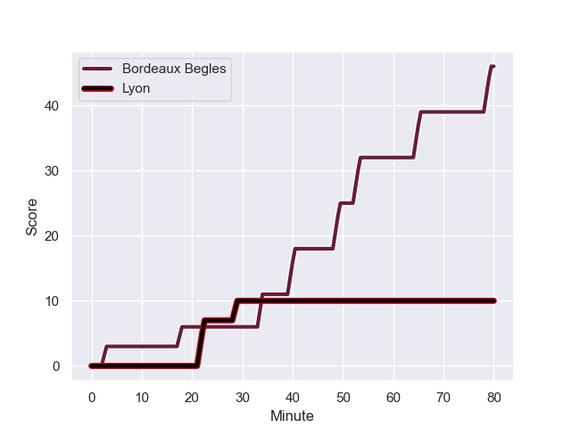
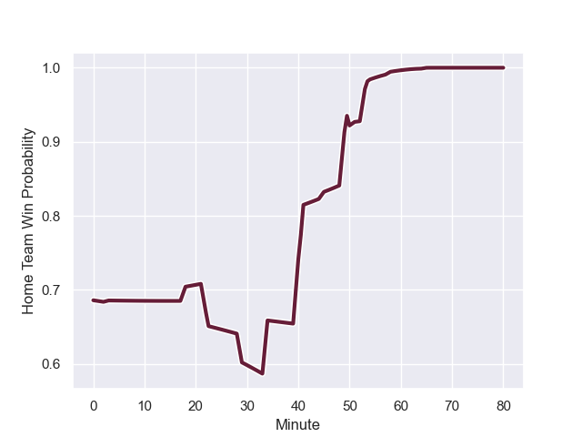

---  
layout: page  
title: Lyon at Bordeaux Begles; 10-46  
date: 2023-12-22 18:00:00 -0500  
categories: "Top 14 Orange 2023" match review  
---
# Lyon at Bordeaux Begles; 10-46

# Club Level Predictions

The first set of predictions treats a club as the smallest object, as the club develops its members, organizes a gameplan, and deploys its players as needed for each match. This club model has a prediction of 0.638, which translates to predicting Bordeaux Begles to win by 5.0.

Each club has a rating and a rating deviation (similar to a Glicko rating), and expected performances can be generated. This allows for simulated matches and spreads like the ones below.
## Projected Performances - Club Model

## Projected Spreads - Club Model

## Projected Results - Club Model

# Player Level Predictions - Version 2

Treating teams instead as an entity made up of the currently active players, I have ratings for each player in an altogether different system. These can be combined to form team ratings once teamsheets are announced, weighting starters a bit higher than the reserves. After the match is played, players can be weighted by their minutes on the field, allowing for an accurate measure of the team's composition. With these compiled team ratings, we can make predictions, measure inaccuracy, and update the individual player ratings.
## Prediction with Player Minutes: Bordeaux Begles by 8.6

Bordeaux Begles by 3.8 on a neutral field
## Prediction without Player Minutes: Bordeaux Begles by 7.7

Bordeaux Begles by 3.0 on a neutral pitch

## Projected Performances - Player Model

## Projected Spreads - Player Model

## Projected Results - Player Model

## Scores over Time

## Win Probability over Time

There were 8 large changes in win probability in this match

|   Away Minutes | Away Player           |   Away elo |   Number |   Home elo | Home Player        |   Home Minutes |
|---------------:|:----------------------|-----------:|---------:|-----------:|:-------------------|---------------:|
|             45 | Sebastien Taofifenua  |      30.54 |        1 |      58.96 | Ugo Boniface       |             58 |
|             54 | Guillaume Marchand    |      42.77 |        2 |      51.05 | Maxime Lamothe     |             63 |
|             45 | Paulo Tafili          |      35.88 |        3 |      84.49 | Ben Tameifuna      |             50 |
|             52 | Killian Geraci        |      33.38 |        4 |      53.83 | Alexandre Ricard   |             54 |
|             80 | Romain Taofifenua     |      57.07 |        5 |      38.36 | Kane Douglas       |             80 |
|             80 | Marvin Okuya          |      46.63 |        6 |      65.84 | Pierre Bochaton    |             80 |
|             80 | Mickael Guillard      |      51.69 |        7 |      52.13 | Marko Gazzotti     |             63 |
|             41 | Jordan Taufua         |     102.96 |        8 |      73.51 | Tevita Tatafu      |             80 |
|             58 | Baptiste Couilloud    |      90.59 |        9 |      21.19 | Paul Abadie        |             50 |
|             58 | Paddy Jackson         |      81.9  |       10 |     113.36 | Matthieu Jalibert  |             58 |
|             80 | Davit Niniashvili     |      72.59 |       11 |      40.5  | Pablo Uberti       |             58 |
|             80 | Thibault Regard       |      82.52 |       12 |      67.34 | Yoram Moefana      |             80 |
|             80 | Alfred Parisien       |      47.87 |       13 |      57.64 | Nicolas Depoortere |             80 |
|             80 | Vincent Rattez        |     123.9  |       14 |     100.36 | Damian Penaud      |             80 |
|             64 | Thaakir Abrahams      |      29.39 |       15 |      97.87 | Romain Buros       |             80 |
|             39 | Pierre-Samuel Pacheco |      37.49 |       16 |      70.78 | Mahamadou Diaby    |             26 |
|             35 | Jerome Rey            |      22.51 |       17 |      53.43 | Jefferson Poirot   |             22 |
|             35 | Demba Bamba           |      86.48 |       18 |      93.96 | Madosh Tambwe      |             22 |
|             26 | Yanis Charcosset      |      43.61 |       19 |      34.31 | Carlu Sadie        |             30 |
|             22 | Fletcher Smith        |      32.64 |       20 |     131.58 | Maxime Lucu        |             30 |
|             22 | Liam Rimet            |      45.27 |       21 |      45.38 | Mateo Garcia       |             22 |
|             16 | Kyle Godwin           |      67.9  |       22 |      58.6  | Antoine Miquel     |             17 |
|             28 | Joel Kpoku            |      49.99 |       23 |      31.85 | Romain Laterrade   |             17 |

