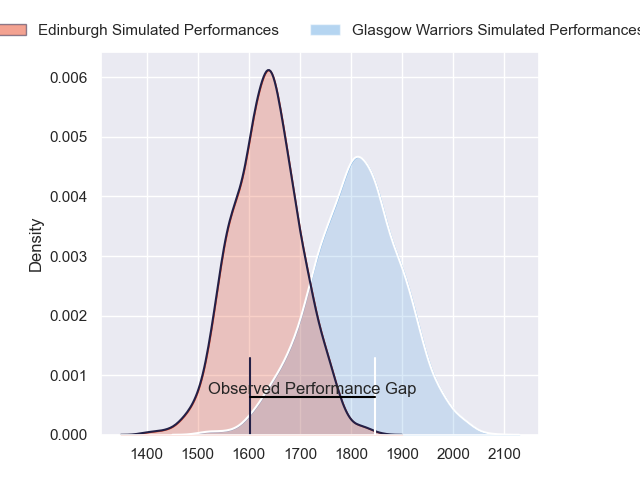
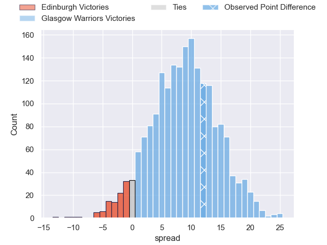
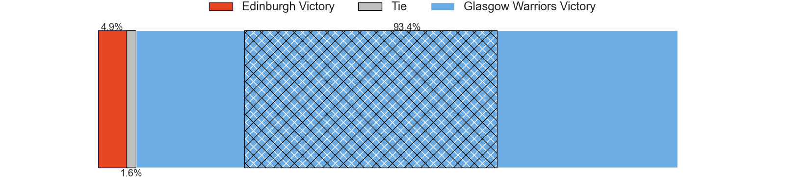
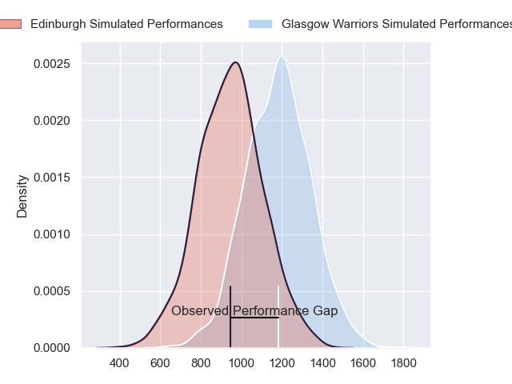
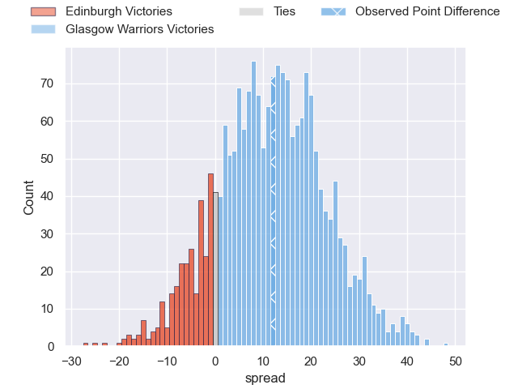
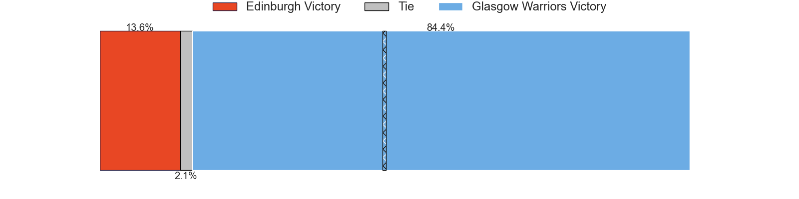
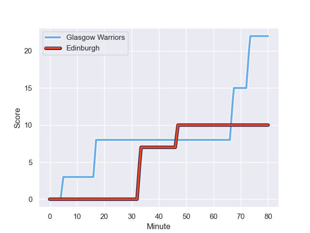
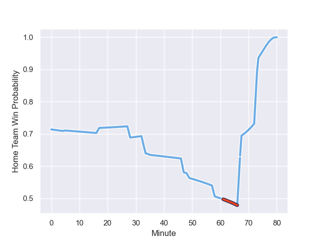

---  
layout: page  
title: Edinburgh at Glasgow Warriors; 10-22  
date: 2023-12-22 18:00:00 -0500  
categories: "United Rugby Championship 2023" match review  
---
# Edinburgh at Glasgow Warriors; 10-22

# Club Level Predictions

The first set of predictions treats a club as the smallest object, as the club develops its members, organizes a gameplan, and deploys its players as needed for each match. This club model has a prediction of 0.726, which translates to predicting Glasgow Warriors to win by 8.7.

Each club has a rating and a rating deviation (similar to a Glicko rating), and expected performances can be generated. This allows for simulated matches and spreads like the ones below.
## Projected Performances - Club Model

## Projected Spreads - Club Model

## Projected Results - Club Model

# Player Level Predictions - Version 2

Treating teams instead as an entity made up of the currently active players, I have ratings for each player in an altogether different system. These can be combined to form team ratings once teamsheets are announced, weighting starters a bit higher than the reserves. After the match is played, players can be weighted by their minutes on the field, allowing for an accurate measure of the team's composition. With these compiled team ratings, we can make predictions, measure inaccuracy, and update the individual player ratings.
## Prediction with Player Minutes: Glasgow Warriors by 10.1

Glasgow Warriors by 5.9 on a neutral field
## Prediction without Player Minutes: Glasgow Warriors by 12.8

Glasgow Warriors by 8.5 on a neutral pitch

## Projected Performances - Player Model

## Projected Spreads - Player Model

## Projected Results - Player Model

## Scores over Time

## Win Probability over Time

There were 8 large changes in win probability in this match

|   Away Minutes | Away Player         |   Away elo |   Number |   Home elo | Home Player       |   Home Minutes |
|---------------:|:--------------------|-----------:|---------:|-----------:|:------------------|---------------:|
|             69 | Pierre Schoeman     |      56.08 |        1 |      93.62 | Jamie Bhatti      |             58 |
|             69 | Ewan Ashman         |      39.6  |        2 |     118.62 | George Turner     |             28 |
|             74 | WP Nel              |      90.83 |        3 |     117.54 | Zander Fagerson   |             58 |
|             74 | Glen Young          |      18.12 |        4 |     121.34 | Scott Cummings    |             78 |
|             80 | Grant Gilchrist     |      91.91 |        5 |      69.89 | Richie Gray       |             58 |
|             80 | Jamie Ritchie       |     122.86 |        6 |      34.83 | Ally Miller       |             80 |
|             49 | Hamish Watson       |      48.28 |        7 |      71.41 | Rory Darge        |             80 |
|             80 | Viliame Mata        |      38.89 |        8 |      54    | Sione Vailanu     |             74 |
|             69 | Ali Price           |      73.24 |        9 |     134.44 | George Horne      |             80 |
|             80 | Ben Healy           |      48.82 |       10 |      57.26 | Ross Thompson     |             58 |
|             80 | Duhan van der Merwe |      65.07 |       11 |      61.01 | Kyle Rowe         |             69 |
|             35 | James Lang          |      59.04 |       12 |      79.43 | Stafford McDowall |             80 |
|             80 | Matt Currie         |      51.94 |       13 |      47.14 | Sione Tuipulotu   |             80 |
|             80 | Darcy Graham        |      59.83 |       14 |      59.49 | Huw Jones         |             80 |
|             69 | Wes Goosen          |      68.63 |       15 |      48.38 | Josh McKay        |             80 |
|             45 | Mark Bennett        |      65.22 |       16 |      42.49 | Johnny Matthews   |             52 |
|             31 | Luke Crosbie        |      77.89 |       17 |      36.8  | Greg Peterson     |             22 |
|             11 | Emiliano Boffelli   |      63.43 |       18 |      43.12 | Nathan McBeth     |             22 |
|             11 | Dave Cherry         |      51.74 |       19 |      89.9  | Oli Kebble        |             22 |
|             11 | Boan Venter         |      26.59 |       20 |      45.89 | Tom Jordan        |             22 |
|             11 | Ben Vellacott       |      59.35 |       21 |      46.71 | Ben Afshar        |             11 |
|              6 | Marshall Sykes      |      44.35 |       22 |      95.83 | Henco Venter      |              6 |
|              6 | D'Arcy Rae          |      47.46 |       23 |      39.68 | Max Williamson    |              2 |

