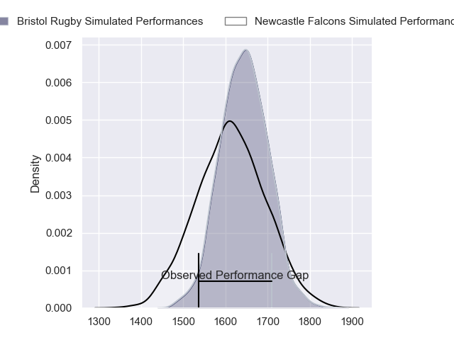
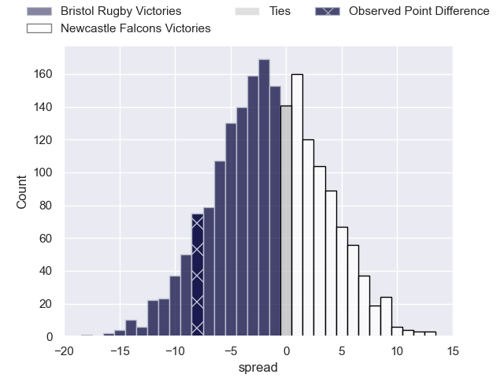
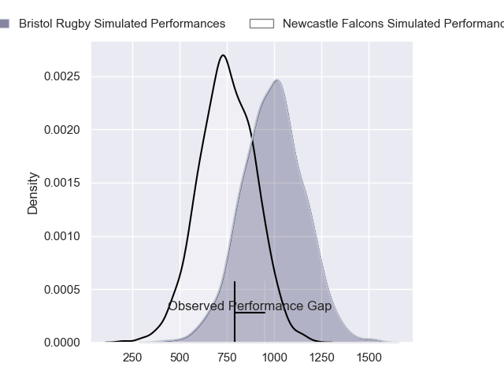
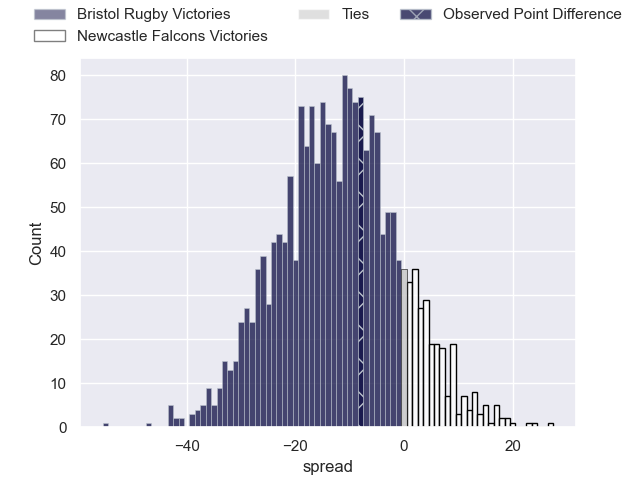
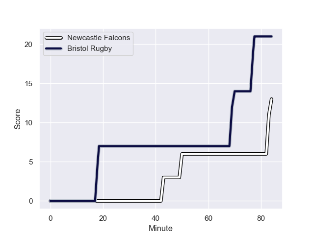
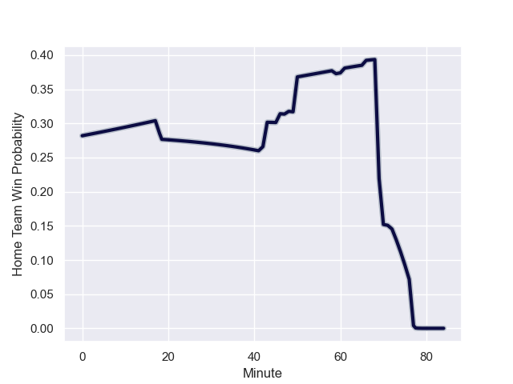

---  
layout: page  
title: Bristol Rugby at Newcastle Falcons; 21-13  
date: 2023-12-22 18:00:00 -0500  
categories: "Gallagher Premiership 2023" match review  
---
# Bristol Rugby at Newcastle Falcons; 21-13

# Club Level Predictions

The first set of predictions treats a club as the smallest object, as the club develops its members, organizes a gameplan, and deploys its players as needed for each match. This club model has a prediction of 0.46, which translates to predicting Bristol Rugby to win by 1.4.

Each club has a rating and a rating deviation (similar to a Glicko rating), and expected performances can be generated. This allows for simulated matches and spreads like the ones below.
## Projected Performances - Club Model

## Projected Spreads - Club Model

## Projected Results - Club Model

# Player Level Predictions - Version 2

Treating teams instead as an entity made up of the currently active players, I have ratings for each player in an altogether different system. These can be combined to form team ratings once teamsheets are announced, weighting starters a bit higher than the reserves. After the match is played, players can be weighted by their minutes on the field, allowing for an accurate measure of the team's composition. With these compiled team ratings, we can make predictions, measure inaccuracy, and update the individual player ratings.
## Prediction with Player Minutes: Bristol Rugby by 10.4

Bristol Rugby by 14.9 on a neutral field
## Prediction without Player Minutes: Bristol Rugby by 10.4

Bristol Rugby by 15.0 on a neutral pitch

## Projected Performances - Player Model

## Projected Spreads - Player Model

## Projected Results - Player Model

## Scores over Time

## Win Probability over Time

There were 5 large changes in win probability in this match

|   Away Minutes | Away Player                |   Away elo |   Number |   Home elo | Home Player         |   Home Minutes |
|---------------:|:---------------------------|-----------:|---------:|-----------:|:--------------------|---------------:|
|             46 | Jake Woolmore              |      75.55 |        1 |      36.16 | Phil Brantingham    |             59 |
|             42 | Harry Thacker              |      61.37 |        2 |      29.32 | Jamie Blamire       |             71 |
|             61 | Kyle Sinckler              |      68.34 |        3 |      22.74 | Eduardo Bello       |             71 |
|             84 | James Dun                  |      52.2  |        4 |      27.13 | John Hawkins        |             66 |
|             84 | Joe Batley                 |      65.06 |        5 |      -5.2  | Sebastian de Chaves |             84 |
|             82 | Steven Luatua              |     110.42 |        6 |      40.7  | Sam Cross           |             42 |
|             84 | Fitz Harding               |      64.44 |        7 |      46.65 | Guy Pepper          |             84 |
|             71 | Magnus Bradbury            |      46.65 |        8 |      34.39 | Callum Chick        |             84 |
|             84 | Harry Randall              |      73.46 |        9 |      46.65 | James Elliott       |             48 |
|             84 | Callum Sheedy              |      78.94 |       10 |      46.65 | Louie Johnson       |             48 |
|             84 | Richard Lane               |      54.37 |       11 |      60.52 | Mateo Carreras      |             73 |
|             84 | Benhard Janse van Rensburg |      75.5  |       12 |      46.65 | Jordan Holgate      |             84 |
|             72 | Virimi Vakatawa            |     103.47 |       13 |      46.65 | Oliver Spencer      |             61 |
|             69 | Gabriel Ibitoye            |      59.52 |       14 |      72.19 | Adam Radwan         |             84 |
|             84 | Max Malins                 |      49.57 |       15 |      80.65 | Tom Penny           |             84 |
|             42 | Gabriel Oghre              |      45.62 |       16 |      55.61 | Bryan Byrne         |             13 |
|             38 | Max Lahiff                 |      46.65 |       17 |      21.99 | Adam Brocklebank    |             25 |
|             23 | George Kloska              |      52.73 |       18 |      56.68 | Murray McCallum     |             13 |
|             13 | Josh Caulfield             |      41.93 |       19 |      46.65 | Kiran McDonald      |             18 |
|              2 | Paddy Pearce               |      46.65 |       20 |      41.34 | Pedro Rubiolo       |             42 |
|              0 | Kieran Marmion             |      81.83 |       21 |      46.65 | Hugh O'Sullivan     |             36 |
|             15 | James Williams             |      38.43 |       22 |      56.96 | Rory Jennings       |             36 |
|             12 | Noah Heward                |      46.65 |       23 |      46.65 | George Wacokecoke   |             23 |

