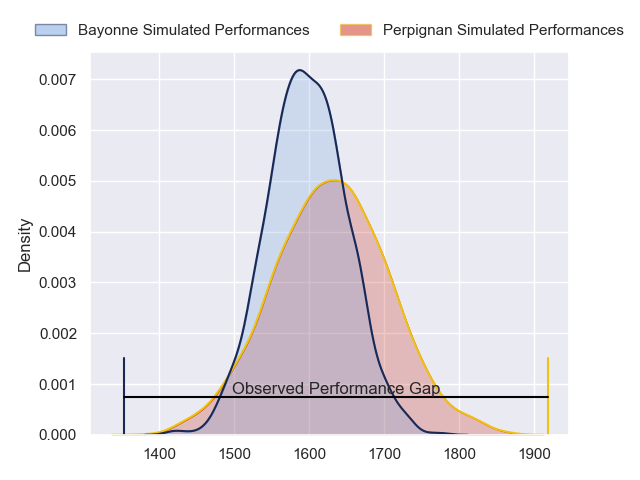
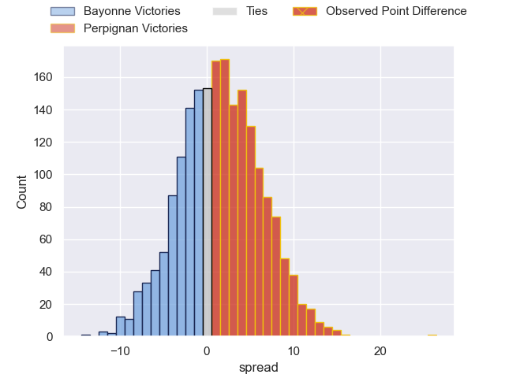
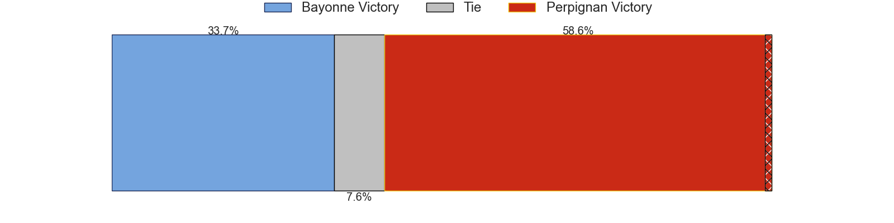
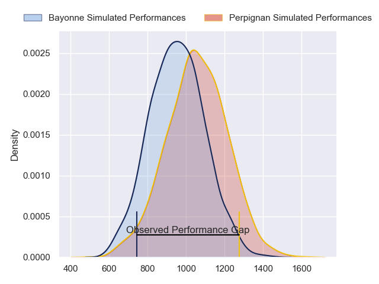
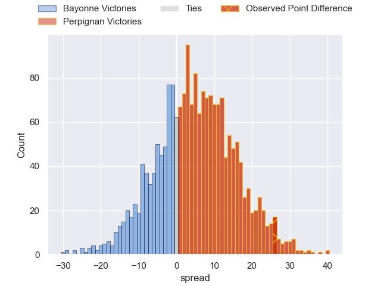
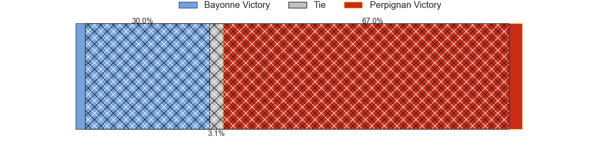
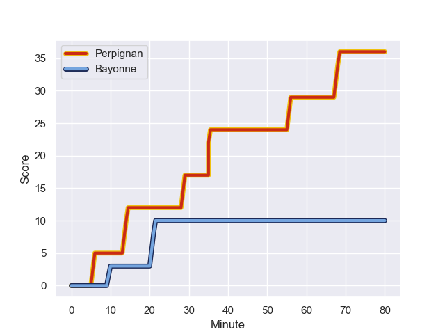
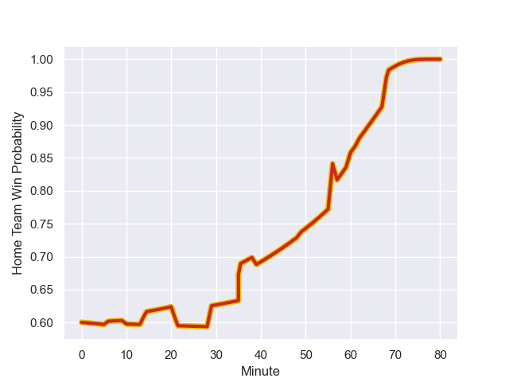

---  
layout: page  
title: Bayonne at Perpignan; 10-36  
date: 2023-12-22 18:00:00 -0500  
categories: "Top 14 Orange 2023" match review  
---
# Bayonne at Perpignan; 10-36

# Club Level Predictions

The first set of predictions treats a club as the smallest object, as the club develops its members, organizes a gameplan, and deploys its players as needed for each match. This club model has a prediction of 0.543, which translates to predicting Perpignan to win by 1.5.

Each club has a rating and a rating deviation (similar to a Glicko rating), and expected performances can be generated. This allows for simulated matches and spreads like the ones below.
## Projected Performances - Club Model

## Projected Spreads - Club Model

## Projected Results - Club Model

# Player Level Predictions - Version 2

Treating teams instead as an entity made up of the currently active players, I have ratings for each player in an altogether different system. These can be combined to form team ratings once teamsheets are announced, weighting starters a bit higher than the reserves. After the match is played, players can be weighted by their minutes on the field, allowing for an accurate measure of the team's composition. With these compiled team ratings, we can make predictions, measure inaccuracy, and update the individual player ratings.
## Prediction with Player Minutes: Perpignan by 4.4

Perpignan by 0.5 on a neutral field
## Prediction without Player Minutes: Perpignan by 5.9

Perpignan by 1.0 on a neutral pitch

## Projected Performances - Player Model

## Projected Spreads - Player Model

## Projected Results - Player Model

## Scores over Time

## Win Probability over Time

There were 4 large changes in win probability in this match

|   Away Minutes | Away Player             |   Away elo |   Number |   Home elo | Home Player           |   Home Minutes |
|---------------:|:------------------------|-----------:|---------:|-----------:|:----------------------|---------------:|
|             47 | Matis Perchaud          |      31.37 |        1 |      38.05 | Xavier Chiocci        |             47 |
|             39 | Vincent Giudicelli      |      34.58 |        2 |      62.55 | Seilala Lam           |             47 |
|             47 | Tevita Tatafu           |      43.09 |        3 |      48.03 | Pietro Ceccarelli     |             62 |
|             57 | Thomas Ceyte            |      53    |        4 |      79.29 | Marvin Orie           |             80 |
|             80 | Lucas Paulos            |      65.27 |        5 |      44.46 | Posolo Tuilagi        |             49 |
|             41 | Pierre Huguet           |      40.12 |        6 |      71.19 | Patrick Sobela        |             54 |
|             80 | Arthur Iturria          |      82.49 |        7 |      55.91 | Jacobus van Tonder    |             62 |
|             80 | Uzair Cassiem           |      76.98 |        8 |      63.88 | Joaquin Oviedo        |             80 |
|             57 | Guillaume Rouet Piffard |      89.57 |        9 |      69.61 | Tom Ecochard          |             71 |
|             60 | Camille Lopez           |     113.43 |       10 |      66.59 | Jake McIntyre         |             80 |
|             80 | Nadir Megdoud           |      68.12 |       11 |      48.02 | Ali Crossdale         |             80 |
|             80 | Federico Mori           |      42.75 |       12 |     117.39 | Jeronimo de la Fuente |             80 |
|             47 | Guillaume Martocq       |      39.27 |       13 |      68.34 | Afusipa Taumoepeau    |             71 |
|             80 | Aurelien Callandret     |      71.45 |       14 |      39.63 | Tavite Veredamu       |             80 |
|             80 | Cheikh Tiberghien       |      31.95 |       15 |      55.88 | Tommaso Allan         |             80 |
|             41 | Thomas Acquier          |      71.5  |       16 |      53.35 | Sacha Lotrian         |             33 |
|             33 | Swan Cormenier          |      50.83 |       17 |      55.91 | Ignacio Ruiz          |             33 |
|             33 | Luke Tagi               |      53.26 |       18 |      33.29 | Mathieu Tanguy        |             31 |
|             39 | Remi Bourdeau           |      96.5  |       19 |      83.71 | So'otala Fa'aso'o     |             26 |
|             23 | Denis Marchois          |      99.25 |       20 |     101.15 | Arthur Joly           |             18 |
|             23 | Maxime Machenaud        |      75.03 |       21 |      26    | Ewan Bertheau         |             18 |
|             20 | Thomas Dolhagaray       |      43.85 |       22 |      42.68 | Matteo Rodor          |              9 |
|             33 | Reece Hodge             |      80.77 |       23 |     108.56 | Mathieu Acebes        |              9 |

