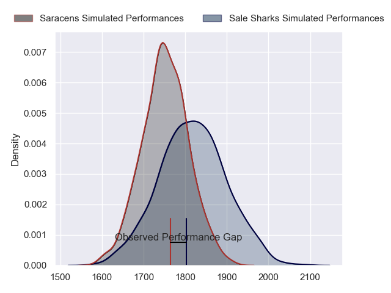
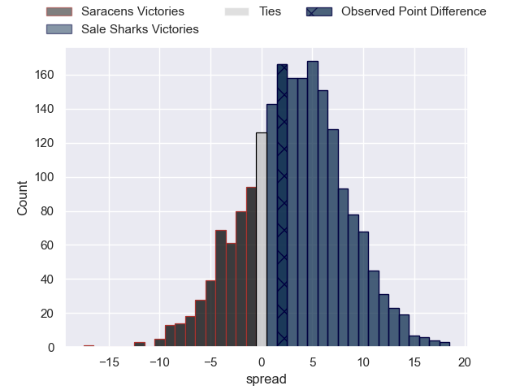
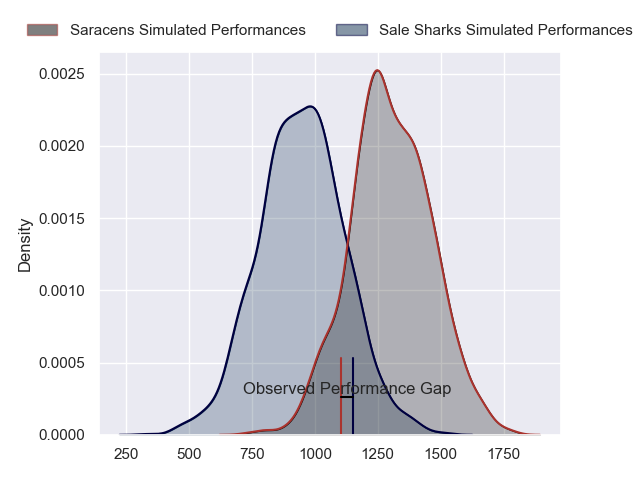
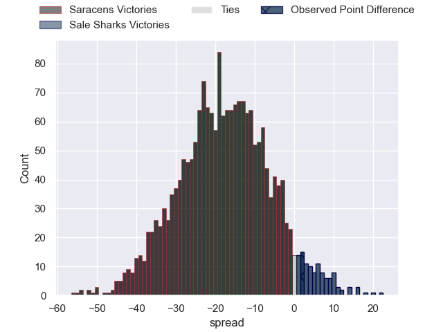
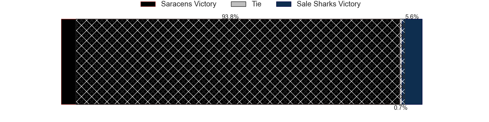
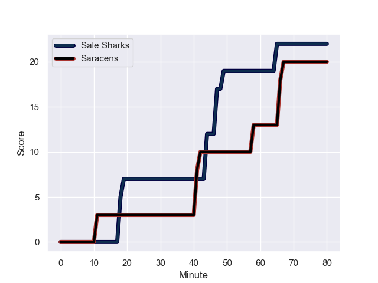
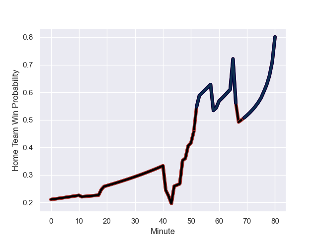

---  
layout: page  
title: Saracens at Sale Sharks; 20-22  
date: 2023-12-22 18:00:00 -0500  
categories: "Gallagher Premiership 2023" match review  
---
# Saracens at Sale Sharks; 20-22

# Club Level Predictions

The first set of predictions treats a club as the smallest object, as the club develops its members, organizes a gameplan, and deploys its players as needed for each match. This club model has a prediction of 0.599, which translates to predicting Sale Sharks to win by 3.5.

Each club has a rating and a rating deviation (similar to a Glicko rating), and expected performances can be generated. This allows for simulated matches and spreads like the ones below.
## Projected Performances - Club Model

## Projected Spreads - Club Model

## Projected Results - Club Model

# Player Level Predictions - Version 2

Treating teams instead as an entity made up of the currently active players, I have ratings for each player in an altogether different system. These can be combined to form team ratings once teamsheets are announced, weighting starters a bit higher than the reserves. After the match is played, players can be weighted by their minutes on the field, allowing for an accurate measure of the team's composition. With these compiled team ratings, we can make predictions, measure inaccuracy, and update the individual player ratings.
## Prediction with Player Minutes: Saracens by 14.6

Saracens by 19.5 on a neutral field
## Prediction without Player Minutes: Saracens by 14.0

Saracens by 18.9 on a neutral pitch

## Projected Performances - Player Model

## Projected Spreads - Player Model

## Projected Results - Player Model

## Scores over Time

## Win Probability over Time

There were 15 large changes in win probability in this match

|   Away Minutes | Away Player          |   Away elo |   Number |   Home elo | Home Player          |   Home Minutes |
|---------------:|:---------------------|-----------:|---------:|-----------:|:---------------------|---------------:|
|             52 | Mako Vunipola        |     129.43 |        1 |      46.65 | Ross Harrison        |             80 |
|             53 | Jamie George         |     118.22 |        2 |     108.32 | Agustin Creevy       |             41 |
|             76 | Alec Clarey          |      45.21 |        3 |      46.65 | Nic Schonert         |             49 |
|             80 | Maro Itoje           |     113.82 |        4 |      46.65 | Cobus Wiese          |             80 |
|             76 | Theo McFarland       |      52.88 |        5 |      46.65 | Jonny Hill           |             58 |
|             80 | Juan Martin Gonzalez |     103.72 |        6 |      46.65 | Ernst van Rhyn       |             80 |
|             80 | Andy Christie        |      49.66 |        7 |      46.65 | Ben Curry            |             80 |
|             52 | Billy Vunipola       |     135.31 |        8 |      46.65 | Jean-Luc du Preez    |             80 |
|             60 | Ivan van Zyl         |      81.9  |        9 |      46.65 | Gus Warr             |             80 |
|             80 | Owen Farrell         |     145.79 |       10 |     107.57 | George Ford          |             80 |
|             61 | Sean Maitland        |     106.08 |       11 |      46.65 | Arron Reed           |             80 |
|             80 | Olly Hartley         |      34.59 |       12 |     115.18 | Manu Tuilagi         |             43 |
|             80 | Nick Tompkins        |     121.45 |       13 |      46.65 | Robert du Preez      |             80 |
|             80 | Lucio Cinti          |      61.07 |       14 |      46.65 | Tom Roebuck          |             80 |
|             80 | Alex Goode           |      93.48 |       15 |      46.65 | Joe Carpenter        |             80 |
|             27 | Theo Dan             |      52.97 |       16 |      46.65 | Luke Cowan-Dickie    |             39 |
|             28 | Tom West             |      54.7  |       17 |      46.65 | Tumy Onasanya        |              0 |
|             11 | Logovi'i Mulipola    |      46.65 |       18 |      46.65 | Asher Opoku-Fordjour |             31 |
|             28 | Hugh Tizard          |      50.9  |       19 |      46.65 | Josh Beaumont        |             22 |
|              4 | Toby Knight          |      35.35 |       20 |      46.65 | Sam Dugdale          |              0 |
|             20 | Gareth Simpson       |      46.65 |       21 |      46.65 | Nye Thomas           |              0 |
|              0 | Manu Vunipola        |      57.13 |       22 |      46.65 | Sam James            |              0 |
|             12 | Tom Parton           |     106.46 |       23 |      46.65 | Sam Bedlow           |             37 |

