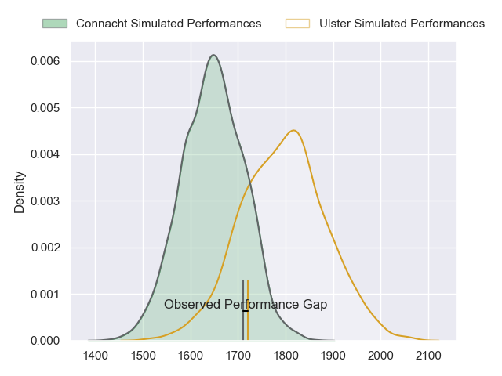
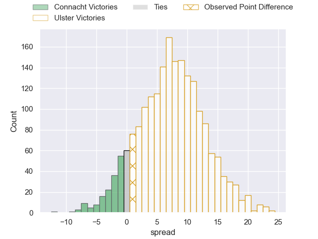
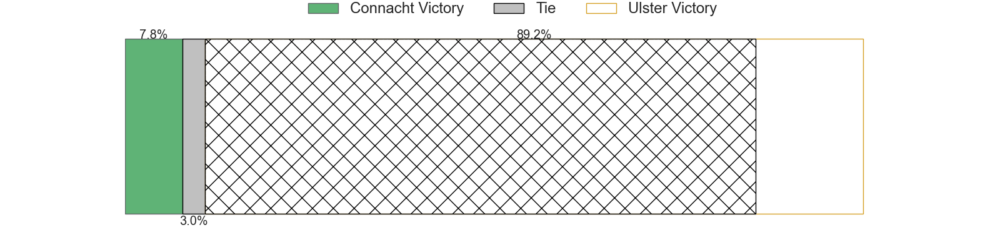
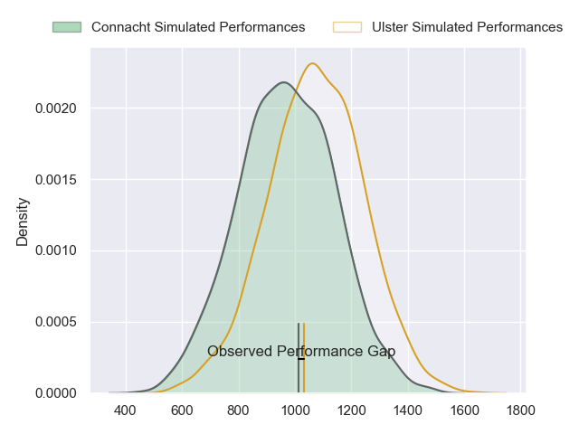
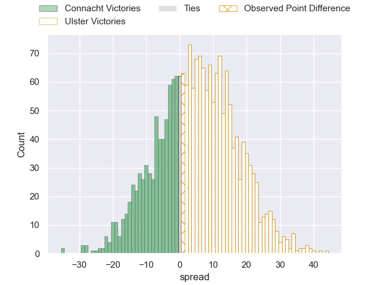
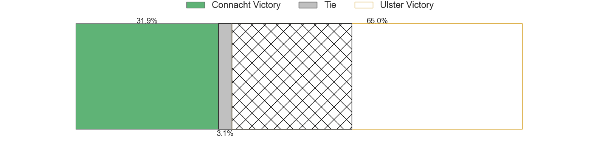
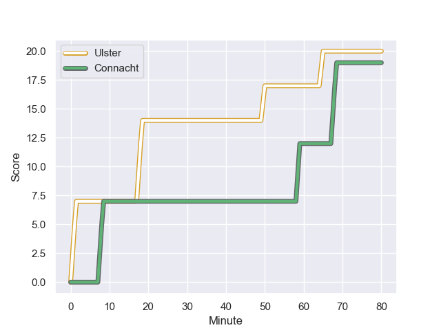
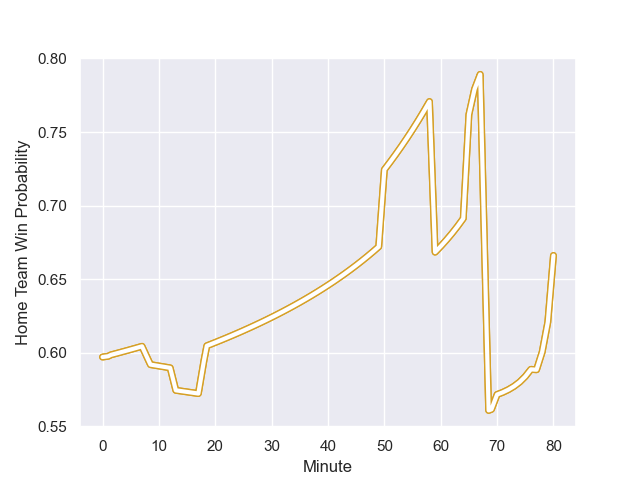

---  
layout: page  
title: Connacht at Ulster; 19-20  
date: 2023-12-22 18:00:00 -0500  
categories: "United Rugby Championship 2023" match review  
---
# Connacht at Ulster; 19-20

# Club Level Predictions

The first set of predictions treats a club as the smallest object, as the club develops its members, organizes a gameplan, and deploys its players as needed for each match. This club model has a prediction of 0.696, which translates to predicting Ulster to win by 7.3.

Each club has a rating and a rating deviation (similar to a Glicko rating), and expected performances can be generated. This allows for simulated matches and spreads like the ones below.
## Projected Performances - Club Model

## Projected Spreads - Club Model

## Projected Results - Club Model

# Player Level Predictions - Version 2

Treating teams instead as an entity made up of the currently active players, I have ratings for each player in an altogether different system. These can be combined to form team ratings once teamsheets are announced, weighting starters a bit higher than the reserves. After the match is played, players can be weighted by their minutes on the field, allowing for an accurate measure of the team's composition. With these compiled team ratings, we can make predictions, measure inaccuracy, and update the individual player ratings.
## Prediction with Player Minutes: Ulster by 4.4

Ulster by 0.1 on a neutral field
## Prediction without Player Minutes: Ulster by 4.6

Ulster by 0.3 on a neutral pitch

## Projected Performances - Player Model

## Projected Spreads - Player Model

## Projected Results - Player Model

## Scores over Time

## Win Probability over Time

There were 6 large changes in win probability in this match

|   Away Minutes | Away Player           |   Away elo |   Number |   Home elo | Home Player       |   Home Minutes |
|---------------:|:----------------------|-----------:|---------:|-----------:|:------------------|---------------:|
|             65 | Denis Buckley         |      65.86 |        1 |      48.7  | Andrew Warwick    |             51 |
|             50 | Tadgh McElroy         |      43.53 |        2 |      38.22 | Tom Stewart       |             80 |
|             66 | Finlay Bealham        |      92.8  |        3 |      83.07 | Marty Moore       |             51 |
|             61 | Darragh Murray        |      51.04 |        4 |      63.56 | Kieran Treadwell  |             70 |
|             80 | Gavin Thornbury       |      70.35 |        5 |      70.8  | Iain Henderson    |             80 |
|             80 | Cian Prendergast      |      52.71 |        6 |      50.5  | Matthew Rea       |             80 |
|             80 | Shamus Hurley-Langton |      47.82 |        7 |      58.12 | Sean Reffell      |             53 |
|             13 | Sean F O'Brien        |      46.55 |        8 |      74.64 | Nick Timoney      |             80 |
|             80 | Caolin Blade          |      60.41 |        9 |      82.87 | John Cooney       |             80 |
|             65 | Jack Carty            |      92.13 |       10 |      45.75 | Jake Flannery     |             61 |
|             80 | Byron Ralston         |      29.82 |       11 |      66.08 | Jacob Stockdale   |             80 |
|             80 | Bundee Aki            |     122.13 |       12 |      92.45 | Stuart McCloskey  |             80 |
|             80 | Tom Farrell           |      52.76 |       13 |      56.67 | James Hume        |             66 |
|             76 | Shayne Bolton         |      46.33 |       14 |      52.97 | Robert Baloucoune |             80 |
|             80 | Mack Hansen           |      77.81 |       15 |      91.43 | Will Addison      |             77 |
|             67 | Conor Oliver          |      67.56 |       16 |      94.23 | Steven Kitshoff   |             29 |
|             30 | Dave Heffernan        |      50.49 |       17 |      47.8  | Tom O'Toole       |             29 |
|             19 | Niall Murray          |      68.89 |       18 |      55.65 | Harry Sheridan    |             27 |
|             15 | JJ Hanrahan           |      92.11 |       19 |      45.06 | Nathan Doak       |             19 |
|             15 | Peter Dooley          |      99.78 |       20 |      51.44 | Jude Posthlewaite |             14 |
|             14 | Jack Aungier          |      58.03 |       21 |      93.74 | Alan O'Connor     |             10 |
|              4 | Shane Jennings        |      47.6  |       22 |      46.65 | Shea O'Brien      |              3 |

