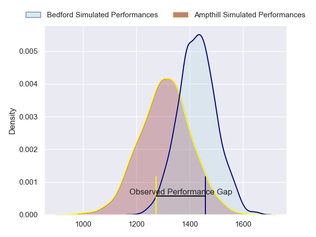
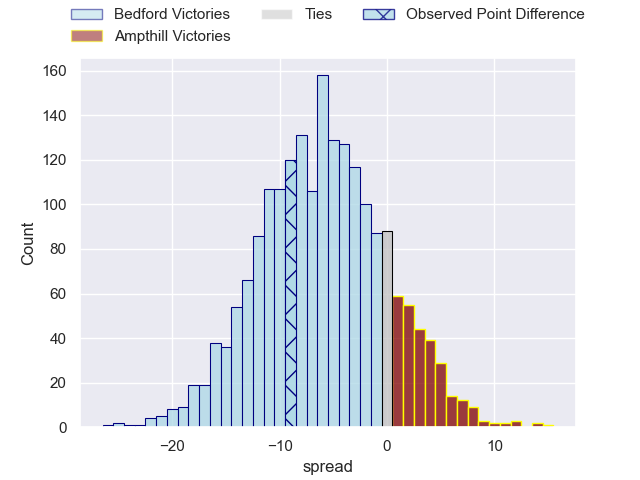
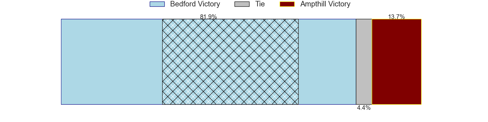
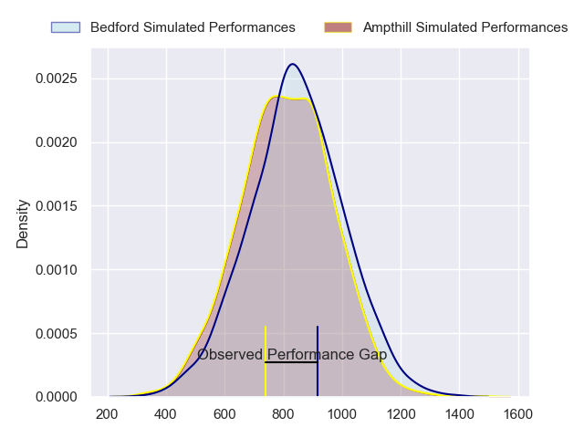
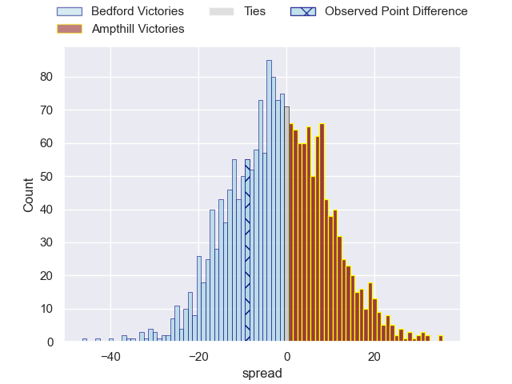
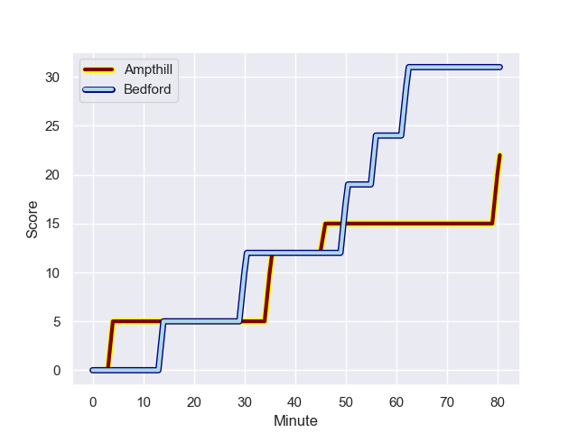
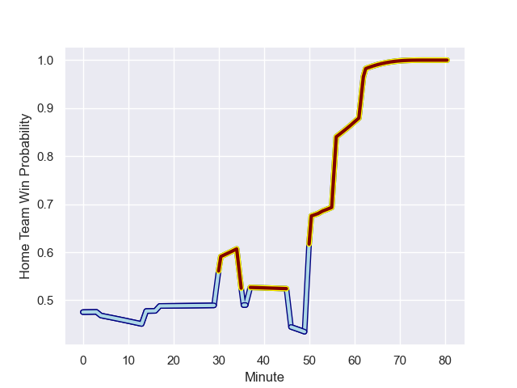

---  
layout: page  
title: Bedford at Ampthill; 31-22  
date: 2023-12-23 18:00:00 -0500  
categories: "RFU Championship 2023" match review  
---
# Bedford at Ampthill; 31-22

# Club Level Predictions

The first set of predictions treats a club as the smallest object, as the club develops its members, organizes a gameplan, and deploys its players as needed for each match. This club model has a prediction of 0.341, which translates to predicting Bedford to win by 5.9.

Each club has a rating and a rating deviation (similar to a Glicko rating), and expected performances can be generated. This allows for simulated matches and spreads like the ones below.
## Projected Performances - Club Model

## Projected Spreads - Club Model

## Projected Results - Club Model

# Player Level Predictions - Version 2

Treating teams instead as an entity made up of the currently active players, I have ratings for each player in an altogether different system. These can be combined to form team ratings once teamsheets are announced, weighting starters a bit higher than the reserves. After the match is played, players can be weighted by their minutes on the field, allowing for an accurate measure of the team's composition. With these compiled team ratings, we can make predictions, measure inaccuracy, and update the individual player ratings.
## Prediction with Player Minutes: Bedford by 1.1

Bedford by 4.3 on a neutral field
## Prediction without Player Minutes: Bedford by 0.1

Bedford by 3.3 on a neutral pitch

## Projected Performances - Player Model

## Projected Spreads - Player Model

## Projected Results - Player Model

## Scores over Time

## Win Probability over Time

There were 11 large changes in win probability in this match

|   Away Minutes | Away Player          |   Away elo |   Number |   Home elo | Home Player                 |   Home Minutes |
|---------------:|:---------------------|-----------:|---------:|-----------:|:----------------------------|---------------:|
|             50 | Jamie Jack           |      28.16 |        1 |      55.48 | Sam Crean                   |             17 |
|             74 | James Fish           |      54.68 |        2 |      34.95 | Samson Adejimi              |             68 |
|             50 | Bryan O'Connor       |      55.85 |        3 |      40.26 | Harvey Beaton               |             60 |
|             50 | Jordan Onojaife      |      43.47 |        4 |      47.72 | Iestyn Rees                 |             63 |
|             68 | Alex Woolford        |      73.54 |        5 |      57.89 | Kaden Pearce-Paul           |             80 |
|             80 | Luke Frost           |      35.04 |        6 |      36.03 | Ollie Stonham               |             80 |
|             80 | Henry Pollock        |      51.42 |        7 |      28    | Josh Smart                  |             50 |
|             68 | Joe Howard           |      37.37 |        8 |      48.09 | Izaiha Moore-Aiono          |             80 |
|             80 | Alex Day             |      82.05 |        9 |      55.16 | Charlie Bracken             |             62 |
|             80 | Louis Grimoldby      |      33.88 |       10 |      53.13 | Gwyn Parks                  |             62 |
|             80 | Dean Adamson         |      73.72 |       11 |      44.31 | Brandon Jackson-Richards    |             80 |
|             80 | Michael Le Bourgeois |      66.26 |       12 |      82.61 | Fraser James Kevin Strachan |             80 |
|             37 | Jamie Elliott        |      41.34 |       13 |      45.82 | Oli Morris                  |             53 |
|             80 | Sean French          |      56.28 |       14 |      54.93 | Tobias Elliott              |             80 |
|             80 | Matthew Worley       |      66    |       15 |      56.35 | Tomas Bacon                 |             80 |
|             43 | William Maisey       |      80.45 |       16 |      46.52 | Jasper McGuire              |             63 |
|             30 | Joey Conway          |      58.75 |       17 |      45.7  | Nathan Michelow             |             30 |
|             30 | Robin Williams       |      67.09 |       18 |      43.31 | Alexandrer Harmes           |             27 |
|             30 | Ed Prowse            |      63.99 |       19 |      38.85 | Dominic Hardman             |             20 |
|             12 | Kieran Curran        |      52.26 |       20 |      67.28 | Peter White                 |             18 |
|             12 | Kayde Sylvester      |      55.02 |       21 |      42.7  | Josh Barton                 |             18 |
|              6 | Craig Wright         |      49.53 |       22 |      43.4  | Joe Peard                   |             17 |
|            nan | nan                  |     nan    |       23 |      34    | Beck Cutting                |             12 |

