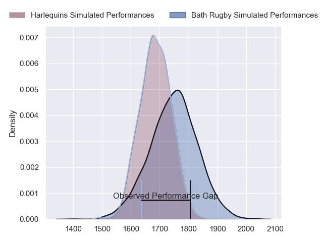
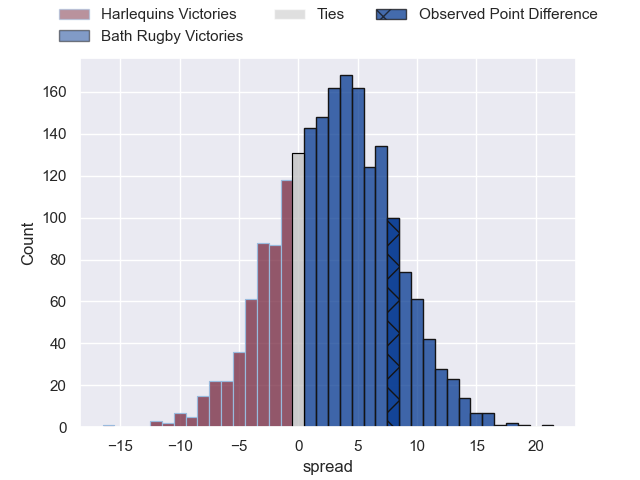
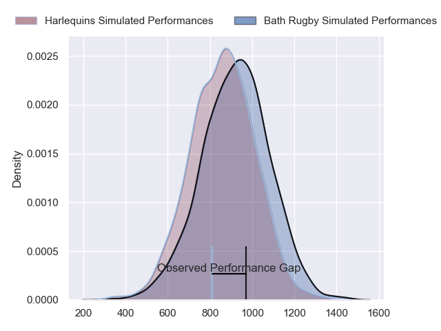
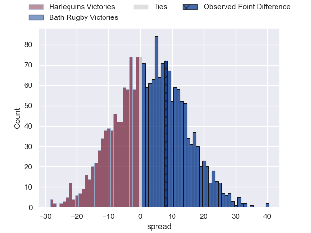
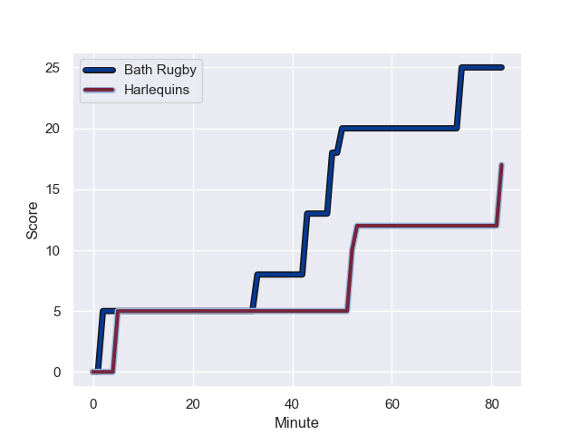
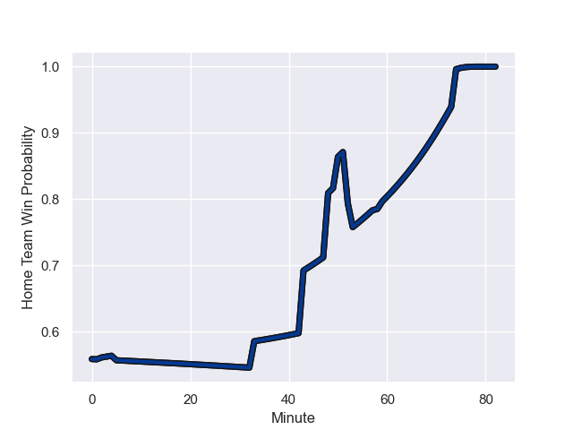

---  
layout: page  
title: Harlequins at Bath Rugby; 17-25  
date: 2023-12-23 18:00:00 -0500  
categories: "Gallagher Premiership 2023" match review  
---
# Harlequins at Bath Rugby; 17-25

# Club Level Predictions

The first set of predictions treats a club as the smallest object, as the club develops its members, organizes a gameplan, and deploys its players as needed for each match. This club model has a prediction of 0.584, which translates to predicting Bath Rugby to win by 3.0.

Each club has a rating and a rating deviation (similar to a Glicko rating), and expected performances can be generated. This allows for simulated matches and spreads like the ones below.
## Projected Performances - Club Model

## Projected Spreads - Club Model

## Projected Results - Club Model

# Player Level Predictions - Version 2

Treating teams instead as an entity made up of the currently active players, I have ratings for each player in an altogether different system. These can be combined to form team ratings once teamsheets are announced, weighting starters a bit higher than the reserves. After the match is played, players can be weighted by their minutes on the field, allowing for an accurate measure of the team's composition. With these compiled team ratings, we can make predictions, measure inaccuracy, and update the individual player ratings.
## Prediction with Player Minutes: Bath Rugby by 2.6

Harlequins by 2.3 on a neutral field
## Prediction without Player Minutes: Bath Rugby by 2.2

Harlequins by 2.6 on a neutral pitch

## Projected Performances - Player Model

## Projected Spreads - Player Model

## Projected Results - Player Model

## Scores over Time

## Win Probability over Time

There were 7 large changes in win probability in this match

|   Away Minutes | Away Player               |   Away elo |   Number |   Home elo | Home Player     |   Home Minutes |
|---------------:|:--------------------------|-----------:|---------:|-----------:|:----------------|---------------:|
|             50 | Joe Marler                |     105.78 |        1 |      46.65 | Beno Obano      |             58 |
|             70 | Jack Walker               |      46.65 |        2 |      46.65 | Niall Annett    |             58 |
|             50 | Will Collier              |      46.65 |        3 |      46.65 | Thomas du Toit  |             58 |
|             57 | Joe Launchbury            |      46.65 |        4 |      46.65 | Elliott Stooke  |             74 |
|             57 | Stephan Lewies            |      46.65 |        5 |      46.65 | Charlie Ewels   |             82 |
|             50 | Chandler Cunningham-South |      46.65 |        6 |      46.65 | GJ van Velze    |             82 |
|             82 | James Chisholm            |      46.65 |        7 |      46.65 | Miles Reid      |             82 |
|             82 | Alex Dombrandt            |      46.65 |        8 |      46.65 | Alfie Barbeary  |             64 |
|             76 | Danny Care                |     134.68 |        9 |      46.65 | Ben Spencer     |             70 |
|             82 | Marcus Smith              |      75.4  |       10 |     142.7  | Finn Russell    |             76 |
|             82 | Louis Lynagh              |      46.65 |       11 |      46.65 | Will Muir       |             82 |
|             82 | Andre Esterhuizen         |      46.65 |       12 |      46.65 | Max Ojomoh      |             59 |
|             66 | Will Joseph               |      46.65 |       13 |      64.01 | Ollie Lawrence  |             82 |
|             82 | Nick David                |      46.65 |       14 |      46.65 | Joe Cokanasiga  |             82 |
|             82 | Tyrone Green              |      46.65 |       15 |      46.65 | Matt Gallagher  |             82 |
|             12 | Sam Riley                 |      46.65 |       16 |      46.65 | Tom Dunn        |             24 |
|             32 | Fin Baxter                |      46.65 |       17 |      46.65 | Juan Schoeman   |             24 |
|             32 | Dillon Lewis              |      82.79 |       18 |      34.5  | Will Stuart     |             24 |
|             25 | Irne Herbst               |      46.65 |       19 |      46.65 | Quinn Roux      |              8 |
|             25 | George Hammond            |      46.65 |       20 |      46.65 | Jaco Coetzee    |             18 |
|             32 | Will Evans                |      46.65 |       21 |      46.65 | Louis Schreuder |             12 |
|              6 | Will Porter               |      46.65 |       22 |      46.65 | Orlando Bailey  |              6 |
|             16 | Oscar Beard               |      46.65 |       23 |      56.71 | Cameron Redpath |             23 |

