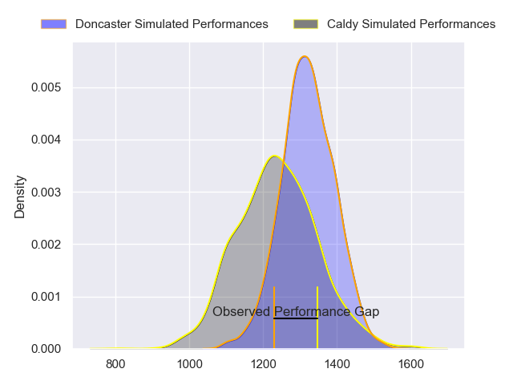
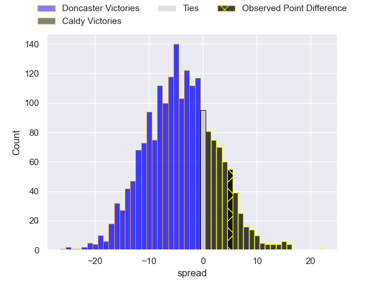
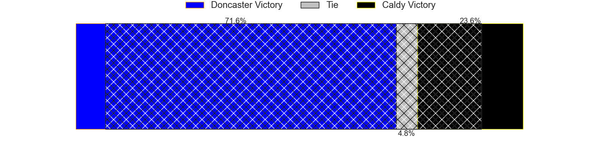
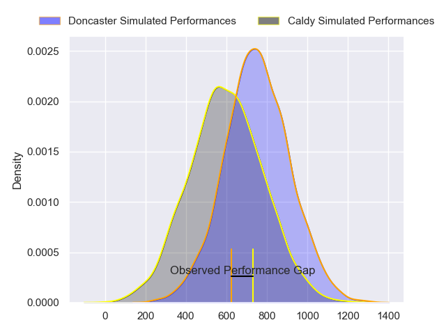
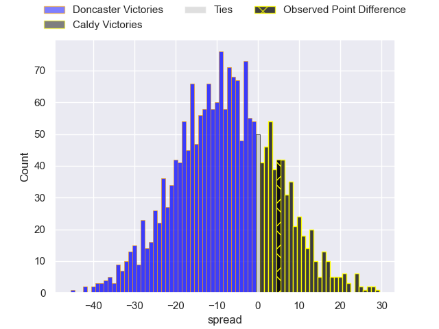
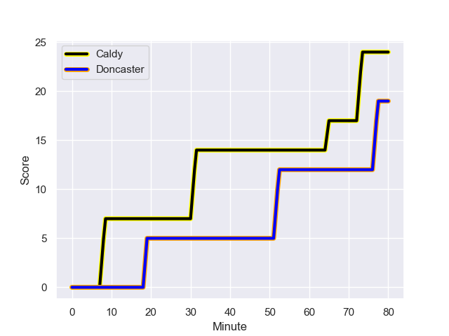
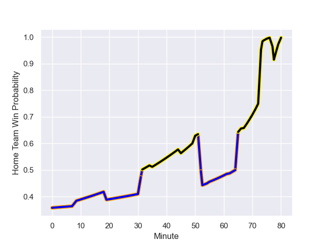

---  
layout: page  
title: Doncaster at Caldy; 19-24  
date: 2023-12-23 18:00:00 -0500  
categories: "RFU Championship 2023" match review  
---
# Doncaster at Caldy; 19-24

# Club Level Predictions

The first set of predictions treats a club as the smallest object, as the club develops its members, organizes a gameplan, and deploys its players as needed for each match. This club model has a prediction of 0.387, which translates to predicting Doncaster to win by 4.1.

Each club has a rating and a rating deviation (similar to a Glicko rating), and expected performances can be generated. This allows for simulated matches and spreads like the ones below.
## Projected Performances - Club Model

## Projected Spreads - Club Model

## Projected Results - Club Model

# Player Level Predictions - Version 2

Treating teams instead as an entity made up of the currently active players, I have ratings for each player in an altogether different system. These can be combined to form team ratings once teamsheets are announced, weighting starters a bit higher than the reserves. After the match is played, players can be weighted by their minutes on the field, allowing for an accurate measure of the team's composition. With these compiled team ratings, we can make predictions, measure inaccuracy, and update the individual player ratings.
## Prediction with Player Minutes: Doncaster by 6.5

Doncaster by 9.6 on a neutral field
## Prediction without Player Minutes: Doncaster by 5.2

Doncaster by 8.3 on a neutral pitch

## Projected Performances - Player Model

## Projected Spreads - Player Model

## Projected Results - Player Model

## Scores over Time

## Win Probability over Time

There were 13 large changes in win probability in this match

|   Away Minutes | Away Player              |   Away elo |   Number |   Home elo | Home Player          |   Home Minutes |
|---------------:|:-------------------------|-----------:|---------:|-----------:|:---------------------|---------------:|
|             76 | Conor Davidson           |      52.6  |        1 |      33.28 | Adam Aigbokhae       |             74 |
|             51 | George Roberts           |      40.59 |        2 |      25.18 | Oliver Hearn         |             80 |
|             45 | Corrie Barrett           |      43.08 |        3 |      21.23 | Joe Sproston         |             50 |
|             62 | Fyn Brown                |      38.08 |        4 |      38.61 | Martin Gerrard       |             80 |
|             80 | Ehize Ehizode            |      18.14 |        5 |      23.5  | Thomas Sanders       |             80 |
|             80 | Harry Wilson             |      33.18 |        6 |      47.78 | Ewan Murphy          |             80 |
|             52 | Archie Smeaton           |      47.67 |        7 |      51.2  | Ciaran Booth         |             80 |
|             80 | Jack Digby               |      65.45 |        8 |      27.8  | Josiah Dickinson     |             80 |
|             76 | Alex Dolly               |      73.58 |        9 |      26.67 | Chris Pilgrim        |             80 |
|             76 | Russell Bennett          |      68.94 |       10 |      27.51 | Rhys Hayes           |             80 |
|             80 | Westleigh Alleyne Holden |      50.24 |       11 |      27.34 | Benjamin Jones       |             80 |
|             35 | Connor Edwards           |      25.34 |       12 |      42.24 | Michael Barlow       |             55 |
|             80 | Joe Margetts             |      52.26 |       13 |      40.82 | Connor Wilkinson     |             67 |
|             80 | George Simpson           |      38.33 |       14 |      26.75 | Nick Royle           |             80 |
|             80 | Billy McBryde            |      76.38 |       15 |      52.36 | Matt Kilcourse       |             80 |
|             18 | Adam Hopkinson           |      44.91 |       16 |      46.38 | Rekeiti Ma'asi-White |             25 |
|             45 | Joe Bedlow               |      39.87 |       17 |      51.99 | Monty Weatherby      |             30 |
|             35 | Andrew Foster            |      74.89 |       18 |      11.49 | Michael Cartmill     |             13 |
|             29 | Tom Doughty              |      46.63 |       19 |      40.57 | Ryan Higginson       |              6 |
|             28 | Evan Mintern             |      69.62 |       20 |     nan    | nan                  |            nan |
|              4 | Harrison Courtney        |      52.96 |       21 |     nan    | nan                  |            nan |
|              4 | Ollie Fox                |      13.9  |       22 |     nan    | nan                  |            nan |
|              4 | Jack Metcalf             |      27.41 |       23 |     nan    | nan                  |            nan |

