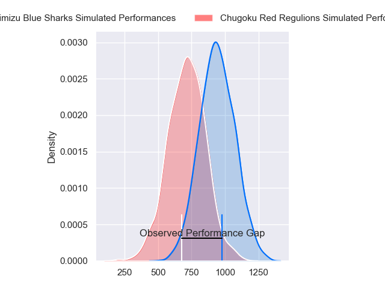
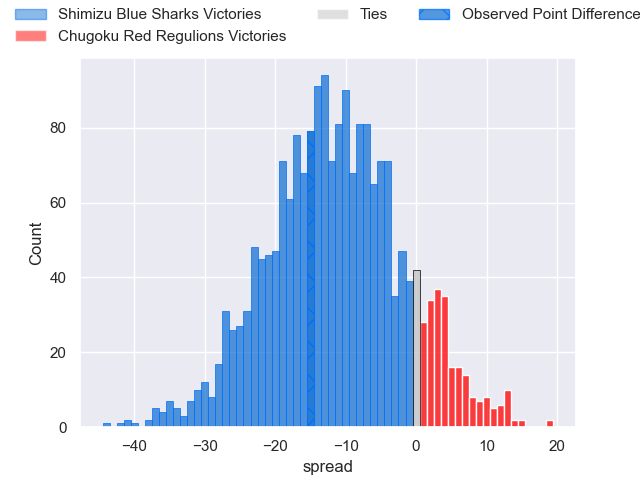
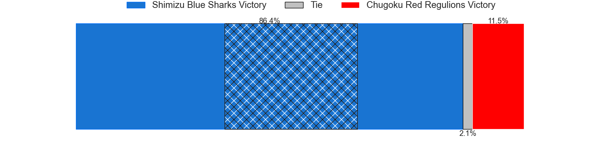
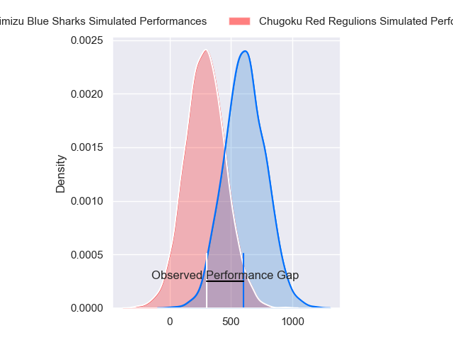
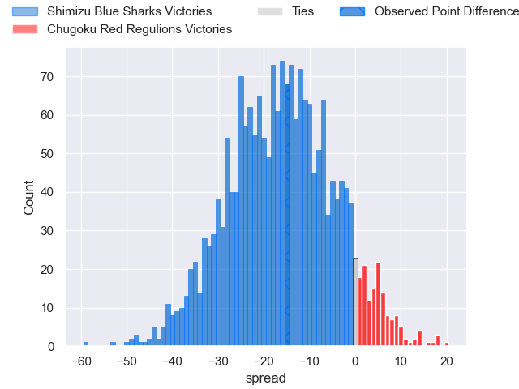
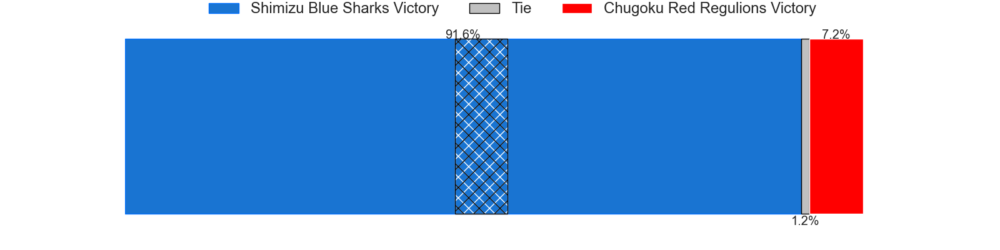
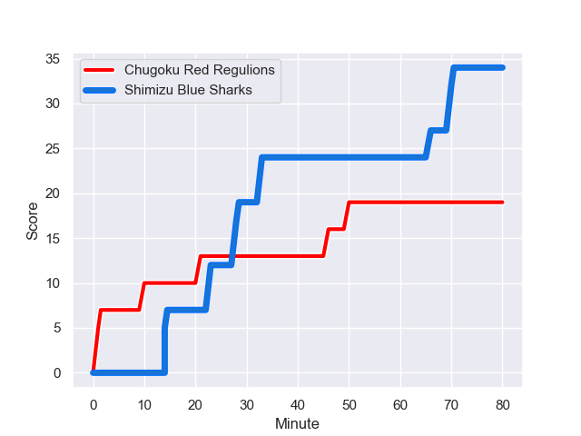
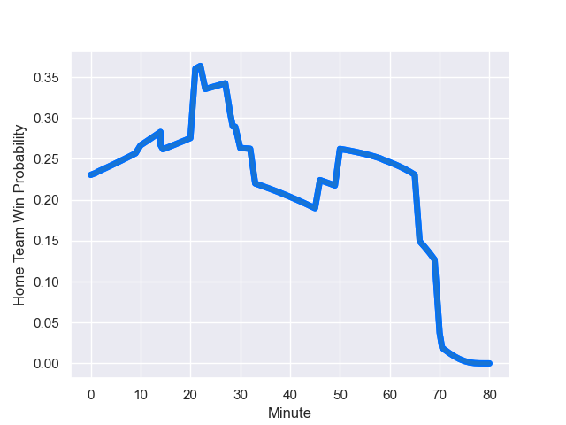

---  
layout: page  
title: Shimizu Blue Sharks at Chugoku Red Regulions; 34-19  
date: 2023-12-23 18:00:00 -0500  
categories: "Japan Rugby League One D3 2023" match review  
---
# Shimizu Blue Sharks at Chugoku Red Regulions; 34-19

# Club Level Predictions

The first set of predictions treats a club as the smallest object, as the club develops its members, organizes a gameplan, and deploys its players as needed for each match. This club model has a prediction of 0.232, which translates to predicting Shimizu Blue Sharks to win by 11.2.

Each club has a rating and a rating deviation (similar to a Glicko rating), and expected performances can be generated. This allows for simulated matches and spreads like the ones below.
## Projected Performances - Club Model

## Projected Spreads - Club Model

## Projected Results - Club Model

# Player Level Predictions - Version 2

Treating teams instead as an entity made up of the currently active players, I have ratings for each player in an altogether different system. These can be combined to form team ratings once teamsheets are announced, weighting starters a bit higher than the reserves. After the match is played, players can be weighted by their minutes on the field, allowing for an accurate measure of the team's composition. With these compiled team ratings, we can make predictions, measure inaccuracy, and update the individual player ratings.
## Prediction with Player Minutes: Shimizu Blue Sharks by 13.4

Shimizu Blue Sharks by 16.5 on a neutral field
## Prediction without Player Minutes: Shimizu Blue Sharks by 13.9

Shimizu Blue Sharks by 17.1 on a neutral pitch

## Projected Performances - Player Model

## Projected Spreads - Player Model

## Projected Results - Player Model

## Scores over Time

## Win Probability over Time

There were 9 large changes in win probability in this match

|   Away Minutes | Away Player         |   Away elo |   Number |   Home elo | Home Player          |   Home Minutes |
|---------------:|:--------------------|-----------:|---------:|-----------:|:---------------------|---------------:|
|             75 | Sanshiro Nomura     |      46.65 |        1 |      17.69 | Kojiro Arito         |             48 |
|             66 | Yasuyuki Yamamoto   |      46.65 |        2 |      18.02 | Kentaro Iwanaga      |             70 |
|             71 | Uha Lee             |      46.65 |        3 |      39.03 | Kento Miyata         |             75 |
|             59 | Sam Chongkit        |      71.38 |        4 |     -46.33 | Taro Nishikawa       |             80 |
|             80 | Tom Rowe            |      44.69 |        5 |     -28.37 | Kouta Moriyama       |             80 |
|             80 | Usa Baleilautoka    |      45.45 |        6 |      31.74 | Shintaro Matsuda     |             80 |
|             80 | Koudai Takahashi    |      44.08 |        7 |      43.27 | Kengo Ishiwatari     |             30 |
|             71 | Murphy Taramai      |     -20.79 |        8 |     -13.77 | Ed Quirk             |             80 |
|             74 | Haruhiro Sakahara   |      46.65 |        9 |      -6.93 | Shohei Tsukamoto     |             80 |
|             21 | Lima Sopoaga        |      84.36 |       10 |      46.65 | Miyazaki Hayato      |             80 |
|             46 | Michael Va'a Toloke |      28.74 |       11 |      34.57 | Hirofumi Higashikawa |             56 |
|             80 | Masaya Yamada       |      46.85 |       12 |      32.19 | Shinya Hirayama      |             56 |
|             80 | Siale Piutau        |      69.59 |       13 |      46.65 | Azuma Syougo         |             80 |
|             80 | Toru Kanazawa       |      44.3  |       14 |      29.78 | Kentaro Fujii        |             80 |
|             80 | Coenie van Wyk      |      36.01 |       15 |      11.52 | Yuto Matsuoka        |             80 |
|             59 | Naoki Moriya        |     -17.76 |       16 |      -2.15 | Shun Kawaguchi       |             29 |
|             34 | John-Ben Kotze      |      65.56 |       17 |      23.74 | Toshiyuki Ooki       |             32 |
|             21 | Tetsunori Osaki     |      36.6  |       18 |     -17.15 | Masaaki Morita       |             24 |
|             14 | Riki Tanaka         |      55.06 |       19 |      15.72 | Hashizo Yoshida      |             24 |
|              9 | Takatoshi Sugawara  |      22.92 |       20 |      31.48 | Noriyuki Kureyama    |             21 |
|              9 | Ryo Sato            |      32.23 |       21 |      25.14 | Yuuki Asai           |             10 |
|              6 | Reijiro Usui        |      43.7  |       22 |      22.12 | Saiya Kitajima       |              5 |
|              5 | Takeo Yoshikawa     |      46.65 |       23 |     nan    | nan                  |            nan |

