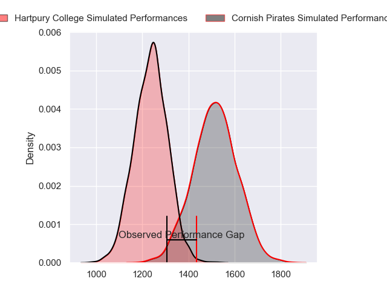
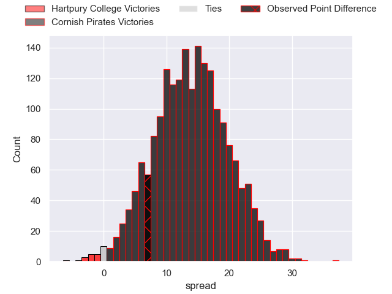
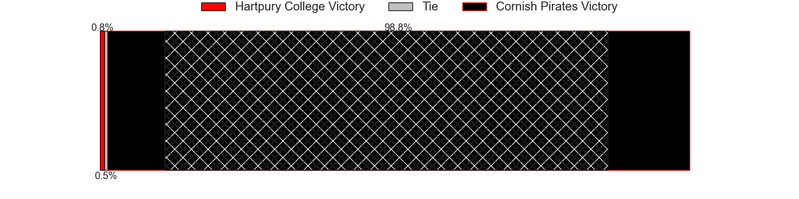
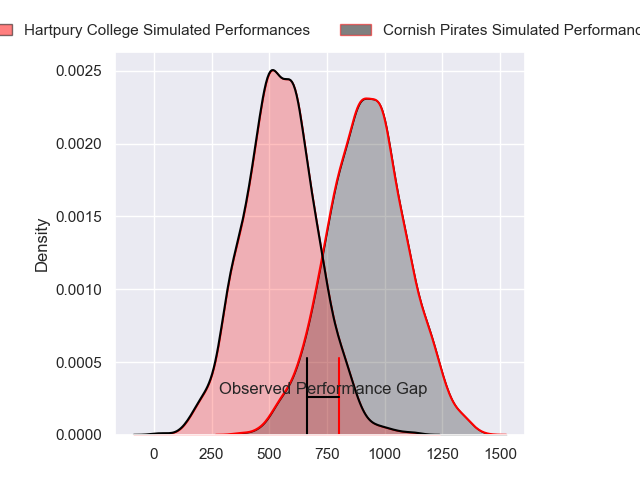
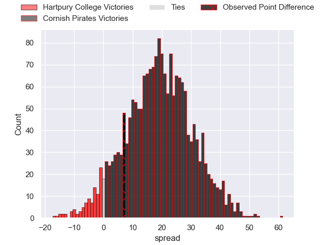
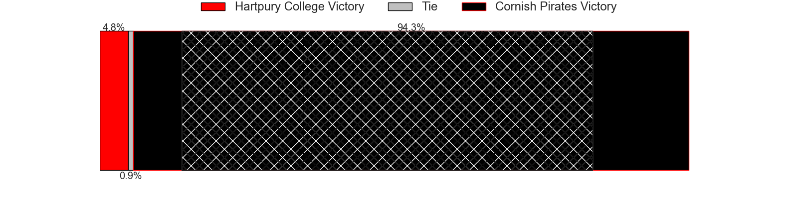
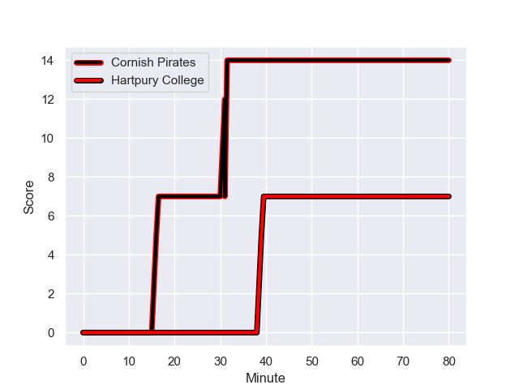
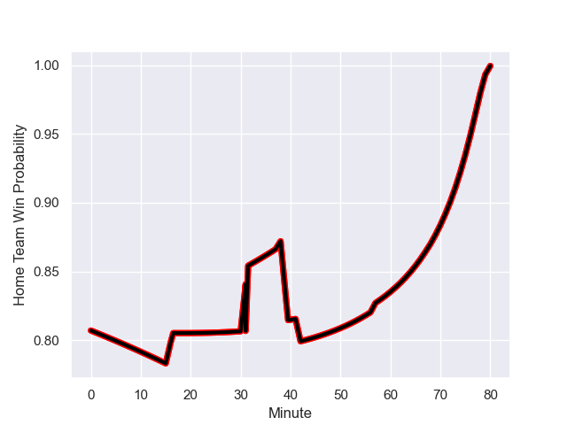

---  
layout: page  
title: Hartpury College at Cornish Pirates; 7-14  
date: 2023-12-23 18:00:00 -0500  
categories: "RFU Championship 2023" match review  
---
# Hartpury College at Cornish Pirates; 7-14

# Club Level Predictions

The first set of predictions treats a club as the smallest object, as the club develops its members, organizes a gameplan, and deploys its players as needed for each match. This club model has a prediction of 0.826, which translates to predicting Cornish Pirates to win by 13.9.

Each club has a rating and a rating deviation (similar to a Glicko rating), and expected performances can be generated. This allows for simulated matches and spreads like the ones below.
## Projected Performances - Club Model

## Projected Spreads - Club Model

## Projected Results - Club Model

# Player Level Predictions - Version 2

Treating teams instead as an entity made up of the currently active players, I have ratings for each player in an altogether different system. These can be combined to form team ratings once teamsheets are announced, weighting starters a bit higher than the reserves. After the match is played, players can be weighted by their minutes on the field, allowing for an accurate measure of the team's composition. With these compiled team ratings, we can make predictions, measure inaccuracy, and update the individual player ratings.
## Prediction with Player Minutes: Cornish Pirates by 15.7

Cornish Pirates by 12.4 on a neutral field
## Prediction without Player Minutes: Cornish Pirates by 14.8

Cornish Pirates by 11.4 on a neutral pitch

## Projected Performances - Player Model

## Projected Spreads - Player Model

## Projected Results - Player Model

## Scores over Time

## Win Probability over Time

There were 4 large changes in win probability in this match

|   Away Minutes | Away Player           |   Away elo |   Number |   Home elo | Home Player          |   Home Minutes |
|---------------:|:----------------------|-----------:|---------:|-----------:|:---------------------|---------------:|
|             42 | Mikey Summerfield     |      52.89 |        1 |      55.77 | Lefty Zigiriadis     |             57 |
|             80 | William Crane         |      43.12 |        2 |      55.3  | Morgan Nelson        |             64 |
|             42 | Joe Rees              |      -1.71 |        3 |      58.53 | Matt Johnson         |             57 |
|             57 | Dale Lemon            |      50.51 |        4 |      56.38 | Hugh Bokenham        |             68 |
|             80 | Jack Davies           |      48.19 |        5 |      59.37 | Steele Robert Barker |             80 |
|             80 | Samuel Lewis          |      27.94 |        6 |      61.12 | Peter Everett        |             80 |
|             57 | Harry Short           |      63.97 |        7 |      64.63 | Will Gibson          |             68 |
|             80 | Mitchell Eadie        |      46.65 |        8 |      81.54 | John Stevens         |             80 |
|             79 | Michael Austin        |      43.13 |        9 |      49.12 | Alex Schwarz         |             66 |
|             80 | Harry Bazalgette      |      56.37 |       10 |      55.8  | Bruce Houston        |             71 |
|             79 | Jack Reeves           |       0.15 |       11 |      45.32 | Robin Wedlake        |             80 |
|             38 | Morgan Adderly-Jones  |      47.11 |       12 |      54.84 | Joe Elderkin         |             80 |
|             80 | Robbie Smith          |       3.09 |       13 |      44.66 | Tom Georgiou         |             80 |
|             80 | Jack Johnson          |      47.18 |       14 |      45.32 | Matthew McNab        |             80 |
|             23 | Jake Morris           |      11.24 |       15 |      57.57 | Will Trewin          |             80 |
|             42 | Tommy Mathews         |      37    |       16 |      48.96 | Jake Morris          |             23 |
|             38 | Aristot Benz-Salomon  |      48.39 |       17 |      66.04 | Marlen Walker        |             23 |
|             23 | Josh Gray             |      56.3  |       18 |      49.54 | Rhys Williams        |             16 |
|             23 | Joe Owen              |      44.18 |       19 |      50.64 | Ruaridh Dawson       |             14 |
|             38 | Jonathan Benz-Salomon |      42.66 |       20 |      51.34 | Josh Williams        |             12 |
|              1 | Bradley Denty         |      59.37 |       21 |      51.14 | Harry Dugmore        |             12 |
|              1 | Matty Jones           |      51.61 |       22 |      51.96 | Iwan Jenkins         |              9 |

