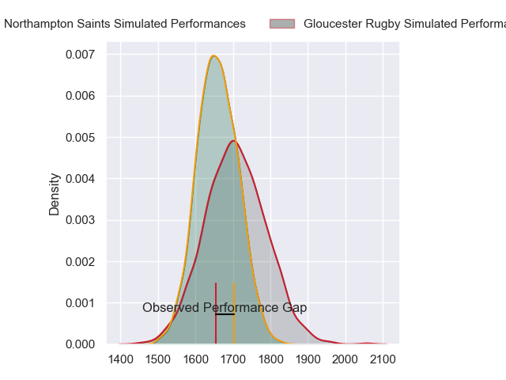
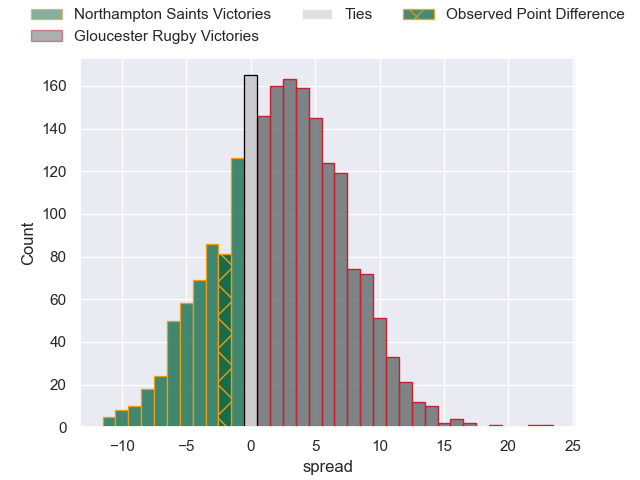
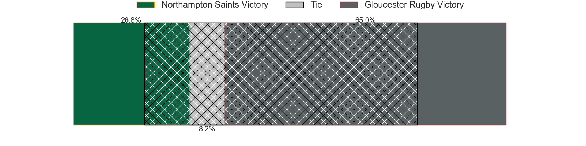
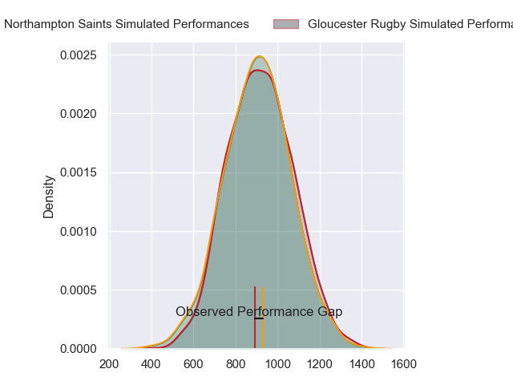
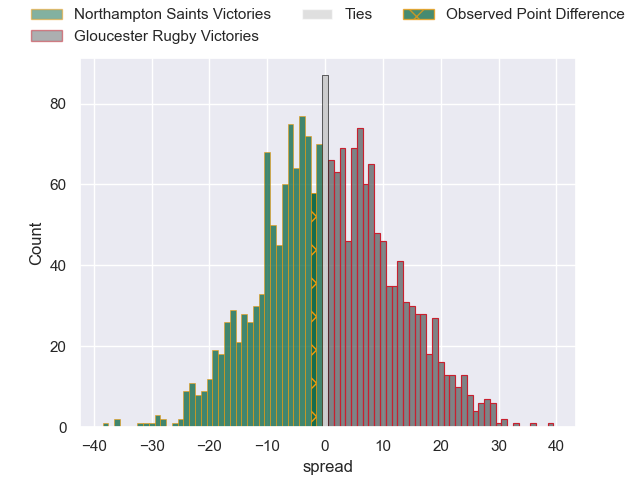
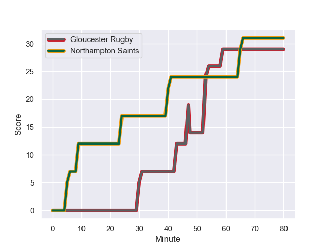
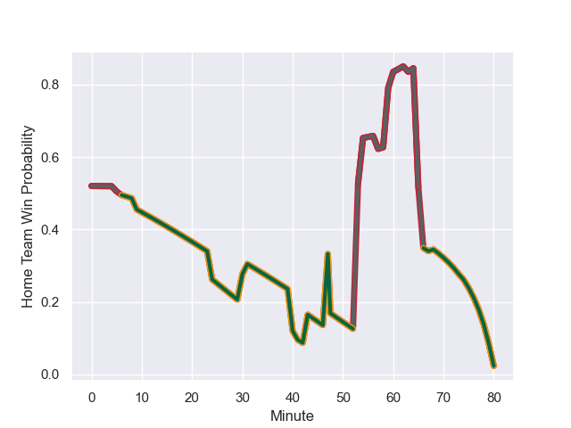

---  
layout: page  
title: Northampton Saints at Gloucester Rugby; 31-29  
date: 2023-12-23 18:00:00 -0500  
categories: "Gallagher Premiership 2023" match review  
---
# Northampton Saints at Gloucester Rugby; 31-29

# Club Level Predictions

The first set of predictions treats a club as the smallest object, as the club develops its members, organizes a gameplan, and deploys its players as needed for each match. This club model has a prediction of 0.573, which translates to predicting Gloucester Rugby to win by 2.6.

Each club has a rating and a rating deviation (similar to a Glicko rating), and expected performances can be generated. This allows for simulated matches and spreads like the ones below.
## Projected Performances - Club Model

## Projected Spreads - Club Model

## Projected Results - Club Model

# Player Level Predictions - Version 2

Treating teams instead as an entity made up of the currently active players, I have ratings for each player in an altogether different system. These can be combined to form team ratings once teamsheets are announced, weighting starters a bit higher than the reserves. After the match is played, players can be weighted by their minutes on the field, allowing for an accurate measure of the team's composition. With these compiled team ratings, we can make predictions, measure inaccuracy, and update the individual player ratings.
## Prediction with Player Minutes: Gloucester Rugby by 0.9

Northampton Saints by 4.1 on a neutral field
## Prediction without Player Minutes: Gloucester Rugby by 0.7

Northampton Saints by 4.3 on a neutral pitch

## Projected Performances - Player Model

## Projected Spreads - Player Model

## Projected Results - Player Model

## Scores over Time

## Win Probability over Time

There were 20 large changes in win probability in this match

|   Away Minutes | Away Player         |   Away elo |   Number |   Home elo | Home Player         |   Home Minutes |
|---------------:|:--------------------|-----------:|---------:|-----------:|:--------------------|---------------:|
|             41 | Ethan Waller        |      66.52 |        1 |      32.3  | Harry Elrington     |             57 |
|             40 | Curtis Langdon      |      51.59 |        2 |      48.73 | Santiago Socino     |             41 |
|             41 | Paul Hill           |      46.65 |        3 |      42.96 | Fraser Balmain      |             41 |
|             54 | Temo Mayanavanua    |      71.56 |        4 |      26.48 | Freddie Clarke      |             68 |
|             80 | Alex Coles          |      18.53 |        5 |      58.72 | Matias Alemanno     |             80 |
|             80 | Courtney Lawes      |      97.94 |        6 |      81.33 | Ruan Ackermann      |             63 |
|             80 | Tom Pearson         |      82.57 |        7 |      39.73 | Lewis Ludlow        |             80 |
|             60 | Sam Graham          |     102.95 |        8 |      46.65 | Zach Mercer         |             80 |
|             80 | Alex Mitchell       |      70.9  |        9 |      26.23 | Stephen Varney      |             80 |
|             80 | Fin Smith           |      44.25 |       10 |      46.65 | Adam Hastings       |             80 |
|             80 | Tommy Freeman       |      59.72 |       11 |      70.22 | Ollie Thorley       |             80 |
|             80 | Rory Hutchinson     |      46.65 |       12 |      74.32 | Max Llewellyn       |             57 |
|             74 | Fraser Dingwall     |      53.47 |       13 |      69.28 | Chris Harris        |             80 |
|             80 | Tom Litchfield      |      47.94 |       14 |      79.44 | Louis Rees-Zammit   |             80 |
|             80 | George Furbank      |      69.42 |       15 |      77.52 | Santiago Carreras   |             80 |
|             40 | Sam Matavesi        |      61.51 |       16 |      49.19 | George McGuigan     |             39 |
|             39 | Tarek Haffar        |      46.65 |       17 |      19    | Jamal Ford-Robinson |             23 |
|             39 | Elliot Millar-Mills |      47.46 |       18 |      46.65 | Kirill Gotovtsev    |             39 |
|             26 | Chunya Munga        |      46.66 |       19 |      46.65 | Cameron Jordan      |             12 |
|             20 | Juarno Augustus     |      46.65 |       20 |      36.81 | Jack Clement        |             17 |
|              0 | Callum Braley       |      46.65 |       21 |      46.65 | Caolan Englefield   |              0 |
|              6 | Charlie Savala      |      46.65 |       22 |      46.65 | Sebastien Atkinson  |             23 |
|              0 | Jake Garside        |      46.65 |       23 |      62.38 | Lloyd Evans         |              0 |

