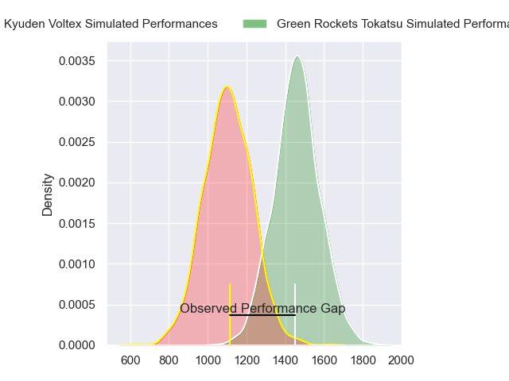
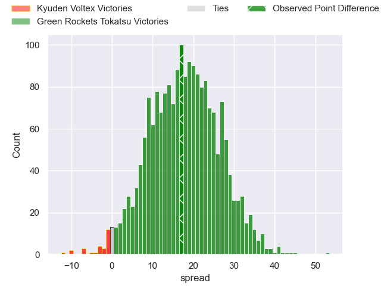
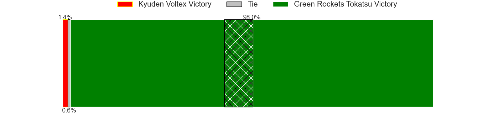
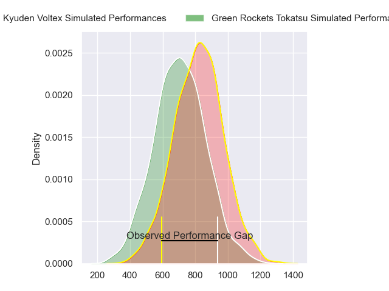
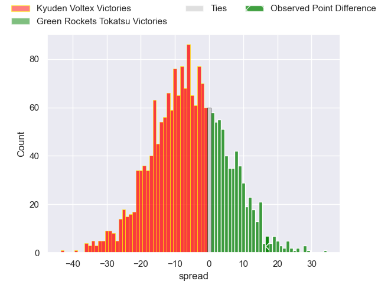
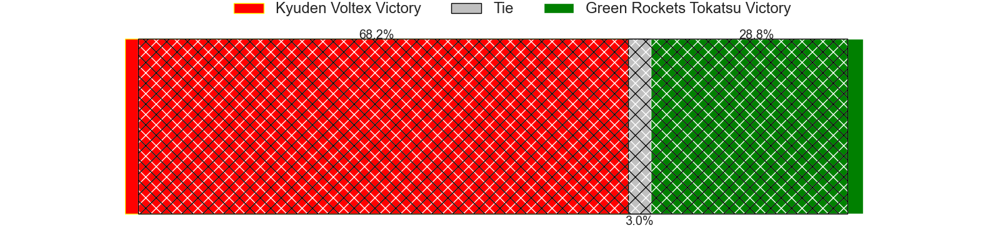
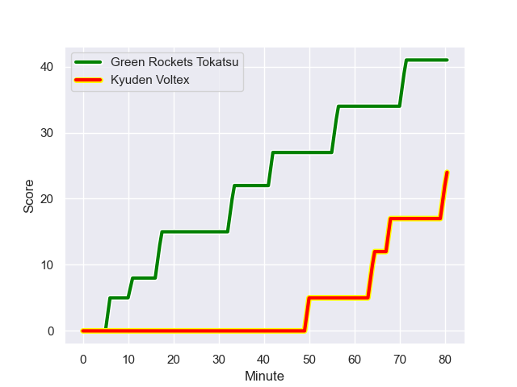
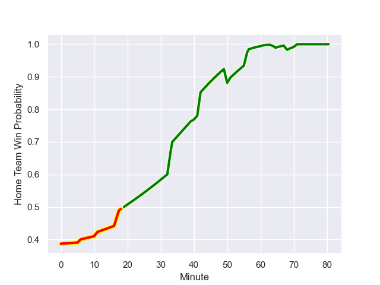

---  
layout: page  
title: Kyuden Voltex at Green Rockets Tokatsu; 24-41  
date: 2023-12-23 18:00:00 -0500  
categories: "Japan Rugby League One D2 2023" match review  
---
# Kyuden Voltex at Green Rockets Tokatsu; 24-41

# Club Level Predictions

The first set of predictions treats a club as the smallest object, as the club develops its members, organizes a gameplan, and deploys its players as needed for each match. This club model has a prediction of 0.869, which translates to predicting Green Rockets Tokatsu to win by 17.6.

Each club has a rating and a rating deviation (similar to a Glicko rating), and expected performances can be generated. This allows for simulated matches and spreads like the ones below.
## Projected Performances - Club Model

## Projected Spreads - Club Model

## Projected Results - Club Model

# Player Level Predictions - Version 2

Treating teams instead as an entity made up of the currently active players, I have ratings for each player in an altogether different system. These can be combined to form team ratings once teamsheets are announced, weighting starters a bit higher than the reserves. After the match is played, players can be weighted by their minutes on the field, allowing for an accurate measure of the team's composition. With these compiled team ratings, we can make predictions, measure inaccuracy, and update the individual player ratings.
## Prediction with Player Minutes: Kyuden Voltex by 5.0

Kyuden Voltex by 8.4 on a neutral field
## Prediction without Player Minutes: Kyuden Voltex by 3.7

Kyuden Voltex by 7.0 on a neutral pitch

## Projected Performances - Player Model

## Projected Spreads - Player Model

## Projected Results - Player Model

## Scores over Time

## Win Probability over Time

There were 6 large changes in win probability in this match

|   Away Minutes | Away Player            |   Away elo |   Number |   Home elo | Home Player           |   Home Minutes |
|---------------:|:-----------------------|-----------:|---------:|-----------:|:----------------------|---------------:|
|             51 | Samuel Nozomu Faialaga |      56    |        1 |      46.48 | Kosei Yamamoto        |             58 |
|             56 | Kyungmun Wang          |      28.92 |        2 |      78.77 | Ash Dixon             |             58 |
|             51 | Yasuo Saruwatari       |      46.29 |        3 |      50.16 | Keisuke Kikuta        |             58 |
|             80 | Ray Tatafu             |      44.5  |        4 |      27.74 | Luke Porter           |             51 |
|             80 | Sean Robinson          |      49.83 |        5 |      31.13 | Daiki Yamagiwa        |             80 |
|             80 | Ken Nakashima          |      52.23 |        6 |      46.42 | Viliami Lutua Ahofono |             63 |
|             80 | Yuuki Yamada           |      64.08 |        7 |      31.51 | Ryoi Kamei            |             80 |
|             80 | Walker Alex Takuya     |      50.64 |        8 |      44.41 | Aseri Masivou         |             80 |
|             56 | Yusaku Kanda           |      46.65 |        9 |      69.96 | Nick Phipps           |             56 |
|             56 | Tom Taylor             |      81.61 |       10 |      71.06 | Taisetsu Kanai        |             72 |
|             80 | Ren Hagiwara           |      47.3  |       11 |      27.42 | Kenta Omata           |             80 |
|             61 | Sione Likuata          |      46.65 |       12 |      45.25 | Christian Laui        |             40 |
|             51 | Sam Vaka               |      47.15 |       13 |       6.03 | Maritino Nemani       |             80 |
|             80 | Akihito Yamada         |     131.2  |       14 |      27.33 | Lomano Lemeki         |             80 |
|             72 | Makoto Kato            |      30.7  |       15 |      28.07 | Tom Marshall          |             80 |
|             29 | Kosuke Oike            |      45.94 |       16 |      35.65 | Koichi Matsura        |             40 |
|             29 | Hayato Kojo            |      46.65 |       17 |      46.65 | Ika Motulalr Takau    |             29 |
|             29 | Kazuto Tokunaga        |      54.4  |       18 |      46.65 | Yusuke Maruo          |             24 |
|             24 | Yuya Otsuka            |      48.7  |       19 |      55.18 | Myuu Arai             |             22 |
|             24 | Shunta Takenouchi      |      53.13 |       20 |      44.72 | Suguru Kubo           |             22 |
|             24 | Phil Burleigh          |      59.85 |       21 |      65.83 | Kanta Higashionna     |             22 |
|             19 | Keisuke Yamzoe         |      46.65 |       22 |      46.65 | Mitieli Tuinakauvadra |             17 |
|              8 | Syuma Kanayama         |      44.42 |       23 |      51.15 | Tiaan Swanepoel       |              8 |

