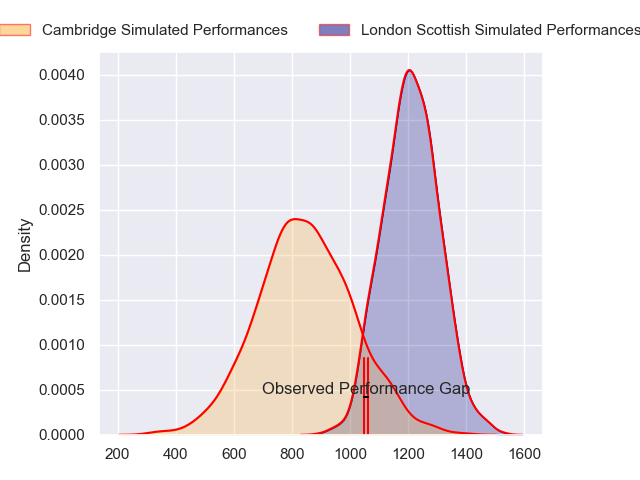
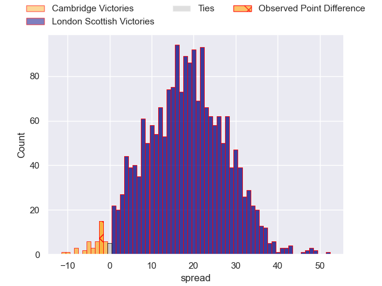
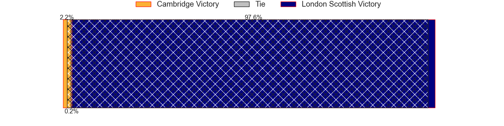
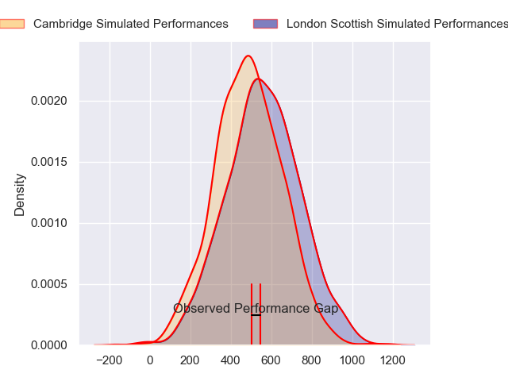
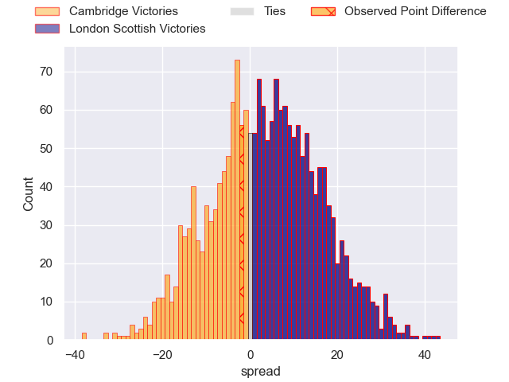
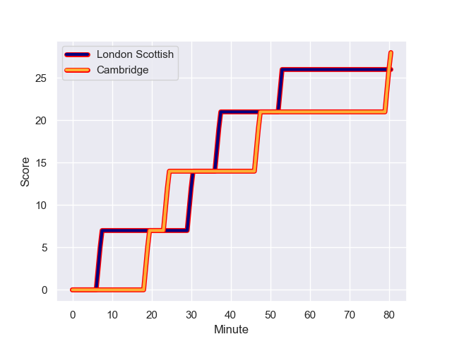
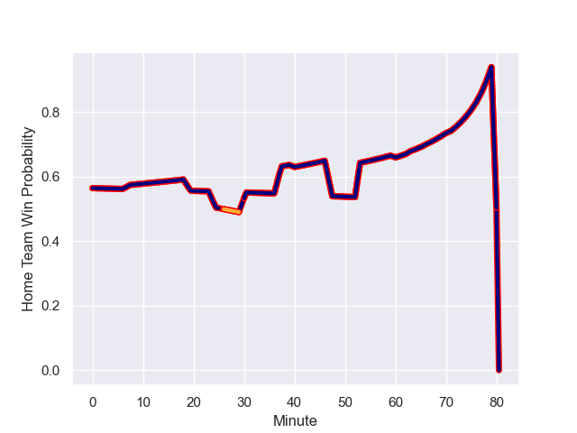

---  
layout: page  
title: Cambridge at London Scottish; 28-26  
date: 2023-12-23 18:00:00 -0500  
categories: "RFU Championship 2023" match review  
---
# Cambridge at London Scottish; 28-26

# Club Level Predictions

The first set of predictions treats a club as the smallest object, as the club develops its members, organizes a gameplan, and deploys its players as needed for each match. This club model has a prediction of 0.864, which translates to predicting London Scottish to win by 18.0.

Each club has a rating and a rating deviation (similar to a Glicko rating), and expected performances can be generated. This allows for simulated matches and spreads like the ones below.
## Projected Performances - Club Model

## Projected Spreads - Club Model

## Projected Results - Club Model

# Player Level Predictions - Version 2

Treating teams instead as an entity made up of the currently active players, I have ratings for each player in an altogether different system. These can be combined to form team ratings once teamsheets are announced, weighting starters a bit higher than the reserves. After the match is played, players can be weighted by their minutes on the field, allowing for an accurate measure of the team's composition. With these compiled team ratings, we can make predictions, measure inaccuracy, and update the individual player ratings.
## Prediction with Player Minutes: London Scottish by 2.8

Cambridge by 0.5 on a neutral field
## Prediction without Player Minutes: London Scottish by 2.8

Cambridge by 0.5 on a neutral pitch

## Projected Performances - Player Model

## Projected Spreads - Player Model

## Projected Results - Player Model

## Scores over Time

## Win Probability over Time

There were 11 large changes in win probability in this match

|   Away Minutes | Away Player          |   Away elo |   Number |   Home elo | Home Player          |   Home Minutes |
|---------------:|:---------------------|-----------:|---------:|-----------:|:---------------------|---------------:|
|             66 | Jake Elwood          |      31.46 |        1 |      48.82 | Will Prior           |             60 |
|             66 | Benjamin Brownlie    |      41.94 |        2 |      48.04 | Jack Musk            |             80 |
|             79 | Matt Collins         |      42.75 |        3 |      29.76 | Ashley Challenger    |             80 |
|             47 | Ewan Richards        |      39.85 |        4 |      25.95 | Jonny Green          |             80 |
|             80 | George Bretag-Norris |      36.76 |        5 |      36.93 | Zach Carr            |             80 |
|             80 | Benjamin Hoppe       |      40.18 |        6 |      54.15 | Bailey Ransom        |             80 |
|             40 | Ben Adams            |      19.55 |        7 |       5.54 | Jack Ingall          |             80 |
|             40 | Anthony Maka         |      41.76 |        8 |      26.44 | Tom Marshall         |             63 |
|             80 | Sam Edwards          |      30.92 |        9 |      38.43 | Lewis Gjaltema       |             79 |
|             80 | Jamie Benson         |      22.77 |       10 |      44.89 | Alexander Lloyd-Seed |             80 |
|             80 | Josef Green          |      33.11 |       11 |     -13.85 | Noah Ferdinand       |             80 |
|             71 | Sam Hanks            |       9.09 |       12 |      44.88 | Bryn Bradley         |             80 |
|             80 | Tom Hoppe            |      41.05 |       13 |      24.02 | Hayden Hyde          |             71 |
|             80 | Matthew Hema         |      26.77 |       14 |      45.87 | Luke Mehson          |             80 |
|             79 | Elias Caven          |      27.16 |       15 |      23.05 | Cameron Anderson     |             80 |
|             40 | Matthew Dawson       |      35.23 |       16 |      21.66 | George Cave          |             20 |
|             40 | Nahum Merigan        |      43.08 |       17 |      36.66 | Ioan Rhys Davies     |             17 |
|             33 | Kieran Frost         |      27    |       18 |      31.78 | Ben Waghorn          |              9 |
|             14 | Huw Owen             |      45.91 |       19 |      34.63 | Jonny Law            |              1 |
|             14 | Morgan Veness        |      24.02 |       20 |     nan    | nan                  |            nan |
|              9 | Steffan James        |      37.32 |       21 |     nan    | nan                  |            nan |
|              1 | Kieran Duffin        |      34.89 |       22 |     nan    | nan                  |            nan |
|              1 | Beltus Nonleh        |      46.65 |       23 |     nan    | nan                  |            nan |

