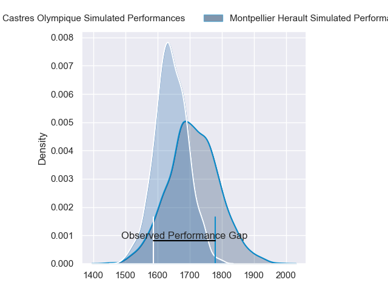
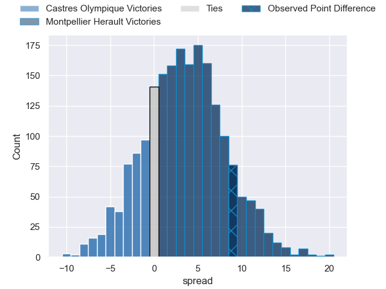
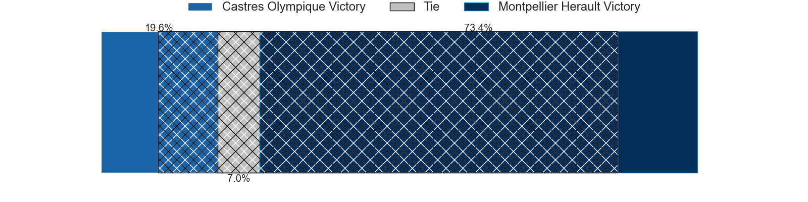
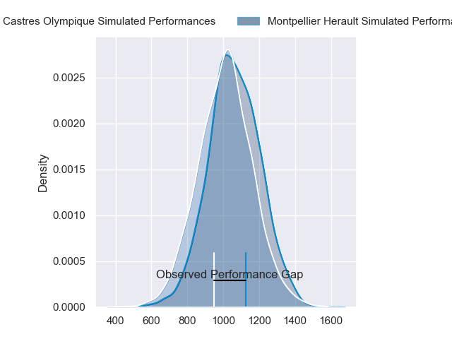
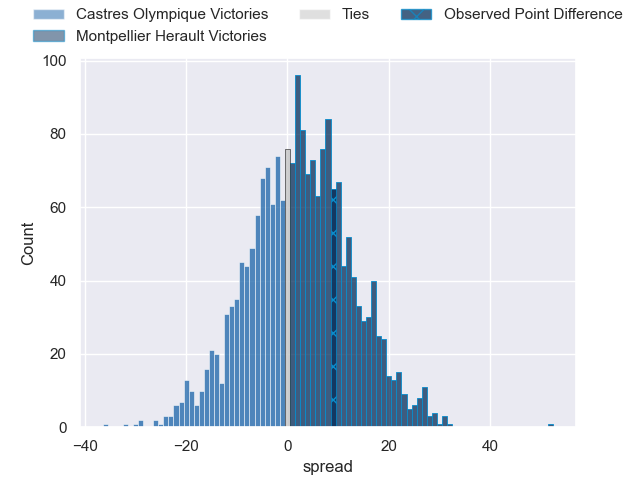
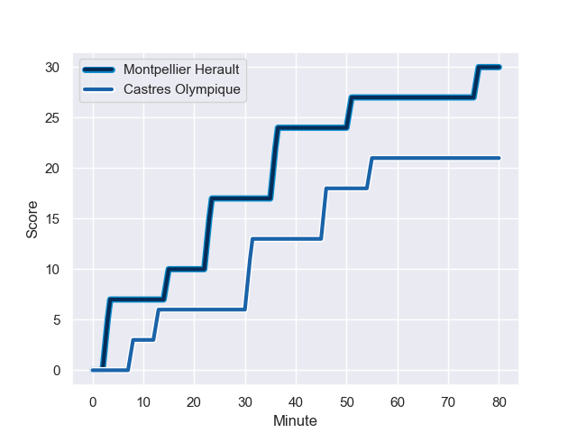
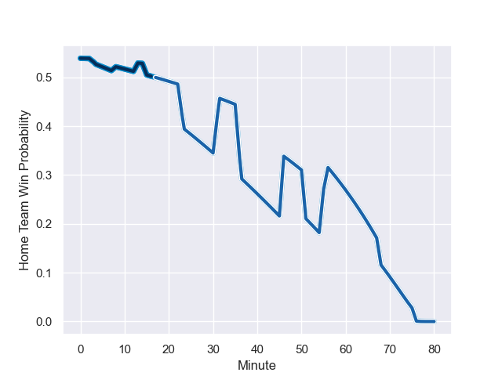

---  
layout: page  
title: Castres Olympique at Montpellier Herault; 21-30  
date: 2023-12-23 18:00:00 -0500  
categories: "Top 14 Orange 2023" match review  
---
# Castres Olympique at Montpellier Herault; 21-30

# Club Level Predictions

The first set of predictions treats a club as the smallest object, as the club develops its members, organizes a gameplan, and deploys its players as needed for each match. This club model has a prediction of 0.593, which translates to predicting Montpellier Herault to win by 3.3.

Each club has a rating and a rating deviation (similar to a Glicko rating), and expected performances can be generated. This allows for simulated matches and spreads like the ones below.
## Projected Performances - Club Model

## Projected Spreads - Club Model

## Projected Results - Club Model

# Player Level Predictions - Version 2

Treating teams instead as an entity made up of the currently active players, I have ratings for each player in an altogether different system. These can be combined to form team ratings once teamsheets are announced, weighting starters a bit higher than the reserves. After the match is played, players can be weighted by their minutes on the field, allowing for an accurate measure of the team's composition. With these compiled team ratings, we can make predictions, measure inaccuracy, and update the individual player ratings.
## Prediction with Player Minutes: Montpellier Herault by 1.7

Castres Olympique by 3.0 on a neutral field
## Prediction without Player Minutes: Montpellier Herault by 1.1

Castres Olympique by 3.6 on a neutral pitch

## Projected Performances - Player Model

## Projected Spreads - Player Model

## Projected Results - Player Model

## Scores over Time

## Win Probability over Time

There were 12 large changes in win probability in this match

|   Away Minutes | Away Player          |   Away elo |   Number |   Home elo | Home Player                 |   Home Minutes |
|---------------:|:---------------------|-----------:|---------:|-----------:|:----------------------------|---------------:|
|             68 | Antoine Tichit       |      75.36 |        1 |      72.73 | Enzo Forletta               |             48 |
|             68 | Gaetan Barlot        |      88.92 |        2 |      62.75 | Brandon Paenga-Amosa        |             48 |
|             58 | Levan Chilachava     |      71.79 |        3 |      46.61 | Titi Lamositele             |             41 |
|             56 | Leone Nakarawa       |      88.36 |        4 |      66.41 | Marco Tauleigne             |             80 |
|             80 | Tom Staniforth       |      63.12 |        5 |      69.29 | Paul Willemse               |             80 |
|             80 | Mathieu Babillot     |      66.07 |        6 |      83.8  | Yacouba Camara              |             33 |
|             56 | Baptiste Delaporte   |      54.83 |        7 |      24.64 | Alexandre Becognee          |             56 |
|             80 | Tyler Ardron         |     105.09 |        8 |      64.77 | Sam Simmonds                |             80 |
|             68 | Santiago Arata       |      57.3  |        9 |      40.76 | Léo Coly                    |             52 |
|             65 | Pierre Popelin       |      67.22 |       10 |      37.27 | Louis Carbonel              |             80 |
|             80 | Josaia Raisuqe       |      41.24 |       11 |     105.59 | Ben Lam                     |             80 |
|             80 | Vilimoni Botitu      |      56.98 |       12 |      69.63 | Jan Serfontein              |             80 |
|             80 | Adrien Seguret       |      51.65 |       13 |      50.92 | Arthur Vincent              |             65 |
|             80 | Geoffrey Palis       |      94.88 |       14 |      55.37 | Julien Tisseron             |             52 |
|             52 | Julien Dumora        |      75.45 |       15 |      67.16 | Anthony Bouthier            |             80 |
|             28 | Filipo Nakosi        |      98.63 |       16 |      69.9  | Nicolaas Janse van Rensburg |             47 |
|             24 | Baptiste Cope        |      43    |       17 |      92.71 | Harry Williams              |             39 |
|             24 | Florent Vanverberghe |      52.86 |       18 |      35.72 | Vano Karkadze               |             32 |
|             22 | Aurélien Azar        |      28.37 |       19 |      19.5  | Baptiste Erdocio            |             32 |
|             15 | Louis Le Brun        |      40.23 |       20 |      78.54 | Cobus Reinach               |             28 |
|             12 | Loïs Guerois         |      42.37 |       21 |     131.28 | Geoffrey Doumayrou          |             28 |
|             12 | Jeremy Fernandez     |      20.48 |       22 |      39.45 | Lenni Nouchi                |             24 |
|             12 | Loris Zarantonello   |      43.89 |       23 |      55.67 | Paolo Garbisi               |             15 |

