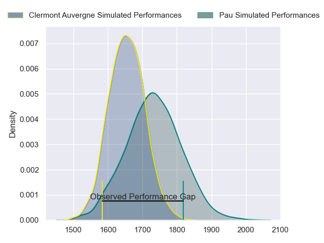
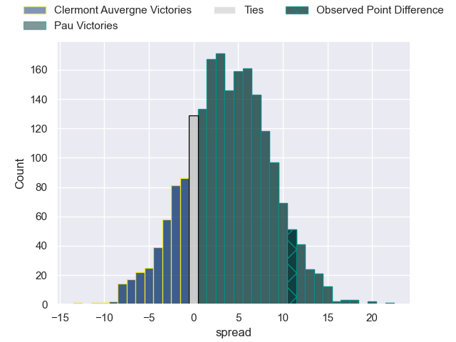
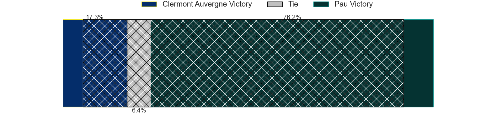
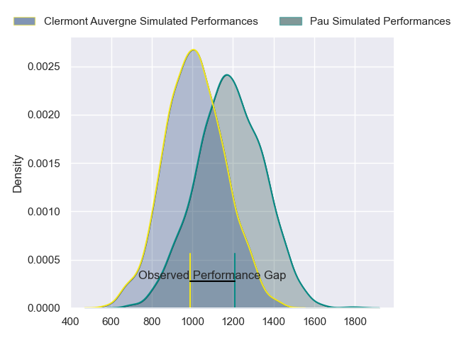
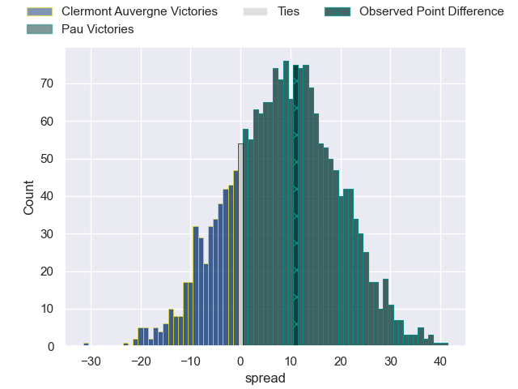
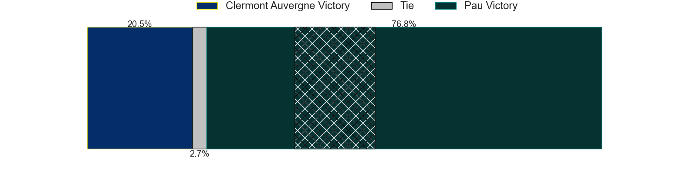
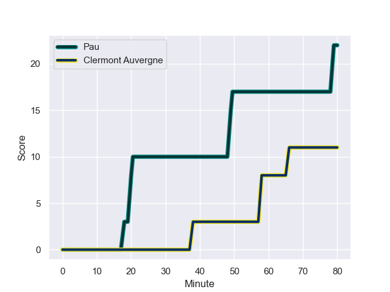
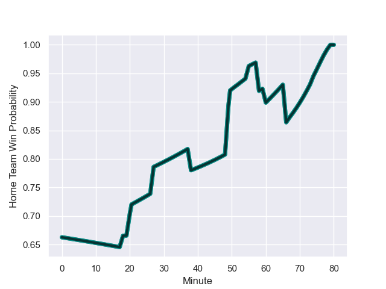

---  
layout: page  
title: Clermont Auvergne at Pau; 11-22  
date: 2023-12-23 18:00:00 -0500  
categories: "Top 14 Orange 2023" match review  
---
# Clermont Auvergne at Pau; 11-22

# Club Level Predictions

The first set of predictions treats a club as the smallest object, as the club develops its members, organizes a gameplan, and deploys its players as needed for each match. This club model has a prediction of 0.61, which translates to predicting Pau to win by 3.9.

Each club has a rating and a rating deviation (similar to a Glicko rating), and expected performances can be generated. This allows for simulated matches and spreads like the ones below.
## Projected Performances - Club Model

## Projected Spreads - Club Model

## Projected Results - Club Model

# Player Level Predictions - Version 2

Treating teams instead as an entity made up of the currently active players, I have ratings for each player in an altogether different system. These can be combined to form team ratings once teamsheets are announced, weighting starters a bit higher than the reserves. After the match is played, players can be weighted by their minutes on the field, allowing for an accurate measure of the team's composition. With these compiled team ratings, we can make predictions, measure inaccuracy, and update the individual player ratings.
## Prediction with Player Minutes: Pau by 7.4

Pau by 2.5 on a neutral field
## Prediction without Player Minutes: Pau by 6.1

Pau by 1.3 on a neutral pitch

## Projected Performances - Player Model

## Projected Spreads - Player Model

## Projected Results - Player Model

## Scores over Time

## Win Probability over Time

There were 7 large changes in win probability in this match

|   Away Minutes | Away Player          |   Away elo |   Number |   Home elo | Home Player         |   Home Minutes |
|---------------:|:---------------------|-----------:|---------:|-----------:|:--------------------|---------------:|
|             55 | Etienne Falgoux      |      65.19 |        1 |      54.32 | Siegfried Fisi'ihoi |             53 |
|             50 | Folau Fainga'a       |      77.91 |        2 |      51.12 | Lucas Rey           |             55 |
|             55 | Cristian Ojovan      |      57.74 |        3 |      80.26 | Siate Tokolahi      |             53 |
|             80 | Thibaud Lanen        |      54.61 |        4 |      29.7  | Hugo Auradou        |             80 |
|             80 | Rob Simmons          |     105.89 |        5 |      71.3  | Mickael Capelli     |             67 |
|             52 | Killian Tixeront     |      45.1  |        6 |      68.47 | Lekima Tagitagivalu |             67 |
|             80 | Marcos Kremer        |      49.24 |        7 |     133.98 | Luke Whitelock      |             80 |
|             50 | Pita Gus Sowakula    |      85.39 |        8 |      68.23 | Beka Gorgadze       |             80 |
|             60 | Sebastien Bezy       |      82.31 |        9 |      90.61 | Thibault Daubagna   |             55 |
|             27 | Benjamin Urdapilleta |      97.36 |       10 |     100.18 | Joe Simmonds        |             80 |
|             80 | Alivereti Raka       |      42.67 |       11 |      54.68 | Thomas Carol        |             80 |
|             80 | George Moala         |      87.21 |       12 |      65.63 | Nathan Decron       |             80 |
|             50 | Leon Darricarrere    |      45.44 |       13 |      77.55 | Emilien Gailleton   |             80 |
|             80 | Alex Newsome         |      74.57 |       14 |      77.49 | Aminiasi Tuimaba    |             80 |
|             80 | Anthony Belleau      |      83.3  |       15 |      47.86 | Théo Attissogbe     |             74 |
|             53 | Pierre Fouyssac      |      41.58 |       16 |      73.18 | Remi Seneca         |             27 |
|             30 | Etienne Fourcade     |      45.29 |       17 |      27.8  | Guram Papidze       |             27 |
|             30 | Peceli Yato Senibitu |      99.09 |       18 |     117.87 | Dan Robson          |             25 |
|             30 | Julien Heriteau      |      58.91 |       19 |      44.81 | Youri Delhommel     |             25 |
|             28 | Lucas Dessaigne      |      65.46 |       20 |      73.12 | Martin Puech        |             13 |
|             25 | Rabah Slimani        |      65.7  |       21 |      75.48 | Fabrice Metz        |             13 |
|             25 | Daniel Bibi Biziwu   |      45    |       22 |      47.17 | Axel Desperes       |              6 |
|             20 | Baptiste Jauneau     |      34.69 |       23 |     nan    | nan                 |            nan |

