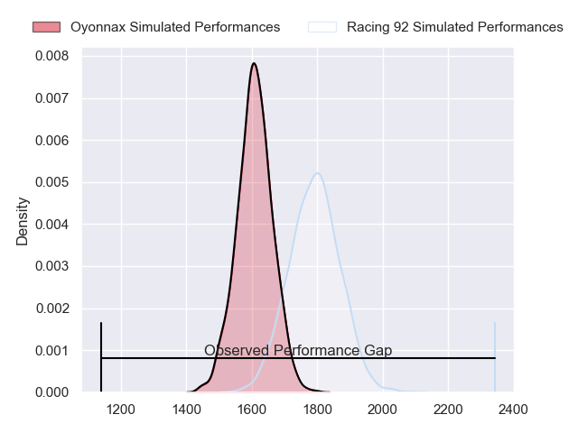
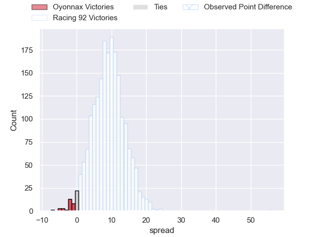
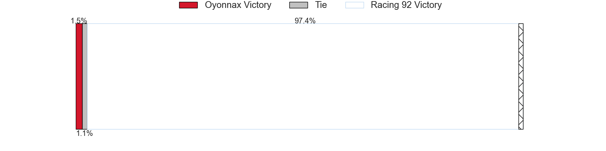
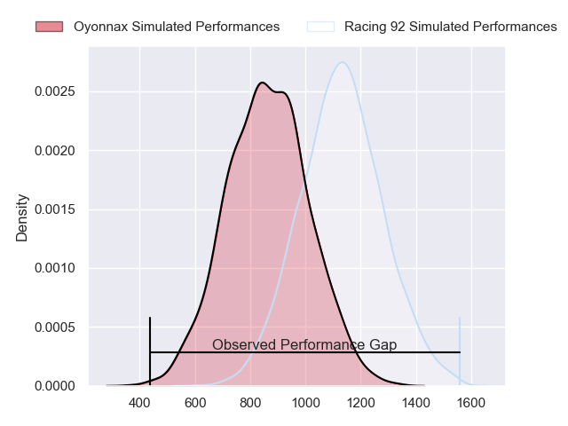
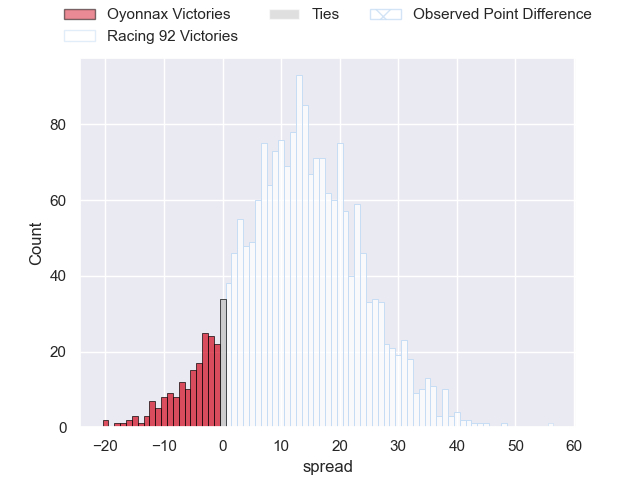
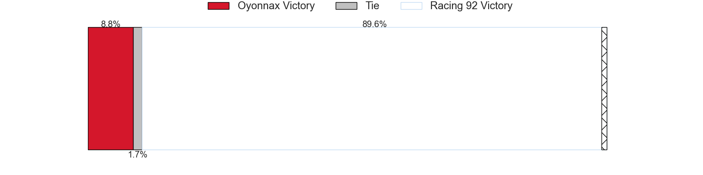
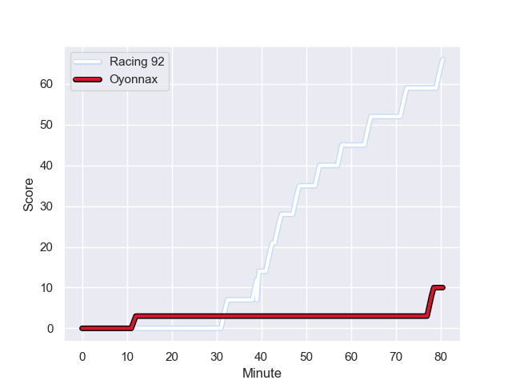
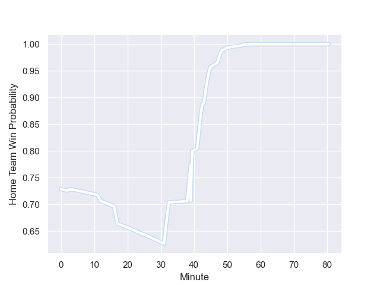

---  
layout: page  
title: Oyonnax at Racing 92; 10-66  
date: 2023-12-23 18:00:00 -0500  
categories: "Top 14 Orange 2023" match review  
---
# Oyonnax at Racing 92; 10-66

# Club Level Predictions

The first set of predictions treats a club as the smallest object, as the club develops its members, organizes a gameplan, and deploys its players as needed for each match. This club model has a prediction of 0.738, which translates to predicting Racing 92 to win by 9.1.

Each club has a rating and a rating deviation (similar to a Glicko rating), and expected performances can be generated. This allows for simulated matches and spreads like the ones below.
## Projected Performances - Club Model

## Projected Spreads - Club Model

## Projected Results - Club Model

# Player Level Predictions - Version 2

Treating teams instead as an entity made up of the currently active players, I have ratings for each player in an altogether different system. These can be combined to form team ratings once teamsheets are announced, weighting starters a bit higher than the reserves. After the match is played, players can be weighted by their minutes on the field, allowing for an accurate measure of the team's composition. With these compiled team ratings, we can make predictions, measure inaccuracy, and update the individual player ratings.
## Prediction with Player Minutes: Racing 92 by 10.8

Racing 92 by 6.1 on a neutral field
## Prediction without Player Minutes: Racing 92 by 10.4

Racing 92 by 5.7 on a neutral pitch

## Projected Performances - Player Model

## Projected Spreads - Player Model

## Projected Results - Player Model

## Scores over Time

## Win Probability over Time

There were 7 large changes in win probability in this match

|   Away Minutes | Away Player       |   Away elo |   Number |   Home elo | Home Player         |   Home Minutes |
|---------------:|:------------------|-----------:|---------:|-----------:|:--------------------|---------------:|
|             45 | Tommy Raynaud     |      67.5  |        1 |      47.04 | Guram Gogichashvili |             53 |
|             45 | Teddy Durand      |      45    |        2 |      53.47 | Janick Tarrit       |             53 |
|              3 | Ali Oz            |      49.11 |        3 |      74.21 | Thomas Laclayat     |             53 |
|             80 | Victor Lebas      |      22.39 |        4 |      39.52 | Fabien Sanconnie    |             53 |
|             50 | Phoenix Battye    |     128.05 |        5 |      51.81 | Will Rowlands       |             80 |
|             55 | Kevin Lebreton    |      64.79 |        6 |      44.68 | Maxime Baudonne     |             80 |
|             80 | Loïc Credoz       |      52.08 |        7 |     110.12 | Siya Kolisi         |             80 |
|             45 | Loic Godener      |      35.12 |        8 |      81.19 | Kitione Kamikamica  |             53 |
|             55 | Jonathan Ruru     |      97.84 |        9 |      74.02 | Nolann Le Garrec    |             53 |
|             80 | Domingo Miotti    |      89.07 |       10 |      87.31 | Antoine Gibert      |             17 |
|             80 | Gavin Stark       |      44.07 |       11 |      56.99 | Wame Naituvi        |             80 |
|             55 | Theo Millet       |      78.72 |       12 |     132.29 | Henry Chavancy      |             53 |
|             80 | Pedro Bettencourt |      34.3  |       13 |      41.22 | Olivier Klemenczak  |             80 |
|             80 | Darren Sweetnam   |      73.49 |       14 |      94.61 | Christian Wade      |             80 |
|             80 | Justin Bouraux    |      46.32 |       15 |      62.18 | Max Spring          |             80 |
|             77 | Thibault Berthaud |      44.53 |       16 |      50.58 | Martin Méliande     |             63 |
|             35 | Wandrille Picault |      61.94 |       17 |      69.95 | James Hall          |             27 |
|             35 | Manu Leiataua     |      17.54 |       18 |      62.46 | Anthime Hemery      |             27 |
|             35 | Rory Sutherland   |      51.86 |       19 |      55.81 | Francis Saili       |             27 |
|             30 | Hugo Fabregue     |      60.3  |       20 |      60.88 | Cedate Gomes Sa     |             27 |
|             25 | Ilan El Khattabi  |      34.03 |       21 |      43.32 | Hassane Kolingar    |             27 |
|             25 | Hugo Hermet       |      41.19 |       22 |     107.87 | Eddy Ben Arous      |             27 |
|             25 | Lucas Mensa       |      83.73 |       23 |      74.22 | Boris Palu          |             27 |

