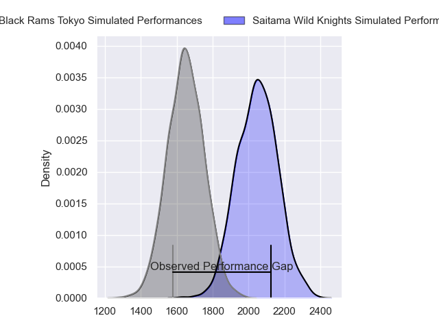
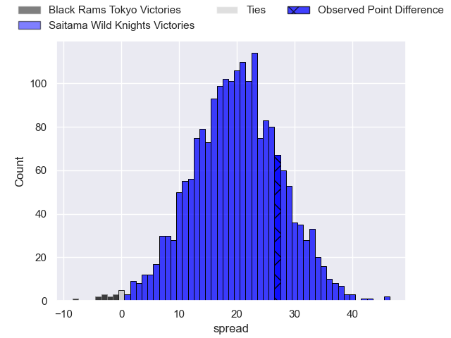
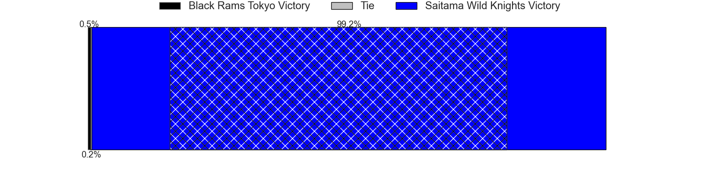
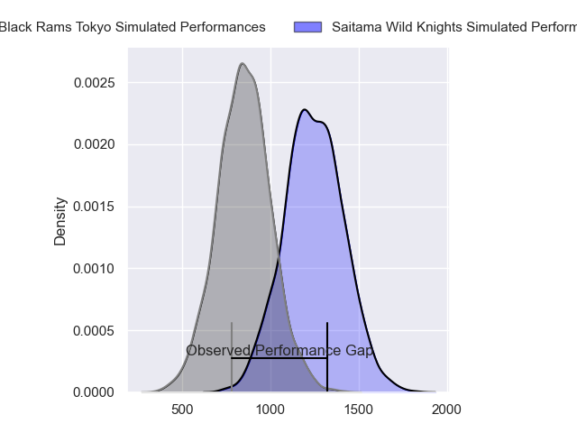
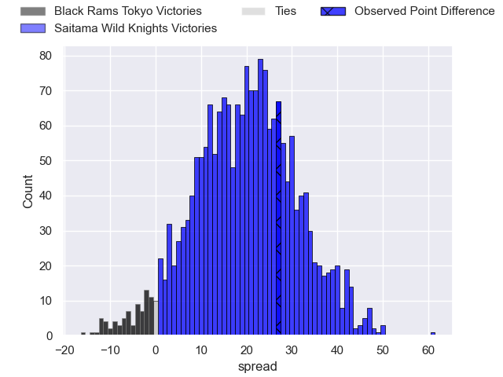
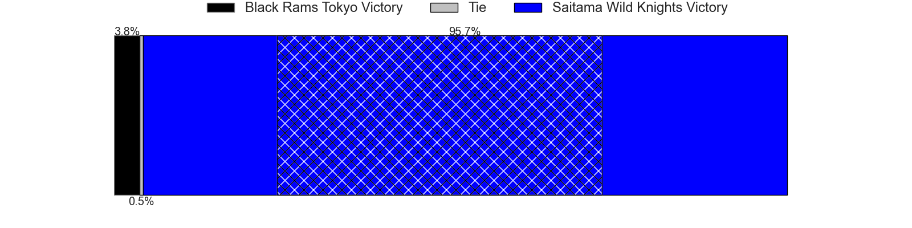
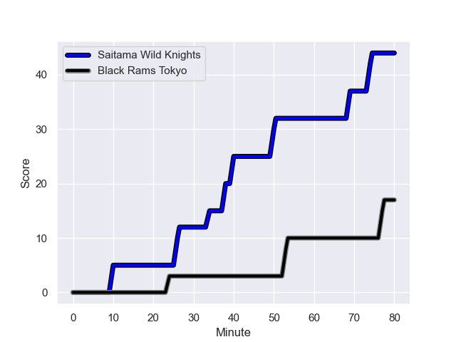
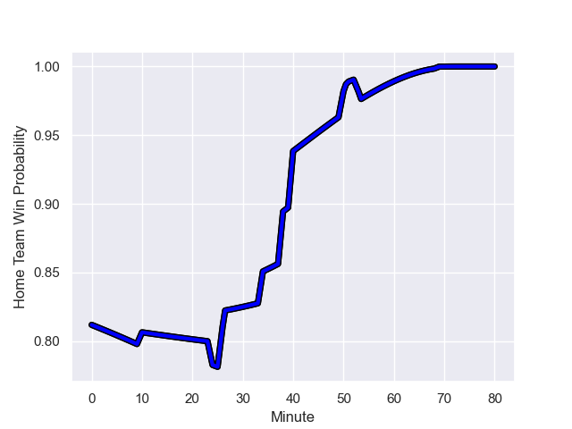

---  
layout: page  
title: Black Rams Tokyo at Saitama Wild Knights; 17-44  
date: 2023-12-23 18:00:00 -0500  
categories: "Japan Rugby League One 2023" match review  
---
# Black Rams Tokyo at Saitama Wild Knights; 17-44

# Club Level Predictions

The first set of predictions treats a club as the smallest object, as the club develops its members, organizes a gameplan, and deploys its players as needed for each match. This club model has a prediction of 0.898, which translates to predicting Saitama Wild Knights to win by 19.8.

Each club has a rating and a rating deviation (similar to a Glicko rating), and expected performances can be generated. This allows for simulated matches and spreads like the ones below.
## Projected Performances - Club Model

## Projected Spreads - Club Model

## Projected Results - Club Model

# Player Level Predictions - Version 2

Treating teams instead as an entity made up of the currently active players, I have ratings for each player in an altogether different system. These can be combined to form team ratings once teamsheets are announced, weighting starters a bit higher than the reserves. After the match is played, players can be weighted by their minutes on the field, allowing for an accurate measure of the team's composition. With these compiled team ratings, we can make predictions, measure inaccuracy, and update the individual player ratings.
## Prediction with Player Minutes: Saitama Wild Knights by 16.1

Saitama Wild Knights by 12.7 on a neutral field
## Prediction without Player Minutes: Saitama Wild Knights by 15.9

Saitama Wild Knights by 12.5 on a neutral pitch

## Projected Performances - Player Model

## Projected Spreads - Player Model

## Projected Results - Player Model

## Scores over Time

## Win Probability over Time

There were 3 large changes in win probability in this match

|   Away Minutes | Away Player        |   Away elo |   Number |   Home elo | Home Player       |   Home Minutes |
|---------------:|:-------------------|-----------:|---------:|-----------:|:------------------|---------------:|
|             51 | Yuichiro Taniguchi |      69.28 |        1 |      88.21 | Keita Inagaki     |             51 |
|             69 | Ko Sato            |      63.83 |        2 |      38.02 | Atsushi Sakate    |             40 |
|             51 | Shohei Oyama       |      51.31 |        3 |      89.87 | Asaeli Ai Valu    |             68 |
|             40 | Mike Stolberg      |       7.54 |        4 |      22    | Liam Mitchell     |             73 |
|             51 | Josh Goodhue       |      52.22 |        5 |      66.38 | Esei Ha'angana    |             69 |
|             80 | Jacob Skeen        |      48.49 |        6 |      55.1  | Shota Fukui       |             80 |
|             40 | Shuhei Matsuhashi  |      66.44 |        7 |      88.07 | Lachlan Boshier   |             80 |
|             80 | Otoya Kihara       |      46.65 |        8 |      78.58 | Jack Cornelsen    |             80 |
|             51 | Syota Yamamoto     |      56.88 |        9 |      74.71 | Taiki Koyama      |             73 |
|             80 | Matt McGahan       |      84.39 |       10 |     100.75 | Rikiya Matsuda    |             73 |
|             80 | Netani Vakayalia   |      73.18 |       11 |     103.51 | Ryuji Noguchi     |             80 |
|             80 | Yuta Kurihara      |      38.64 |       12 |     106.87 | Damian de Allende |             80 |
|             69 | Ryohei Isoda       |      65.16 |       13 |     101.49 | Dylan Riley       |             80 |
|             80 | Daisuke Nishikawa  |      50.16 |       14 |      31.99 | Tomoki Osada      |             80 |
|             80 | Isaac Lucas        |      72.5  |       15 |     106.99 | Koki Takeyama     |             69 |
|             40 | Nathan Hughes      |      88.8  |       16 |     101.7  | Shota Horie       |             40 |
|             40 | Daiki Yanagawa     |      51.28 |       17 |      40.82 | Craig Millar      |             29 |
|             29 | Paddy Ryan         |      35.31 |       18 |      77.4  | Shohei Hirano     |             12 |
|             29 | Taichi Chiba       |      45.25 |       19 |      77.91 | Marika Koroibete  |             11 |
|             29 | Junpei Yukawa      |      45.11 |       20 |      76.38 | Shunsuke Nunomaki |             11 |
|             29 | Takanobu Minami    |      42.45 |       21 |     114.18 | Keisuke Uchida    |              7 |
|             11 | Kazuhiro Koike     |      43.1  |       22 |      23.82 | Mark Abbott       |              7 |
|             11 | Yuki Ikeda         |      65.71 |       23 |      53.56 | Vince Aso         |              7 |

