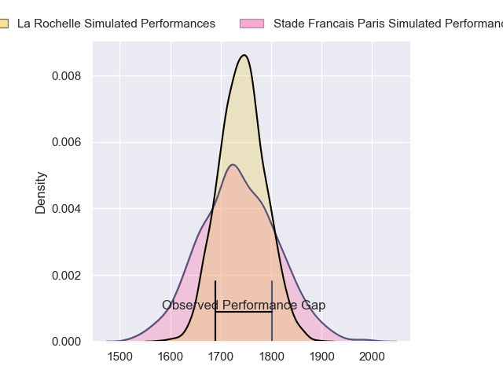
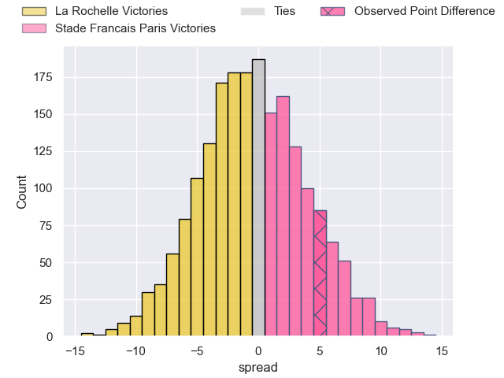
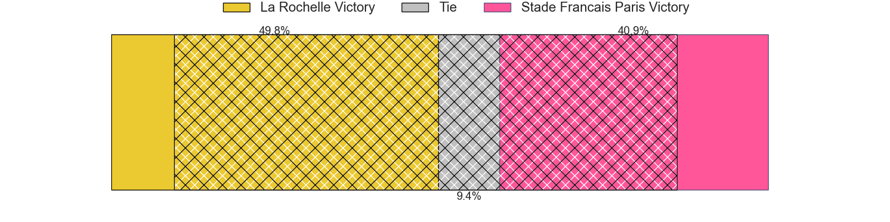
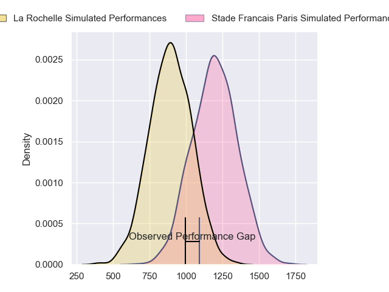
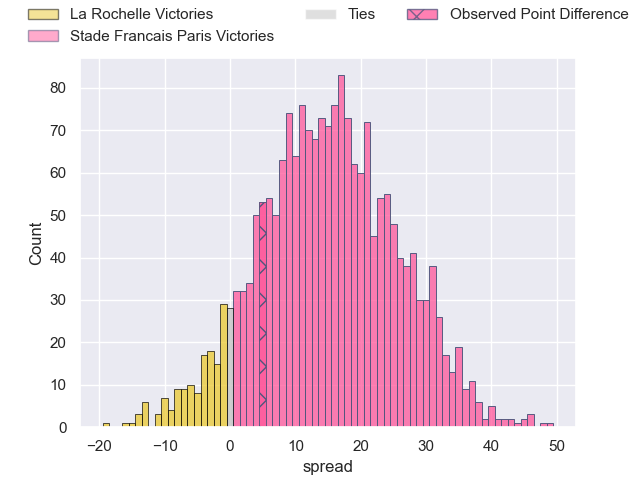
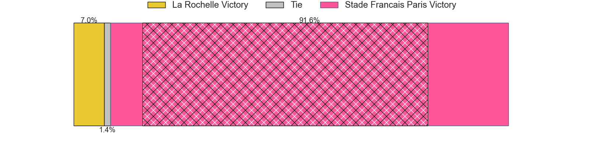
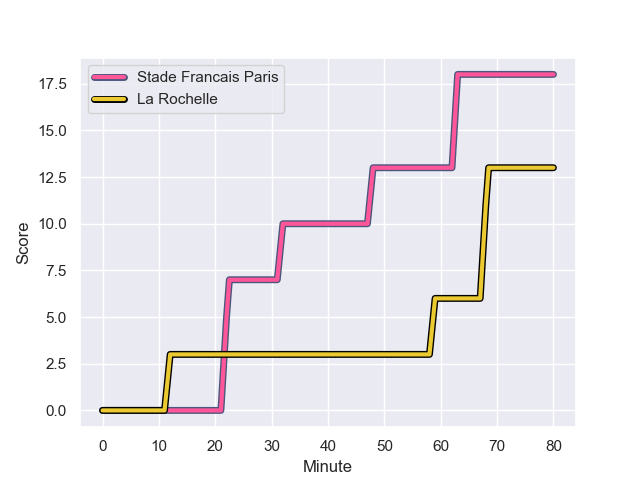
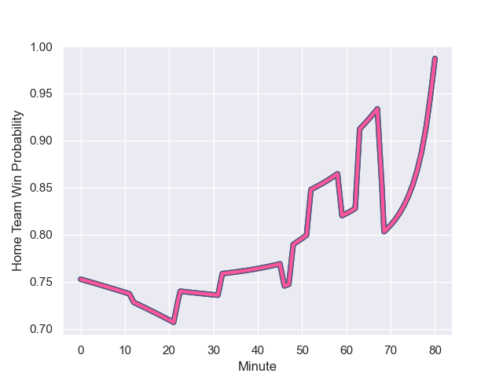

---  
layout: page  
title: La Rochelle at Stade Francais Paris; 13-18  
date: 2023-12-23 18:00:00 -0500  
categories: "Top 14 Orange 2023" match review  
---
# La Rochelle at Stade Francais Paris; 13-18

# Club Level Predictions

The first set of predictions treats a club as the smallest object, as the club develops its members, organizes a gameplan, and deploys its players as needed for each match. This club model has a prediction of 0.491, which translates to predicting La Rochelle to win by 0.3.

Each club has a rating and a rating deviation (similar to a Glicko rating), and expected performances can be generated. This allows for simulated matches and spreads like the ones below.
## Projected Performances - Club Model

## Projected Spreads - Club Model

## Projected Results - Club Model

# Player Level Predictions - Version 2

Treating teams instead as an entity made up of the currently active players, I have ratings for each player in an altogether different system. These can be combined to form team ratings once teamsheets are announced, weighting starters a bit higher than the reserves. After the match is played, players can be weighted by their minutes on the field, allowing for an accurate measure of the team's composition. With these compiled team ratings, we can make predictions, measure inaccuracy, and update the individual player ratings.
## Prediction with Player Minutes: Stade Francais Paris by 12.2

Stade Francais Paris by 7.2 on a neutral field
## Prediction without Player Minutes: Stade Francais Paris by 13.6

Stade Francais Paris by 8.5 on a neutral pitch

## Projected Performances - Player Model

## Projected Spreads - Player Model

## Projected Results - Player Model

## Scores over Time

## Win Probability over Time

There were 9 large changes in win probability in this match

|   Away Minutes | Away Player           |   Away elo |   Number |   Home elo | Home Player             |   Home Minutes |
|---------------:|:----------------------|-----------:|---------:|-----------:|:------------------------|---------------:|
|             65 | Reda Wardi            |      77.4  |        1 |      57.64 | Moses Alo-Emile         |             46 |
|             53 | Quentin Lespiaucq     |      42.57 |        2 |      84.04 | Mickael Ivaldi          |             46 |
|             52 | Aleksandre Kuntelia   |      38.71 |        3 |      83.96 | Francisco Gomez Kodela  |             46 |
|             80 | Thomas Lavault        |      64.62 |        4 |      62.46 | Paul Gabrillagues       |             80 |
|             41 | Remi Picquette        |      50.43 |        5 |      71.22 | Baptiste Pesenti        |             46 |
|             52 | Ultan Dillane         |      54.03 |        6 |      40.03 | Tanginoa Halaifonua     |             80 |
|             80 | Judicael Cancoriet    |      30.11 |        7 |      49.83 | Romain Briatte          |             54 |
|             80 | Yoan Tanga            |      47.27 |        8 |      90.43 | Giovanni Habel-Kueffner |             54 |
|             46 | Teddy Iribaren        |      60    |        9 |     112.6  | Brad Weber              |             80 |
|             65 | Ihaia West            |      40.2  |       10 |      75.16 | Joris Segonds           |             80 |
|             46 | Nathan Bollengier     |      41.04 |       11 |      77.37 | Lester Etien            |             80 |
|             80 | Jonathan Danty        |     100.71 |       12 |      89.35 | Jeremy Ward             |             80 |
|             80 | Jules Favre           |      69.33 |       13 |      82.26 | Joe Marchant            |             79 |
|             80 | Dillyn Leyds          |     106.96 |       14 |      53.33 | Kylan Hamdaoui          |             80 |
|             80 | Antoine Hastoy        |      47.92 |       15 |      63.62 | Leo Barre               |             80 |
|             39 | Will Skelton          |     112.85 |       16 |      59.77 | Sergo Abramishvili      |             34 |
|             34 | Thomas Berjon         |      66.33 |       17 |      81.63 | JJ van der Mescht       |             34 |
|             34 | Hugo Reus             |      45.59 |       18 |      45.81 | Laurent Panis           |             34 |
|             28 | Paul Boudehent        |      28.54 |       19 |      71.9  | Paul Alo-Emile          |             34 |
|             28 | Georges-Henri Colombe |      17.27 |       20 |      21.73 | Mathieu Hirigoyen       |             26 |
|             27 | Tolu Latu             |      74.78 |       21 |      95.48 | Sekou Macalou           |             26 |
|             15 | Louis Penverne        |      46.36 |       22 |      52.13 | Charles Laloi           |              1 |
|             15 | Simeli Daunivucu      |      46.65 |       23 |     nan    | nan                     |            nan |

