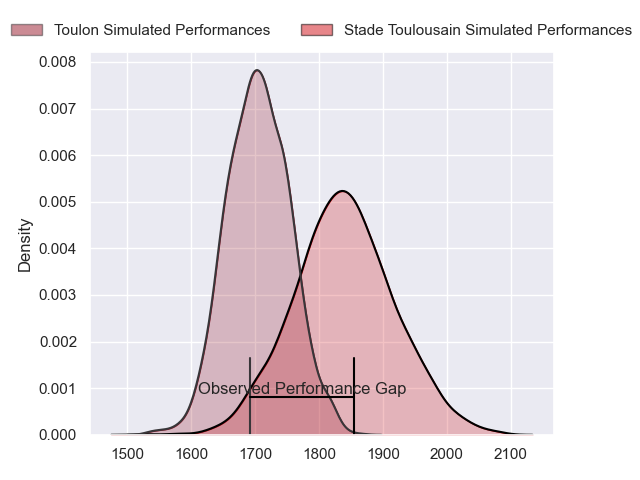
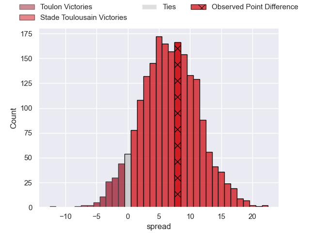
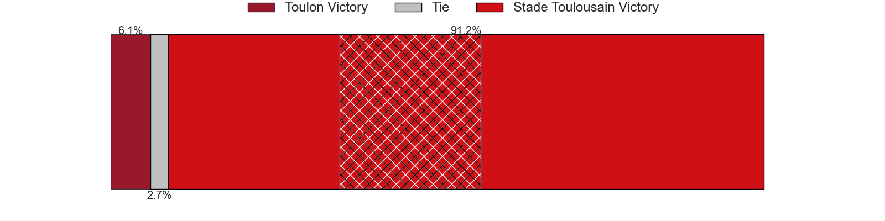
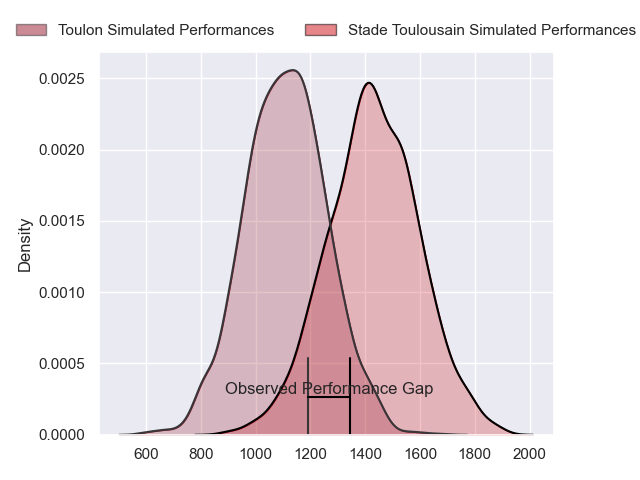
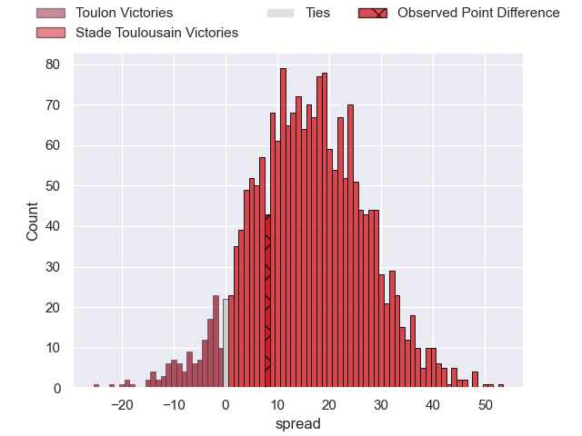
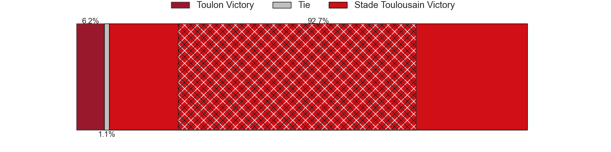
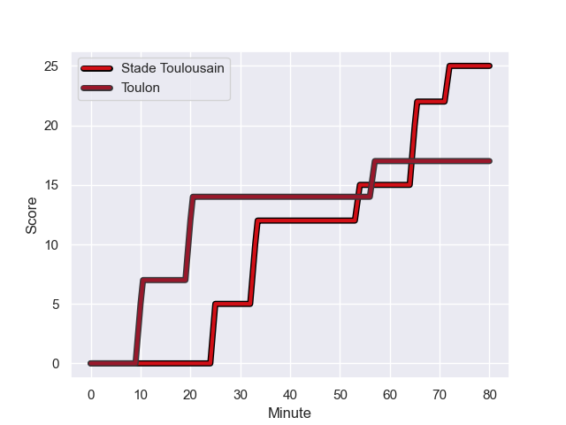
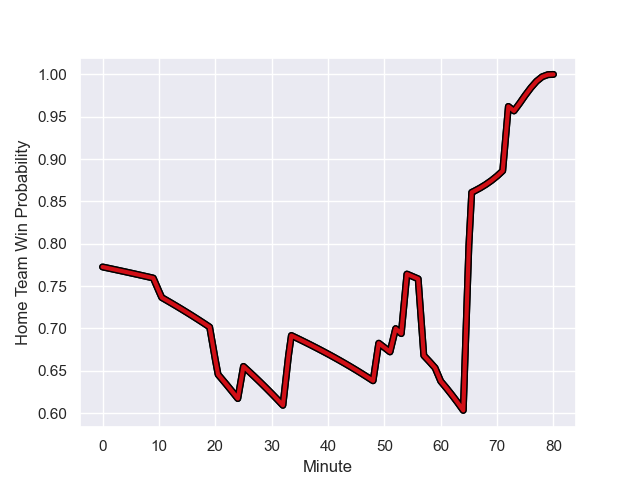

---  
layout: page  
title: Toulon at Stade Toulousain; 17-25  
date: 2023-12-23 18:00:00 -0500  
categories: "Top 14 Orange 2023" match review  
---
# Toulon at Stade Toulousain; 17-25

# Club Level Predictions

The first set of predictions treats a club as the smallest object, as the club develops its members, organizes a gameplan, and deploys its players as needed for each match. This club model has a prediction of 0.681, which translates to predicting Stade Toulousain to win by 6.7.

Each club has a rating and a rating deviation (similar to a Glicko rating), and expected performances can be generated. This allows for simulated matches and spreads like the ones below.
## Projected Performances - Club Model

## Projected Spreads - Club Model

## Projected Results - Club Model

# Player Level Predictions - Version 2

Treating teams instead as an entity made up of the currently active players, I have ratings for each player in an altogether different system. These can be combined to form team ratings once teamsheets are announced, weighting starters a bit higher than the reserves. After the match is played, players can be weighted by their minutes on the field, allowing for an accurate measure of the team's composition. With these compiled team ratings, we can make predictions, measure inaccuracy, and update the individual player ratings.
## Prediction with Player Minutes: Stade Toulousain by 13.5

Stade Toulousain by 8.5 on a neutral field
## Prediction without Player Minutes: Stade Toulousain by 11.5

Stade Toulousain by 6.5 on a neutral pitch

## Projected Performances - Player Model

## Projected Spreads - Player Model

## Projected Results - Player Model

## Scores over Time

## Win Probability over Time

There were 10 large changes in win probability in this match

|   Away Minutes | Away Player            |   Away elo |   Number |   Home elo | Home Player          |   Home Minutes |
|---------------:|:-----------------------|-----------:|---------:|-----------:|:---------------------|---------------:|
|             52 | Dany Priso             |      80.47 |        1 |      45.75 | Rodrigue Neti        |             49 |
|             52 | Christopher Tolofua    |      90.87 |        2 |      87.54 | Peato Mauvaka        |             49 |
|             49 | Emerick Setiano        |      71.87 |        3 |      82.9  | Nepo Laulala         |             60 |
|             52 | Swan Rebbadj           |      56.08 |        4 |      49.27 | Richie Arnold        |             80 |
|             80 | David Ribbans          |      77.84 |        5 |      56.02 | Emmanuel Meafou      |             73 |
|             52 | Yannick Youyoutte      |      52.46 |        6 |     121.77 | Francois Cros        |             80 |
|             80 | Charles Ollivon        |     121.97 |        7 |     105.76 | Anthony Jelonch      |             73 |
|             80 | Selevasio Tolofua      |      88.07 |        8 |      97.6  | Alexandre Roumat     |             52 |
|             73 | Ben White              |      68.15 |        9 |     140.07 | Antoine Dupont       |             80 |
|             61 | Dan Biggar             |     126.13 |       10 |     115.78 | Thomas Ramos         |             80 |
|             74 | Gabin Villiere         |      86.18 |       11 |     103.6  | Matthis Lebel        |             80 |
|             80 | Mathieu Smaili         |      32.27 |       12 |      45.61 | Pita Ahki            |             80 |
|             80 | Seta Tuicuvu           |      56    |       13 |      59.67 | Pierre-Louis Barassi |             76 |
|             80 | Leicester Fainga'anuku |      92.97 |       14 |      57.67 | Dimitri Delibes      |             80 |
|             80 | Marius Domon           |      47.66 |       15 |     131.7  | Blair Kinghorn       |             80 |
|             31 | Beka Gigashvili        |      57.87 |       16 |      93.51 | Cyril Baille         |             31 |
|             28 | Bruce Devaux           |      40.49 |       17 |     102.86 | Julien Marchand      |             31 |
|             28 | Esteban Abadie         |      42.42 |       18 |      87.06 | Jack Willis          |             28 |
|             28 | Jack Singleton         |      83.26 |       19 |      67.61 | David Ainu'u         |             20 |
|             28 | Matthias Halagahu      |      46.89 |       20 |      48.2  | Alban Placines       |              7 |
|             19 | Enzo Herve             |      77.86 |       21 |      58.44 | Piula Faasalele      |              7 |
|              7 | Jules Danglot          |      57.04 |       22 |      56.77 | Santiago Chocobares  |              4 |
|              6 | Jiuta Wainiqolo        |      77.84 |       23 |     nan    | nan                  |            nan |

