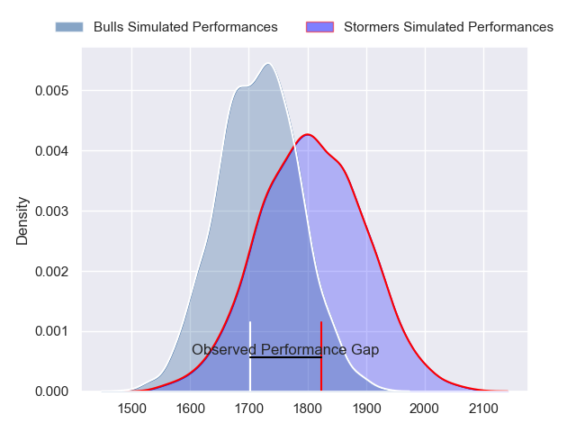
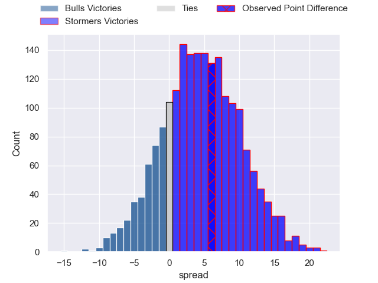
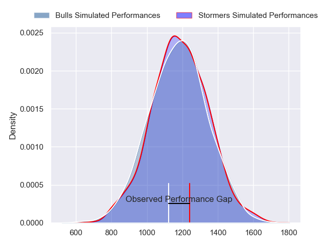
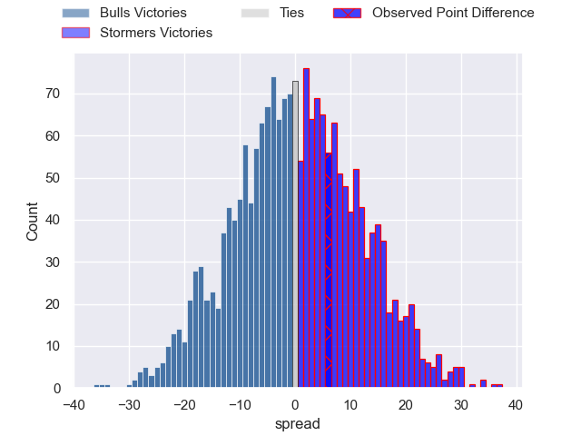
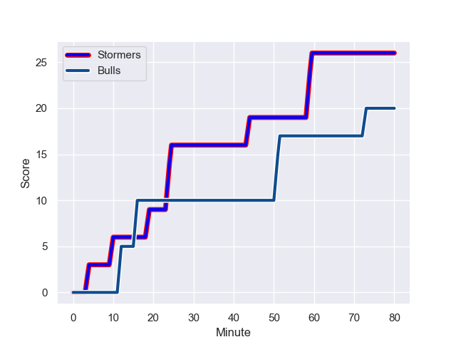
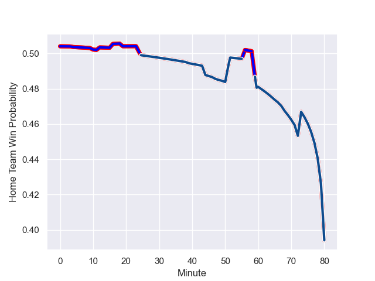

---  
layout: page  
title: Bulls at Stormers; 20-26  
date: 2023-12-23 18:00:00 -0500  
categories: "United Rugby Championship 2023" match review  
---
# Bulls at Stormers; 20-26

# Club Level Predictions

The first set of predictions treats a club as the smallest object, as the club develops its members, organizes a gameplan, and deploys its players as needed for each match. This club model has a prediction of 0.628, which translates to predicting Stormers to win by 4.6.

Each club has a rating and a rating deviation (similar to a Glicko rating), and expected performances can be generated. This allows for simulated matches and spreads like the ones below.
## Projected Performances - Club Model

## Projected Spreads - Club Model

## Projected Results - Club Model

# Player Level Predictions - Version 2

Treating teams instead as an entity made up of the currently active players, I have ratings for each player in an altogether different system. These can be combined to form team ratings once teamsheets are announced, weighting starters a bit higher than the reserves. After the match is played, players can be weighted by their minutes on the field, allowing for an accurate measure of the team's composition. With these compiled team ratings, we can make predictions, measure inaccuracy, and update the individual player ratings.
## Prediction with Player Minutes: Stormers by 0.2

Bulls by 3.7 on a neutral field
## Prediction without Player Minutes: Bulls by 0.0

Bulls by 3.9 on a neutral pitch

## Projected Performances - Player Model

## Projected Spreads - Player Model

## Projected Results - Player Model

## Scores over Time

## Win Probability over Time

There were 1 large changes in win probability in this match

|   Away Minutes | Away Player             |   Away elo |   Number |   Home elo | Home Player           |   Home Minutes |
|---------------:|:------------------------|-----------:|---------:|-----------:|:----------------------|---------------:|
|             56 | Gerhard Steenekamp      |      67.44 |        1 |      63.78 | Sti Sithole           |             56 |
|             69 | Akker van der Merwe     |     107.34 |        2 |      58.08 | Joseph Dweba          |             49 |
|             66 | Wilco Louw              |     109.34 |        3 |      60.35 | Neethling Fouche      |             56 |
|             66 | Janko Swanepoel         |      57.65 |        4 |      71.34 | Adre Smith            |             68 |
|             80 | Reinhardt Ludwig        |      38.94 |        5 |      50.11 | Ruben van Heerden     |             80 |
|             80 | Marco van Staden        |      82.67 |        6 |     118.27 | Deon Fourie           |             80 |
|             80 | Elrigh Louw             |      70.88 |        7 |      41.19 | Ben-Jason Dixon       |             54 |
|             47 | Cameron Hanekom         |      50.73 |        8 |     104.78 | Hacjivah Dayimani     |             80 |
|             80 | Embrose Papier          |      77.62 |        9 |      70.07 | Paul de Wet           |             80 |
|             68 | Johan Goosen            |      58.65 |       10 |      73.36 | Manie Libbok          |             80 |
|             72 | Canan Moodie            |     120.15 |       11 |      81.01 | Leolin Zas            |             80 |
|             80 | David Kriel             |      79.99 |       12 |      63.06 | Jean-Luc du Plessis   |             39 |
|             60 | Stedman-Gee Rivett Gans |      70.98 |       13 |      57.96 | Ruhan Nel             |             80 |
|             80 | Kurt-Lee Arendse        |     114.75 |       14 |      54.8  | Suleiman  Hartzenberg |             80 |
|             80 | Willie le Roux          |     102.6  |       15 |      99.08 | Damian Willemse       |             80 |
|             33 | Celimpilo Gumede        |      43.35 |       16 |      69.07 | Clayton Blommetjies   |             16 |
|             24 | Simphiwe Matanzima      |      53.33 |       17 |      55.01 | Andre-Hugo Venter     |             31 |
|             20 | Sebastian de Klerk      |      95.78 |       18 |      73.72 | Willie Engelbrecht    |             26 |
|             14 | Mornay Smith            |      50.91 |       19 |      50.48 | Stefan Ungerer        |             25 |
|             14 | Deon Slabbert           |      65.56 |       20 |      68.83 | Alistair Vermaak      |             24 |
|             12 | Chris Smith             |      60.02 |       21 |     123.67 | Brok Harris           |             24 |
|             11 | Jan Hendrik Wessels     |      19.72 |       22 |      43.07 | Connor Evans          |             12 |
|              8 | Keagan Johannes         |      31.59 |       23 |     nan    | nan                   |            nan |

