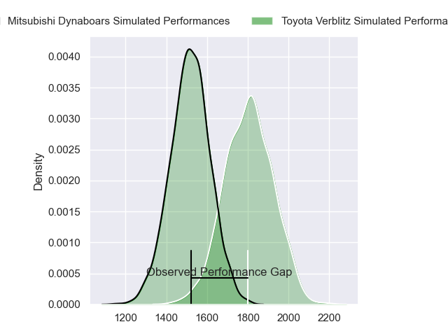
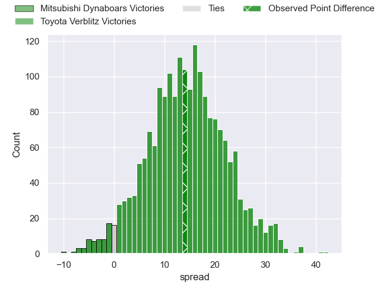
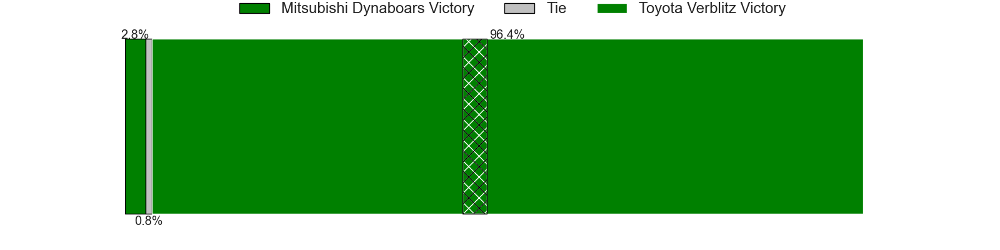
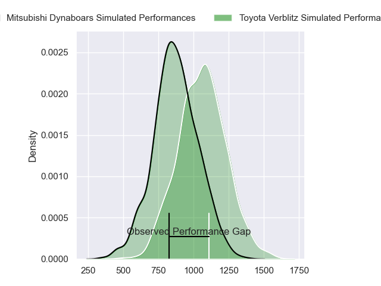
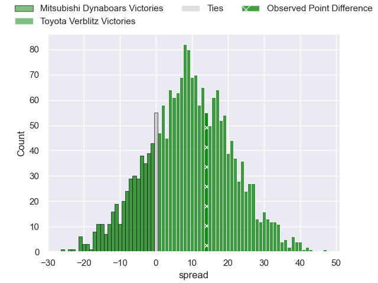
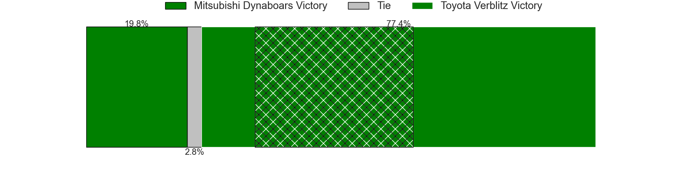
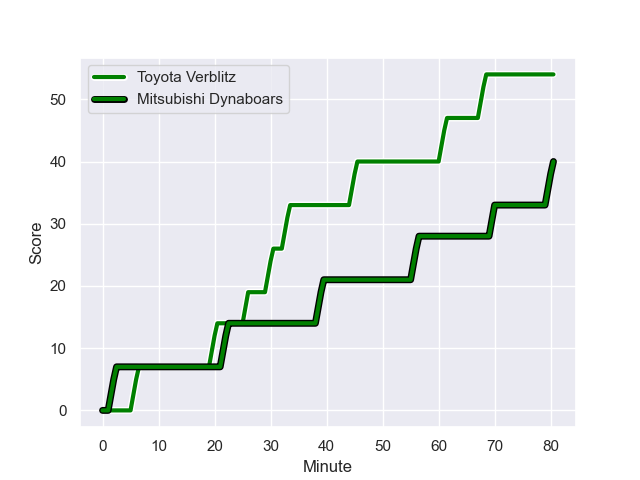
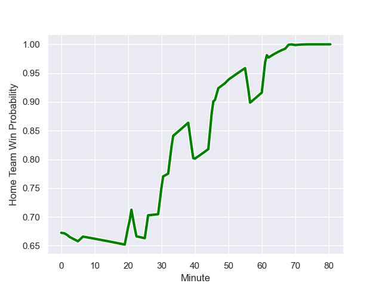

---  
layout: page  
title: Mitsubishi Dynaboars at Toyota Verblitz; 40-54  
date: 2023-12-23 18:00:00 -0500  
categories: "Japan Rugby League One 2023" match review  
---
# Mitsubishi Dynaboars at Toyota Verblitz; 40-54

# Club Level Predictions

The first set of predictions treats a club as the smallest object, as the club develops its members, organizes a gameplan, and deploys its players as needed for each match. This club model has a prediction of 0.827, which translates to predicting Toyota Verblitz to win by 14.2.

Each club has a rating and a rating deviation (similar to a Glicko rating), and expected performances can be generated. This allows for simulated matches and spreads like the ones below.
## Projected Performances - Club Model

## Projected Spreads - Club Model

## Projected Results - Club Model

# Player Level Predictions - Version 2

Treating teams instead as an entity made up of the currently active players, I have ratings for each player in an altogether different system. These can be combined to form team ratings once teamsheets are announced, weighting starters a bit higher than the reserves. After the match is played, players can be weighted by their minutes on the field, allowing for an accurate measure of the team's composition. With these compiled team ratings, we can make predictions, measure inaccuracy, and update the individual player ratings.
## Prediction with Player Minutes: Toyota Verblitz by 7.9

Toyota Verblitz by 4.6 on a neutral field
## Prediction without Player Minutes: Toyota Verblitz by 6.6

Toyota Verblitz by 3.3 on a neutral pitch

## Projected Performances - Player Model

## Projected Spreads - Player Model

## Projected Results - Player Model

## Scores over Time

## Win Probability over Time

There were 9 large changes in win probability in this match

|   Away Minutes | Away Player            |   Away elo |   Number |   Home elo | Home Player         |   Home Minutes |
|---------------:|:-----------------------|-----------:|---------:|-----------:|:--------------------|---------------:|
|             72 | Shunsuke Sakamoto      |      37.03 |        1 |      74.1  | Shogo Miura         |             62 |
|             72 | Yuki Miyazato          |      36.77 |        2 |      96.53 | Yoshikatsu Hikosaka |             68 |
|             47 | Tomoaki Ishii          |     108.35 |        3 |      62.51 | Genki Sudo          |             62 |
|             80 | Epineri Uluiviti       |      14.53 |        4 |      42.17 | Josh Dickson        |             21 |
|             80 | Daniel Linde           |      57.92 |        5 |      67.49 | Tom Robinson        |             80 |
|             80 | Kyo Yoshida            |      83.25 |        6 |      46.65 | Ryusei Koike        |             80 |
|             62 | Yusuke Sakamoto        |      44.77 |        7 |      42.29 | Masato Furukawa     |             80 |
|             62 | Jackson Hemopo         |      76.05 |        8 |      50.99 | Kazuki Himeno       |             80 |
|             50 | Kota Iwamura           |      76.3  |        9 |     111.99 | Aaron Smith         |             69 |
|             50 | James Grayson          |      66.41 |       10 |     161.92 | Beauden Barrett     |             80 |
|             80 | Honeti Taumoha'apai    |      84.96 |       11 |      74.53 | Yuki Okada          |             62 |
|             80 | Curtis Rona            |      62.6  |       12 |      77.07 | Charlie Lawrence    |             80 |
|             80 | Matt Vaega             |      48.19 |       13 |     -24.52 | Siosaia Fifita      |             80 |
|             40 | Ben Paltridge          |      53.87 |       14 |      66.16 | Taichi Takahashi    |             80 |
|             80 | Kazuki Ishida          |      34.74 |       15 |      36.25 | Dick Wilson         |             69 |
|             40 | Roland Alaiasa         |      59.21 |       16 |      66.15 | Isaiah Mapusua      |             59 |
|             33 | Kanzo Schinckel        |      46.65 |       17 |      53.47 | Shunsuke Asaoka     |             18 |
|             30 | Jack Stratton          |      88.35 |       18 |      47.59 | Shuhei Yamaguchi    |             18 |
|             30 | Brackin Karauria-Henry |      44.64 |       19 |      50    | Gaku Shimizu        |             18 |
|              8 | Mototsugu Hachiya      |      38.32 |       20 |      52.42 | Ryuhei Arita        |             12 |
|             18 | Walt Steenkamp         |      64.38 |       21 |      46.28 | Ryang Jong Chu      |             11 |
|              8 | Atsuro Nakamura        |      41.05 |       22 |      68.3  | Tiaan Falcon        |             11 |
|             18 | Masataka Tsuruya       |      94.11 |       23 |     nan    | nan                 |            nan |

