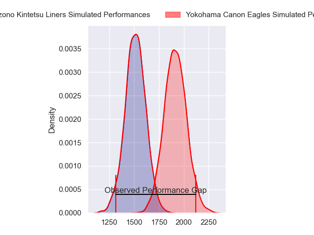
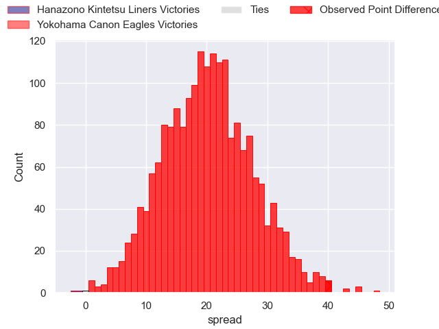
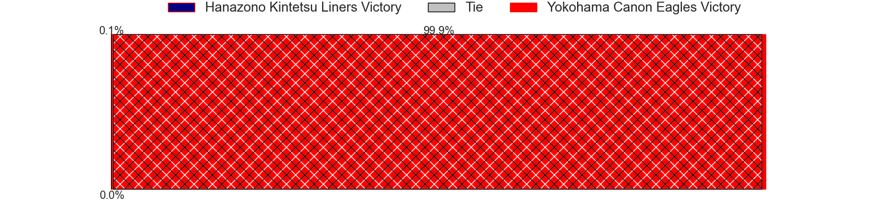
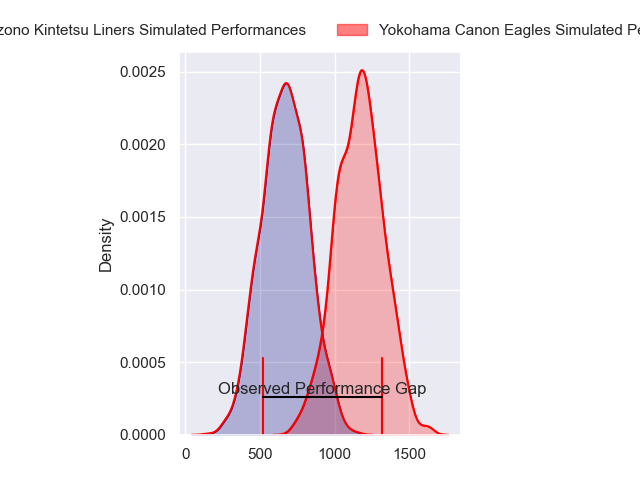
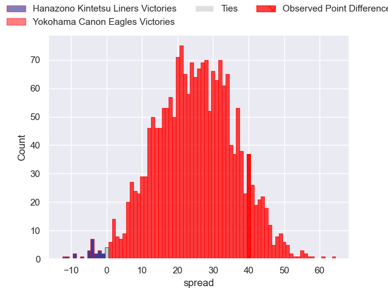
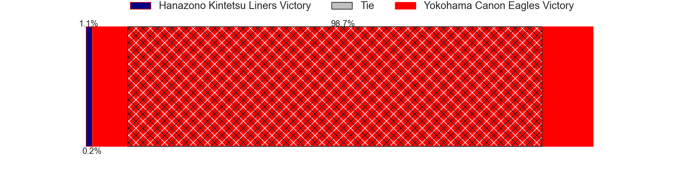
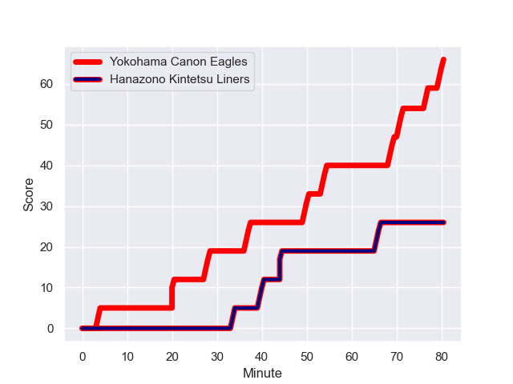
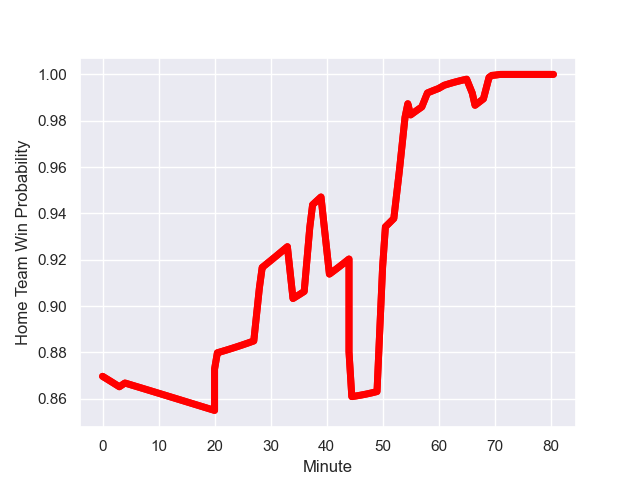

---  
layout: page  
title: Hanazono Kintetsu Liners at Yokohama Canon Eagles; 26-66  
date: 2023-12-23 18:00:00 -0500  
categories: "Japan Rugby League One 2023" match review  
---
# Hanazono Kintetsu Liners at Yokohama Canon Eagles; 26-66

# Club Level Predictions

The first set of predictions treats a club as the smallest object, as the club develops its members, organizes a gameplan, and deploys its players as needed for each match. This club model has a prediction of 0.901, which translates to predicting Yokohama Canon Eagles to win by 20.1.

Each club has a rating and a rating deviation (similar to a Glicko rating), and expected performances can be generated. This allows for simulated matches and spreads like the ones below.
## Projected Performances - Club Model

## Projected Spreads - Club Model

## Projected Results - Club Model

# Player Level Predictions - Version 2

Treating teams instead as an entity made up of the currently active players, I have ratings for each player in an altogether different system. These can be combined to form team ratings once teamsheets are announced, weighting starters a bit higher than the reserves. After the match is played, players can be weighted by their minutes on the field, allowing for an accurate measure of the team's composition. With these compiled team ratings, we can make predictions, measure inaccuracy, and update the individual player ratings.
## Prediction with Player Minutes: Yokohama Canon Eagles by 20.9

Yokohama Canon Eagles by 17.6 on a neutral field
## Prediction without Player Minutes: Yokohama Canon Eagles by 19.0

Yokohama Canon Eagles by 15.7 on a neutral pitch

## Projected Performances - Player Model

## Projected Spreads - Player Model

## Projected Results - Player Model

## Scores over Time

## Win Probability over Time

There were 3 large changes in win probability in this match

|   Away Minutes | Away Player      |   Away elo |   Number |   Home elo | Home Player        |   Home Minutes |
|---------------:|:-----------------|-----------:|---------:|-----------:|:-------------------|---------------:|
|             58 | Kenta Tanaka     |      39.7  |        1 |      92.25 | Takato Okabe       |             62 |
|             58 | Keiichi Kaneko   |      46.59 |        2 |      68.98 | Yusuke Niwai       |             55 |
|             64 | Yuchol Mun       |      46.65 |        3 |      15.89 | Tatsuro Sugimoto   |             58 |
|             80 | James Blackwell  |      64.21 |        4 |      11.9  | Liaki Moli         |             73 |
|             73 | Sanaila Waqa     |      55.53 |        5 |      44.35 | Matt Philip        |             48 |
|             80 | Patrick Tafa     |      32.64 |        6 |      91.06 | Kobus Van Dyk      |             80 |
|             64 | Jed Brown        |      55.1  |        7 |      64.67 | Naoto Shimada      |             80 |
|             80 | Daiki Miyashita  |      16.68 |        8 |      57.14 | Sione Halasili     |             80 |
|             64 | Will Genia       |     103.9  |        9 |     107.83 | Faf de Klerk       |             67 |
|             80 | Daisuke Noguchi  |      33.98 |       10 |      51.4  | Yu Tamura          |             73 |
|             61 | Ryosuke Kataoka  |      67.09 |       11 |      83.15 | Viliame Takayawa   |             80 |
|             80 | Haruki Kanazawa  |      37.09 |       12 |      82.87 | Yusuke Kajimura    |             80 |
|             53 | Liekina Kaufusi  |      43.17 |       13 |     130.96 | Jesse Kriel        |             80 |
|             80 | Ren Takano       |      33.26 |       14 |      67.04 | Inoke Burua        |             62 |
|             80 | Joshua Nohra     |      24.12 |       15 |     123.55 | Jumpei Ogura       |             80 |
|             27 | Takumi Yoshimoto |      39.9  |       16 |      83.93 | Shunta Nakamura    |             32 |
|             22 | Sho Fukui        |      43.31 |       17 |      46.65 | Lekima Nasamila    |             25 |
|             22 | Shun Sasaki      |      37.08 |       18 |      55.79 | Ryosuke Iwaihara   |             22 |
|             19 | Koji Okamura     |       5.04 |       19 |      53.4  | Chang Ho Ahn       |             18 |
|             16 | Shinki Ushikubo  |      32.69 |       20 |      34.65 | Masayoshi Takezawa |             18 |
|             16 | Kensyo Kawamura  |      46.85 |       21 |      48.33 | Kafazumi Yamasuga  |             13 |
|             16 | Tevita Tupou     |      50.17 |       22 |      65.04 | Sioeli Vakalahi    |              7 |
|              7 | Isamu Matsuoka   |      28.54 |       23 |      46.86 | Ryo Tabata         |              7 |

