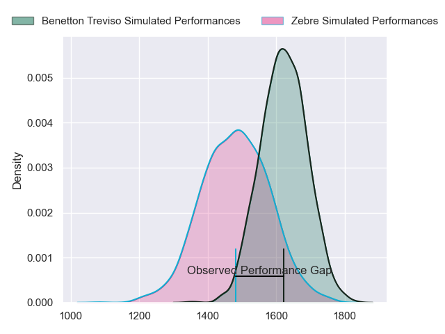
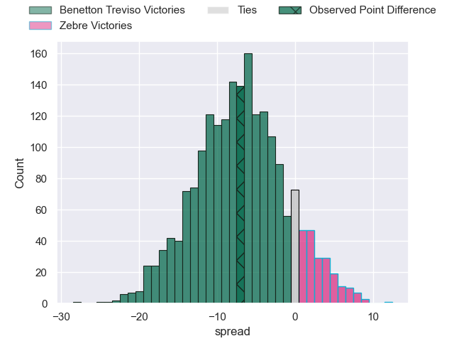
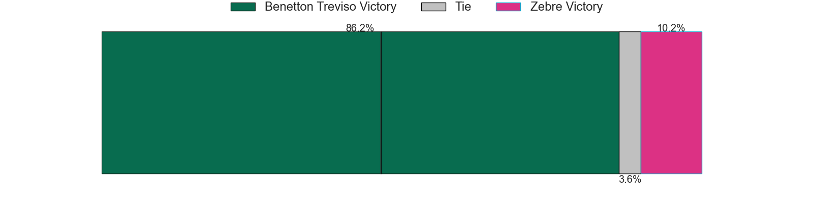
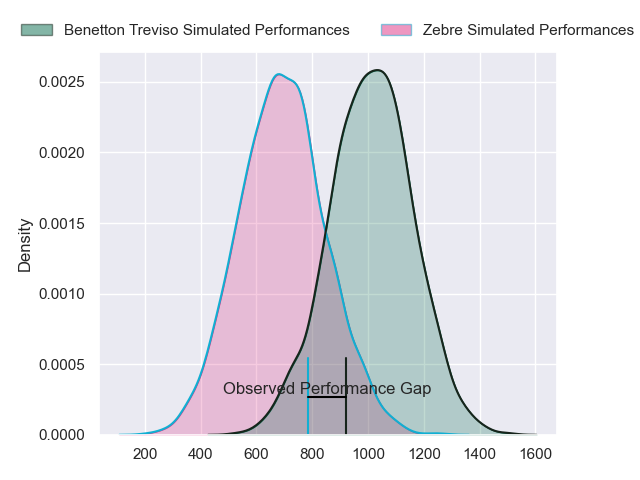
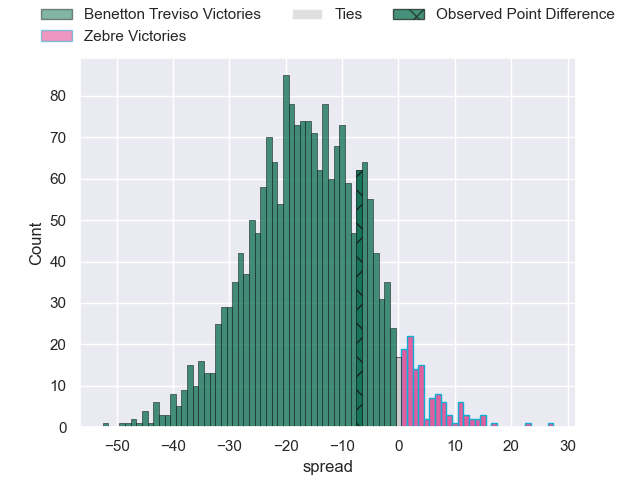
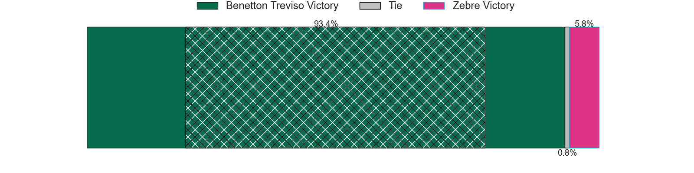
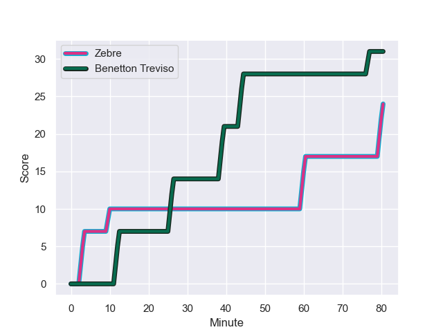
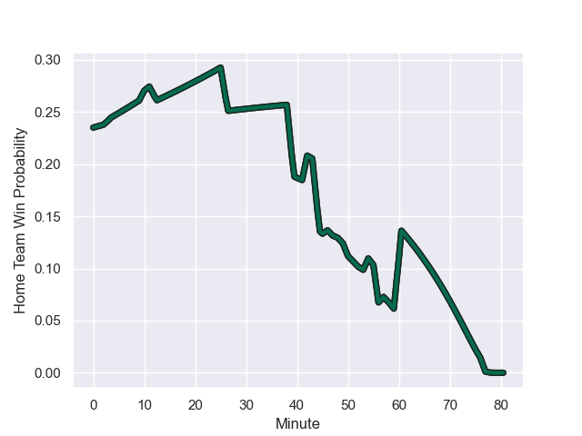

---  
layout: page  
title: Benetton Treviso at Zebre; 31-24  
date: 2023-12-23 18:00:00 -0500  
categories: "United Rugby Championship 2023" match review  
---
# Benetton Treviso at Zebre; 31-24

# Club Level Predictions

The first set of predictions treats a club as the smallest object, as the club develops its members, organizes a gameplan, and deploys its players as needed for each match. This club model has a prediction of 0.308, which translates to predicting Benetton Treviso to win by 7.2.

Each club has a rating and a rating deviation (similar to a Glicko rating), and expected performances can be generated. This allows for simulated matches and spreads like the ones below.
## Projected Performances - Club Model

## Projected Spreads - Club Model

## Projected Results - Club Model

# Player Level Predictions - Version 2

Treating teams instead as an entity made up of the currently active players, I have ratings for each player in an altogether different system. These can be combined to form team ratings once teamsheets are announced, weighting starters a bit higher than the reserves. After the match is played, players can be weighted by their minutes on the field, allowing for an accurate measure of the team's composition. With these compiled team ratings, we can make predictions, measure inaccuracy, and update the individual player ratings.
## Prediction with Player Minutes: Benetton Treviso by 12.9

Benetton Treviso by 16.6 on a neutral field
## Prediction without Player Minutes: Benetton Treviso by 13.8

Benetton Treviso by 17.6 on a neutral pitch

## Projected Performances - Player Model

## Projected Spreads - Player Model

## Projected Results - Player Model

## Scores over Time

## Win Probability over Time

There were 6 large changes in win probability in this match

|   Away Minutes | Away Player         |   Away elo |   Number |   Home elo | Home Player            |   Home Minutes |
|---------------:|:--------------------|-----------:|---------:|-----------:|:-----------------------|---------------:|
|             50 | Mirco Spagnolo      |      60.63 |        1 |      53.66 | Danilo Fischetti       |             66 |
|             46 | Bautista Bernasconi |      42.2  |        2 |      10.74 | Marco Manfredi         |             48 |
|             59 | Giosue Zilocchi     |      57.7  |        3 |      42.02 | Juan Manuel Pitinari   |             48 |
|             80 | Edoardo Iachizzi    |      67.26 |        4 |      26.18 | Dave Sisi              |             57 |
|             42 | Federico Ruzza      |     104.54 |        5 |      42.54 | Andrea Zambonin        |             80 |
|             80 | Alessandro Izekor   |      58.71 |        6 |      54.75 | Guido Volpi            |             80 |
|             80 | Michele Lamaro      |     106.87 |        7 |      47.41 | Giacomo Ferrari        |             80 |
|             62 | Toa Halafihi        |      79.05 |        8 |      55.74 | Davide Ruggeri         |             54 |
|             50 | Andy Uren           |      43.28 |        9 |      24.59 | Gonzalo Jesus Garcia   |             53 |
|             80 | Jacob Umaga         |      82.09 |       10 |      79.33 | Geronimo Prisciantelli |             80 |
|             80 | Onisi Ratave        |      47.19 |       11 |      19.61 | Simone Gesi            |             54 |
|             80 | Malakai Fekitoa     |      91.06 |       12 |      49.29 | Enrico Lucchin         |             80 |
|             56 | Tommaso Menoncello  |      64.42 |       13 |      58.68 | Fetuli Paea            |             56 |
|             44 | Paolo Odogwu        |      79.39 |       14 |      25.04 | Pierre Bruno           |             80 |
|             80 | Rhyno Smith         |      76.68 |       15 |      25.88 | Lorenzo Pani           |             80 |
|             38 | Riccardo Favretto   |      38.69 |       16 |       8.34 | Matteo Nocera          |             32 |
|             36 | Edoardo Padovani    |      65.17 |       17 |      55.3  | Luca Bigi              |             32 |
|             34 | Siua Maile          |      14.6  |       18 |      35.18 | Alessandro Fusco       |             27 |
|             30 | Alessandro Garbisi  |      58.64 |       19 |      98.09 | Luca Morisi            |             26 |
|             30 | Thomas Gallo        |      73.2  |       20 |      10.81 | Iacopo Bianchi         |             26 |
|             24 | Leonardo Marin      |      64.22 |       21 |       5.97 | Giovanni Montemauri    |             24 |
|             21 | Tiziano Pasquali    |      64.1  |       22 |       2.35 | Leonard Krumov         |             23 |
|             18 | Henry Time-Stowers  |      20.99 |       23 |      33.16 | Luca Rizzoli           |             14 |

