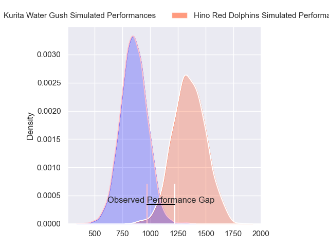
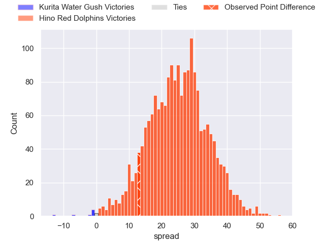
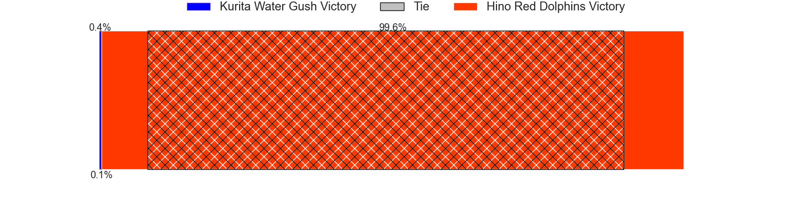
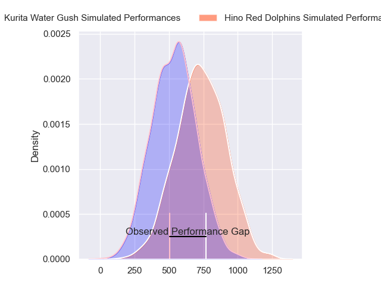
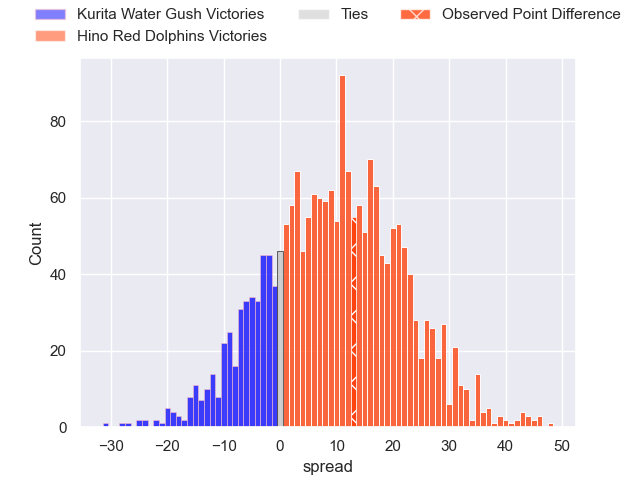
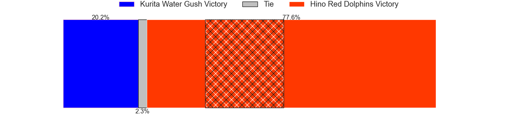
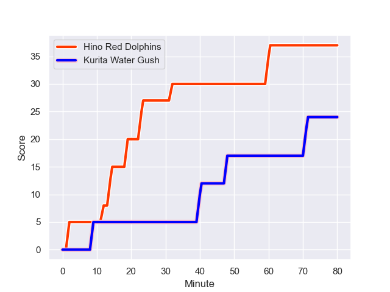
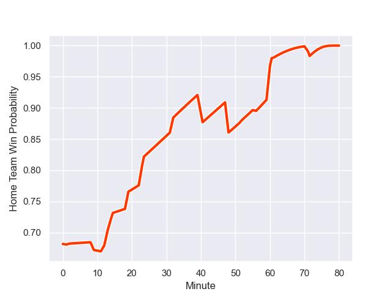

---  
layout: page  
title: Kurita Water Gush at Hino Red Dolphins; 24-37  
date: 2023-12-24 18:00:00 -0500  
categories: "Japan Rugby League One D3 2023" match review  
---
# Kurita Water Gush at Hino Red Dolphins; 24-37

# Club Level Predictions

The first set of predictions treats a club as the smallest object, as the club develops its members, organizes a gameplan, and deploys its players as needed for each match. This club model has a prediction of 0.938, which translates to predicting Hino Red Dolphins to win by 25.2.

Each club has a rating and a rating deviation (similar to a Glicko rating), and expected performances can be generated. This allows for simulated matches and spreads like the ones below.
## Projected Performances - Club Model

## Projected Spreads - Club Model

## Projected Results - Club Model

# Player Level Predictions - Version 2

Treating teams instead as an entity made up of the currently active players, I have ratings for each player in an altogether different system. These can be combined to form team ratings once teamsheets are announced, weighting starters a bit higher than the reserves. After the match is played, players can be weighted by their minutes on the field, allowing for an accurate measure of the team's composition. With these compiled team ratings, we can make predictions, measure inaccuracy, and update the individual player ratings.
## Prediction with Player Minutes: Hino Red Dolphins by 8.4

Hino Red Dolphins by 5.3 on a neutral field
## Prediction without Player Minutes: Hino Red Dolphins by 8.2

Hino Red Dolphins by 5.1 on a neutral pitch

## Projected Performances - Player Model

## Projected Spreads - Player Model

## Projected Results - Player Model

## Scores over Time

## Win Probability over Time

There were 5 large changes in win probability in this match

|   Away Minutes | Away Player          |   Away elo |   Number |   Home elo | Home Player        |   Home Minutes |
|---------------:|:---------------------|-----------:|---------:|-----------:|:-------------------|---------------:|
|             61 | Kei Shibuya          |      47.88 |        1 |      44.33 | Yuto Tokuda        |             70 |
|             61 | Ryota Kuribara       |      20.81 |        2 |      46.65 | Towa Taniguchi     |             77 |
|             67 | Kuriyama Rui         |      33.78 |        3 |      35.02 | Shosuke Funaki     |             56 |
|             52 | Kota Nakamura        |      18.54 |        4 |      54.13 | Zephania Tuinona   |             80 |
|             71 | Mike Williams        |      15.67 |        5 |      46.9  | Noah Tovio         |             80 |
|             80 | Kengo Nakamura       |      30.22 |        6 |      46.65 | Shun Nakashika     |             80 |
|             80 | Yosuke Ishii         |      18    |        7 |      46.65 | Shun Tomonaga      |             70 |
|             80 | Tebita Oto           |      59.18 |        8 |      46.65 | Shohei Ijima       |             64 |
|             61 | Ryo Omasa            |      36.84 |        9 |      15.51 | Norifumi Hashimoto |             79 |
|             80 | Piers Francis        |      52.82 |       10 |      70.57 | Simon Hickey       |             80 |
|             80 | Keigo Hamazoe        |      31.81 |       11 |      29.88 | Sora Ohchi         |             80 |
|             80 | Jamie Vakalahi       |      48.06 |       12 |      25.44 | Shogo Tokota       |             13 |
|             56 | Ayato Sakamoto       |       5.65 |       13 |      38.55 | Yuta Matsui        |             71 |
|             67 | Hosea Saumaki        |      41.64 |       14 |      46.65 | Ko Kojima          |             80 |
|             80 | Koshi Emoto          |      53.39 |       15 |      33.86 | Kyoji Takano       |             80 |
|             28 | Mitsuo Nakao         |      14.84 |       16 |      55.91 | Taiki Kawai        |             67 |
|             24 | Antonio Mikaele-Tu'u |      43.64 |       17 |      46.65 | Taiga Yamaguchi    |             24 |
|             19 | Shoya Koyama         |      23.04 |       18 |      46.65 | Yutaro Danno       |             10 |
|             19 | Ryutaro Iguchi       |      46.65 |       19 |      53.34 | Yuta Kasahara      |             10 |
|             19 | Kakeru Sugihara      |      50.97 |       20 |      46.65 | Keita Doi          |              9 |
|             13 | Aki Kajiwara         |      40.77 |       21 |      46.65 | Daiki Yanagawa     |              3 |
|             13 | Takuro Hayashida     |      30.1  |       22 |      61.55 | Yuki Kagoshima     |              1 |
|              9 | Taisei Nakao         |      49.61 |       23 |      48.05 | Junya Lee          |             16 |

