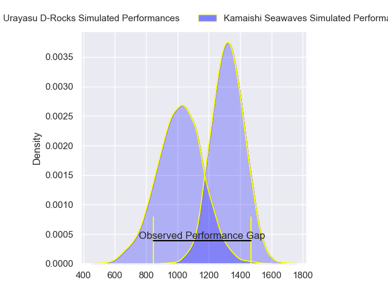
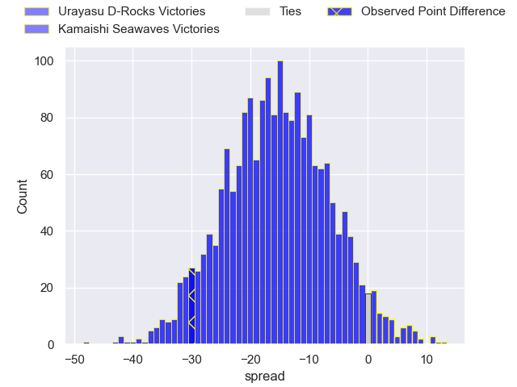
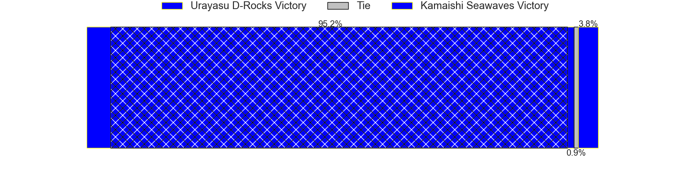
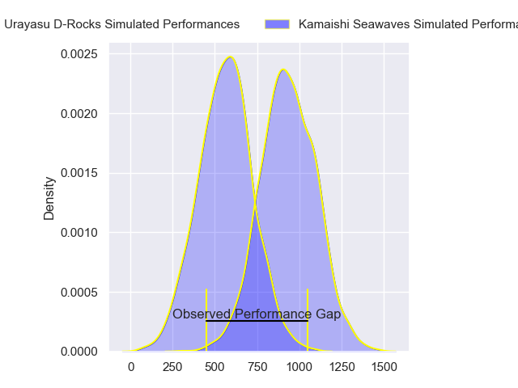
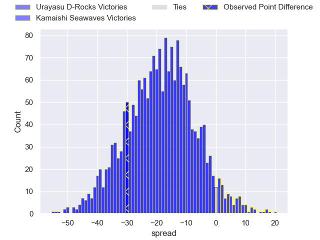
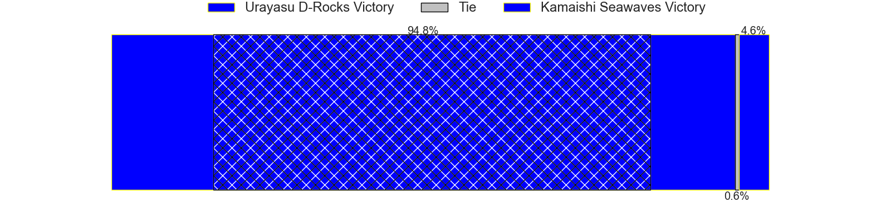
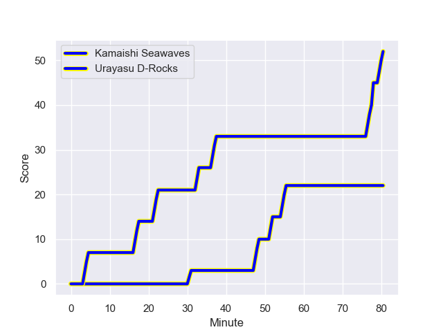
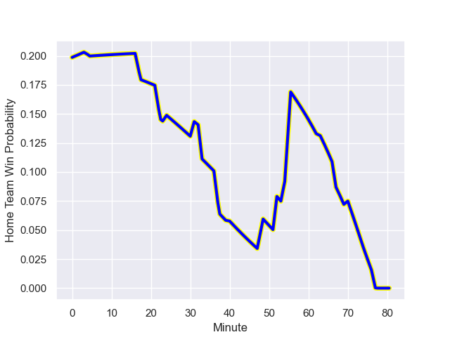

---  
layout: page  
title: Urayasu D-Rocks at Kamaishi Seawaves; 52-22  
date: 2023-12-24 18:00:00 -0500  
categories: "Japan Rugby League One D2 2023" match review  
---
# Urayasu D-Rocks at Kamaishi Seawaves; 52-22

# Club Level Predictions

The first set of predictions treats a club as the smallest object, as the club develops its members, organizes a gameplan, and deploys its players as needed for each match. This club model has a prediction of 0.159, which translates to predicting Urayasu D-Rocks to win by 15.3.

Each club has a rating and a rating deviation (similar to a Glicko rating), and expected performances can be generated. This allows for simulated matches and spreads like the ones below.
## Projected Performances - Club Model

## Projected Spreads - Club Model

## Projected Results - Club Model

# Player Level Predictions - Version 2

Treating teams instead as an entity made up of the currently active players, I have ratings for each player in an altogether different system. These can be combined to form team ratings once teamsheets are announced, weighting starters a bit higher than the reserves. After the match is played, players can be weighted by their minutes on the field, allowing for an accurate measure of the team's composition. With these compiled team ratings, we can make predictions, measure inaccuracy, and update the individual player ratings.
## Prediction with Player Minutes: Urayasu D-Rocks by 15.4

Urayasu D-Rocks by 18.6 on a neutral field
## Prediction without Player Minutes: Urayasu D-Rocks by 15.2

Urayasu D-Rocks by 18.3 on a neutral pitch

## Projected Performances - Player Model

## Projected Spreads - Player Model

## Projected Results - Player Model

## Scores over Time

## Win Probability over Time

There were 5 large changes in win probability in this match

|   Away Minutes | Away Player          |   Away elo |   Number |   Home elo | Home Player        |   Home Minutes |
|---------------:|:---------------------|-----------:|---------:|-----------:|:-------------------|---------------:|
|             54 | Kazuma Nishikawa     |      27.82 |        1 |      48.16 | Yusuke Yamada      |             54 |
|             54 | Shokei Kin           |      50.19 |        2 |      18.39 | Daiki Ito          |             80 |
|             54 | Kim Ryom             |      49.21 |        3 |      18.82 | Flyn Yates         |             40 |
|             63 | Yuta Kojima          |      73.97 |        4 |      30.62 | Hamish Dalzell     |             80 |
|             80 | Wimpie van der Walt  |      72.38 |        5 |      30.98 | Ben Nee Nee        |             54 |
|             24 | Shingo Nakashima     |      77.33 |        6 |      14.9  | Ryunosuke Yamada   |             80 |
|             80 | Shin Takeuchi        |      46.65 |        7 |      41.08 | Daisuke Musya      |             80 |
|             80 | Tyler Paul           |      99.19 |        8 |      36.87 | Naoki Ouno         |             40 |
|             75 | Ren Iinuma           |      45    |        9 |      37.14 | Atsushi Minami     |             67 |
|             70 | Otere Black          |      65.27 |       10 |      42.85 | Kazuki Ochi        |             67 |
|             80 | Kai Ishii            |      38.96 |       11 |      79.98 | Jamie Henry        |             80 |
|             80 | Samu Kerevi          |     101.65 |       12 |      51.44 | Kohei Ishigaki     |             80 |
|             80 | Tone Tukufuka        |      96.18 |       13 |      20.86 | Osuka Lloyd Murata |             54 |
|             80 | Larry Steven Sulunga |      46.67 |       14 |      -1.55 | Kodai Ono          |             80 |
|             75 | Takuhei Yasuda       |      72.31 |       15 |       0.21 | Cam Bailey         |             80 |
|             56 | Shinya Osugi         |      57.78 |       16 |      35.82 | Seta Koroitamana   |             40 |
|             26 | Kazuki Ban           |      46.87 |       17 |      46.65 | Tomoyoshi Oikawa   |             40 |
|             26 | Ryuji Fujimura       |      50.07 |       18 |      35.54 | Shoichiro Inada    |             26 |
|             26 | Syuhei Takeuchi      |      34.29 |       19 |      43.95 | Syou Kataoka       |             26 |
|             17 | Levi Douglas         |      30.27 |       20 |      46.65 | Ryota Kono         |             26 |
|             10 | Hayden Cripps        |      59.72 |       21 |      41.64 | Takumi Tokairin    |             13 |
|              5 | Taisei Konishi       |      45.63 |       22 |      12.78 | Ryoma Nakamura     |             13 |
|              5 | Syouta Takano        |      27.05 |       23 |     nan    | nan                |            nan |

