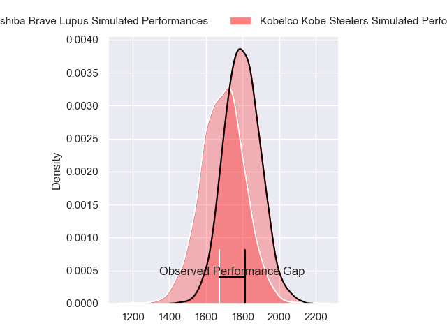
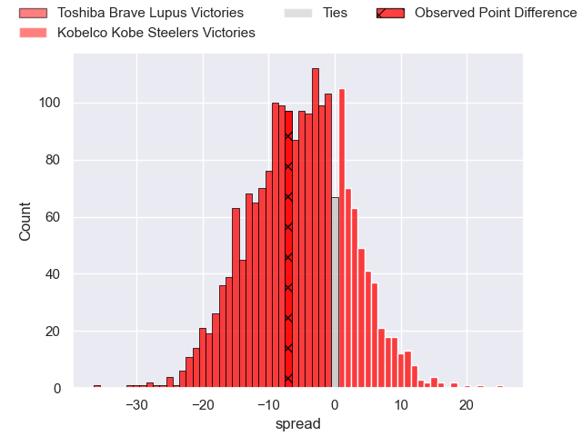
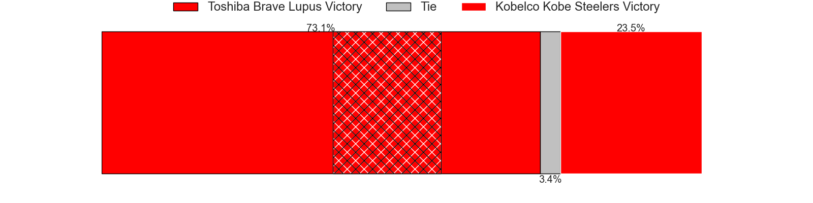
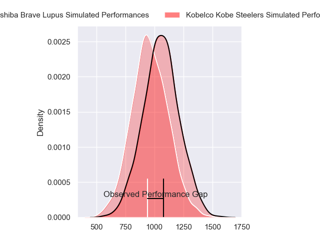
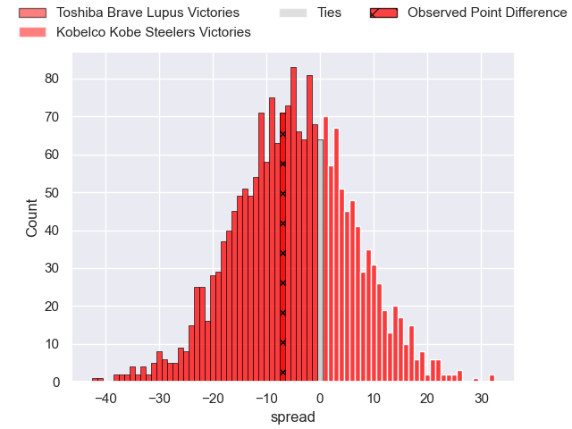
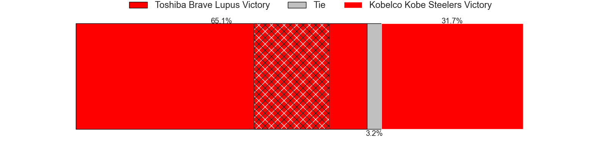
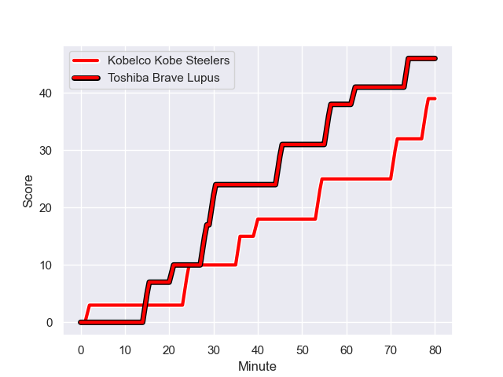
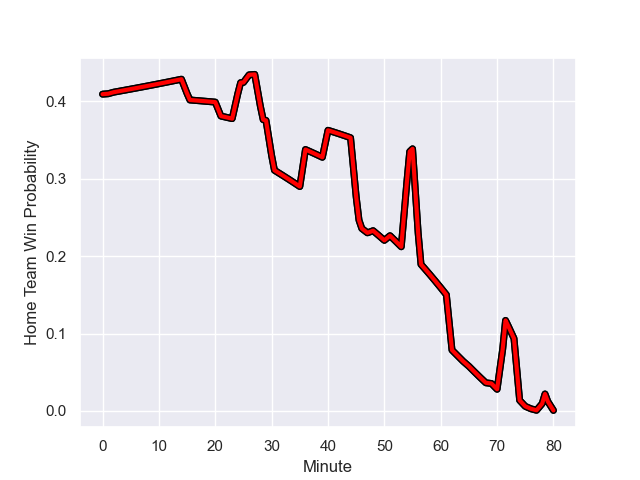

---  
layout: page  
title: Toshiba Brave Lupus at Kobelco Kobe Steelers; 46-39  
date: 2023-12-24 18:00:00 -0500  
categories: "Japan Rugby League One 2023" match review  
---
# Toshiba Brave Lupus at Kobelco Kobe Steelers; 46-39

# Club Level Predictions

The first set of predictions treats a club as the smallest object, as the club develops its members, organizes a gameplan, and deploys its players as needed for each match. This club model has a prediction of 0.365, which translates to predicting Toshiba Brave Lupus to win by 5.1.

Each club has a rating and a rating deviation (similar to a Glicko rating), and expected performances can be generated. This allows for simulated matches and spreads like the ones below.
## Projected Performances - Club Model

## Projected Spreads - Club Model

## Projected Results - Club Model

# Player Level Predictions - Version 2

Treating teams instead as an entity made up of the currently active players, I have ratings for each player in an altogether different system. These can be combined to form team ratings once teamsheets are announced, weighting starters a bit higher than the reserves. After the match is played, players can be weighted by their minutes on the field, allowing for an accurate measure of the team's composition. With these compiled team ratings, we can make predictions, measure inaccuracy, and update the individual player ratings.
## Prediction with Player Minutes: Toshiba Brave Lupus by 4.0

Toshiba Brave Lupus by 7.4 on a neutral field
## Prediction without Player Minutes: Toshiba Brave Lupus by 4.2

Toshiba Brave Lupus by 7.6 on a neutral pitch

## Projected Performances - Player Model

## Projected Spreads - Player Model

## Projected Results - Player Model

## Scores over Time

## Win Probability over Time

There were 15 large changes in win probability in this match

|   Away Minutes | Away Player      |   Away elo |   Number |   Home elo | Home Player              |   Home Minutes |
|---------------:|:-----------------|-----------:|---------:|-----------:|:-------------------------|---------------:|
|             62 | Sena Kimura      |      52.04 |        1 |      47.02 | Shigure Takao            |             48 |
|             69 | Mamoru Harada    |      47.6  |        2 |      51.77 | Takuya Kitade            |             48 |
|             55 | Teruo Makabe     |      59.99 |        3 |     -13.99 | Koo Ji-won               |             65 |
|             80 | Warner Dearns    |      77.16 |        4 |      46.65 | Waisake Raratubua        |             62 |
|             51 | Jacob Pierce     |     114.38 |        5 |     142.71 | Brodie Retallick         |             75 |
|             80 | Shannon Frizell  |      66.33 |        6 |      56.26 | Amanaki Saumaki          |             80 |
|             51 | Shin Ito         |      58.83 |        7 |     112.33 | Ardie Savea              |             80 |
|             80 | Michael Leitch   |     100.92 |        8 |      41.08 | Tiennan Costley          |             80 |
|             46 | Yuhei Sugiyama   |      55.97 |        9 |      53.1  | Daiki Nakajima           |             65 |
|             80 | Richie Mo'unga   |     130.13 |       10 |      77.92 | Bryn Gatland             |             80 |
|             80 | Atsuki Kuwayama  |      58.2  |       11 |      91.02 | Rakuhei Yamashita        |             62 |
|             51 | Taichi Mano      |      58.09 |       12 |      15.89 | Seungsin Lee             |             80 |
|             80 | Rob Thompson     |      54.19 |       13 |      66.37 | Ngani Laumape            |             62 |
|             26 | Jone Naikabula   |      61.37 |       14 |      43.47 | Kanta Matsunaga          |             80 |
|             80 | Takuro Matsunaga |      77.26 |       15 |      47.44 | Ryohei Yamanaka          |             80 |
|             54 | Yuto Mori        |      47.81 |       16 |      79.72 | Isileli Nakajima Vakauta |             32 |
|             34 | Takahiro Ogawa   |      74.71 |       17 |      40.32 | Kenta Matsuoka           |             32 |
|             29 | Takeshi Sasaki   |      57.3  |       18 |      34    | Takara Imamura           |             18 |
|             29 | Samuela Anise    |      32.62 |       19 |      58.47 | Michael Little           |             18 |
|             29 | Seta Tamanivalu  |     108.03 |       20 |      35.25 | Junta Hamano             |             18 |
|             25 | Taufa Latu       |      46.65 |       21 |      61.87 | Atsushi Hiwasa           |             15 |
|             18 | Masataka Mikami  |      75.21 |       22 |      50.29 | Takayuki Watanabe        |             15 |
|             11 | Daigo Hashimoto  |      39.29 |       23 |      63.06 | Gerard Cowley-Tuioti     |              5 |

