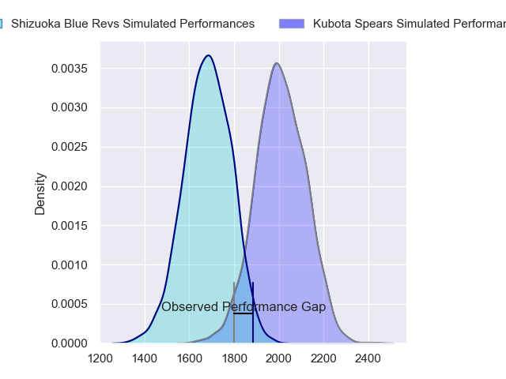
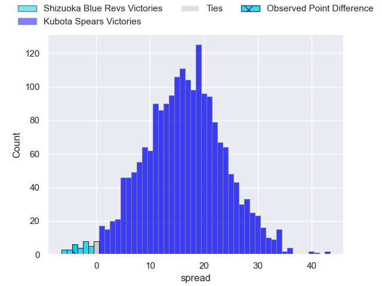
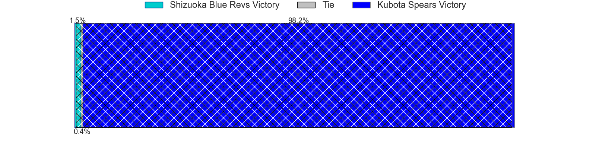
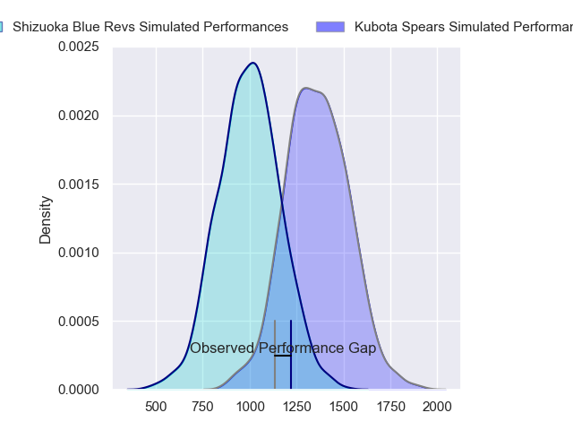
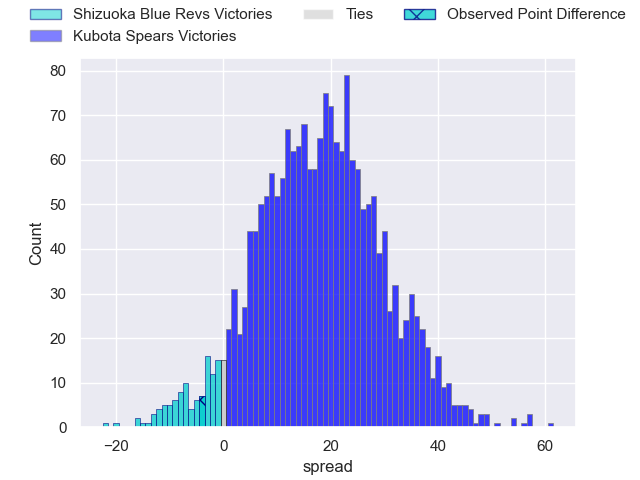
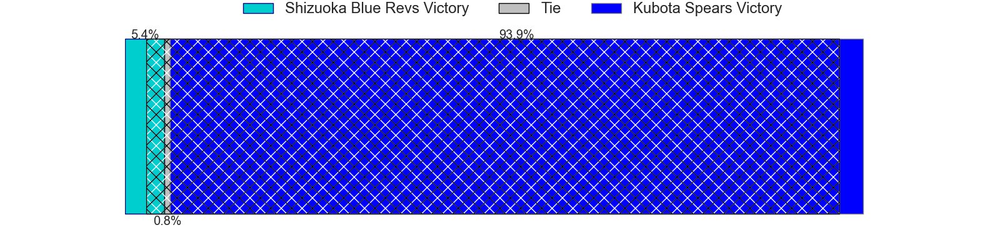
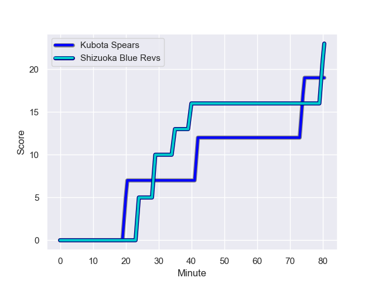
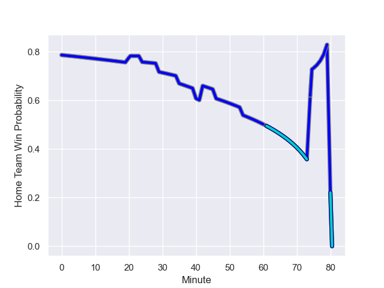

---  
layout: page  
title: Shizuoka Blue Revs at Kubota Spears; 23-19  
date: 2023-12-24 18:00:00 -0500  
categories: "Japan Rugby League One 2023" match review  
---
# Shizuoka Blue Revs at Kubota Spears; 23-19

# Club Level Predictions

The first set of predictions treats a club as the smallest object, as the club develops its members, organizes a gameplan, and deploys its players as needed for each match. This club model has a prediction of 0.855, which translates to predicting Kubota Spears to win by 16.2.

Each club has a rating and a rating deviation (similar to a Glicko rating), and expected performances can be generated. This allows for simulated matches and spreads like the ones below.
## Projected Performances - Club Model

## Projected Spreads - Club Model

## Projected Results - Club Model

# Player Level Predictions - Version 2

Treating teams instead as an entity made up of the currently active players, I have ratings for each player in an altogether different system. These can be combined to form team ratings once teamsheets are announced, weighting starters a bit higher than the reserves. After the match is played, players can be weighted by their minutes on the field, allowing for an accurate measure of the team's composition. With these compiled team ratings, we can make predictions, measure inaccuracy, and update the individual player ratings.
## Prediction with Player Minutes: Kubota Spears by 14.5

Kubota Spears by 11.2 on a neutral field
## Prediction without Player Minutes: Kubota Spears by 14.9

Kubota Spears by 11.6 on a neutral pitch

## Projected Performances - Player Model

## Projected Spreads - Player Model

## Projected Results - Player Model

## Scores over Time

## Win Probability over Time

There were 12 large changes in win probability in this match

|   Away Minutes | Away Player        |   Away elo |   Number |   Home elo | Home Player            |   Home Minutes |
|---------------:|:-------------------|-----------:|---------:|-----------:|:-----------------------|---------------:|
|             66 | Kazuhiro Kawata    |      42.11 |        1 |      77.59 | Kota Kaishi            |             54 |
|             77 | Takeshi Hino       |     109.39 |        2 |     126.86 | Dane Coles             |             46 |
|             66 | Heiichiro Ito      |      73.11 |        3 |      33.31 | Shoya Matsunami        |             54 |
|             80 | Yuya Odo           |      92.8  |        4 |      52    | Yuki Aoki              |             46 |
|             80 | Murray Douglas     |      93.96 |        5 |     137.16 | Ruan Botha             |             80 |
|             50 | Shoji Takuma       |      43.43 |        6 |      69.71 | Finau Tupa             |             80 |
|             80 | Kwagga Smith       |      85.32 |        7 |      84.26 | Takeo Suenaga          |             80 |
|             66 | Malgene Ilaua      |      50.59 |        8 |      78.8  | Faulua Makisi          |             77 |
|             66 | Yuki Yatomi        |      49.68 |        9 |      52.72 | Shinobu Fujiwara       |             80 |
|             80 | Kenta Iemura       |      52.56 |       10 |     159.94 | Bernard Foley          |             80 |
|             80 | Malo Tuitama       |      64.98 |       11 |      70.7  | Haruto Kida            |             80 |
|             66 | Viliami Tahitu'a   |      74.17 |       12 |      72.21 | Harumichi Tatekawa     |             80 |
|             66 | Charles Piutau     |      84.9  |       13 |      86.89 | Sione Teaupa           |             80 |
|             80 | Hironori Yatomi    |      30.32 |       14 |     115.51 | Gerhard van den Heever |             80 |
|             80 | Futo Yamaguchi     |      57.44 |       15 |     120.42 | Liam Williams          |             54 |
|             30 | Eishin Kuwano      |      70.62 |       16 |      57.04 | Schalk Erasmus         |             34 |
|             14 | Bryn Hall          |     108.86 |       17 |      23.8  | JD Schickerling        |             34 |
|             14 | Richard Goh Jones  |      50.35 |       18 |      51.56 | Yota Kaminori          |             26 |
|             14 | Shintaro Okamoto   |      54.6  |       19 |      71.75 | Suryung Kim            |             26 |
|             14 | Jonathan Faauli    |      65.49 |       20 |      48.45 | Satoshi Saita          |             26 |
|             14 | Sohei Nishimura    |      33.79 |       21 |      46.65 | Asipeli Moala          |              3 |
|             14 | Sam Greene         |      19.44 |       22 |     nan    | nan                    |            nan |
|              3 | Richmond Tongatama |      46.64 |       23 |     nan    | nan                    |            nan |

