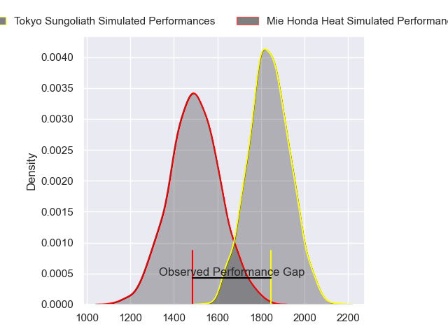
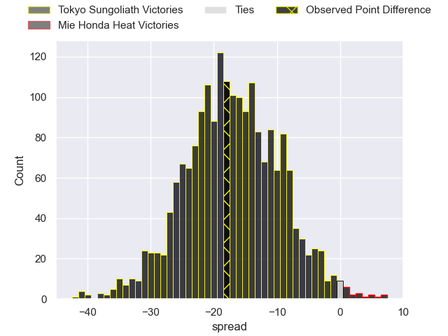
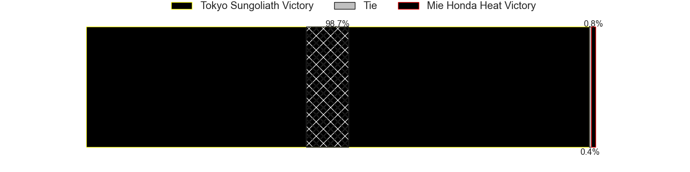
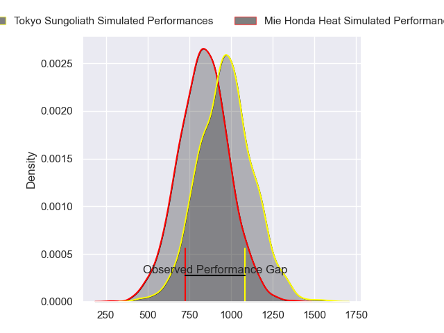
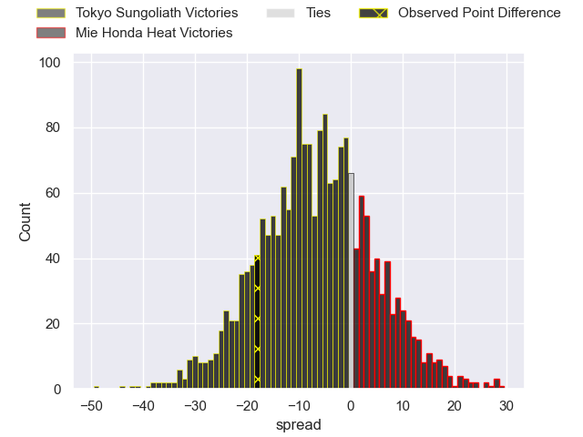
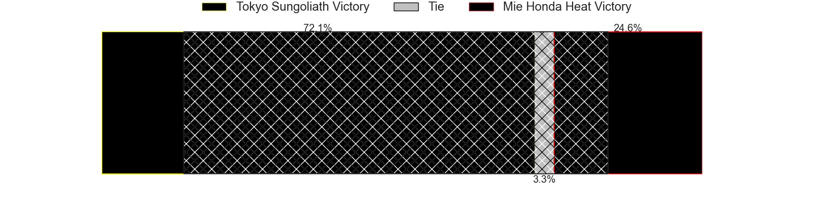
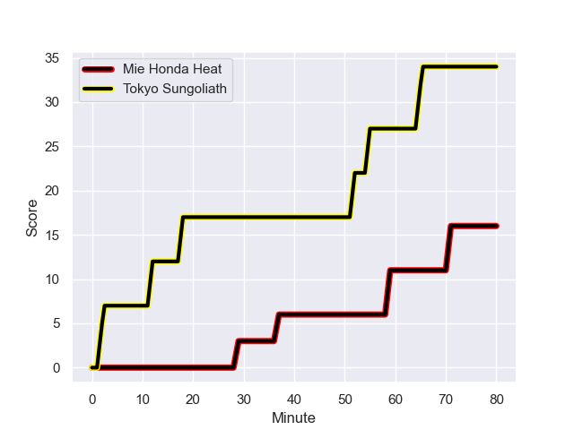
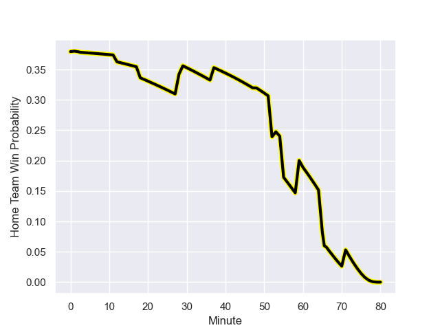

---  
layout: page  
title: Tokyo Sungoliath at Mie Honda Heat; 34-16  
date: 2023-12-24 18:00:00 -0500  
categories: "Japan Rugby League One 2023" match review  
---
# Tokyo Sungoliath at Mie Honda Heat; 34-16

# Club Level Predictions

The first set of predictions treats a club as the smallest object, as the club develops its members, organizes a gameplan, and deploys its players as needed for each match. This club model has a prediction of 0.131, which translates to predicting Tokyo Sungoliath to win by 17.1.

Each club has a rating and a rating deviation (similar to a Glicko rating), and expected performances can be generated. This allows for simulated matches and spreads like the ones below.
## Projected Performances - Club Model

## Projected Spreads - Club Model

## Projected Results - Club Model

# Player Level Predictions - Version 2

Treating teams instead as an entity made up of the currently active players, I have ratings for each player in an altogether different system. These can be combined to form team ratings once teamsheets are announced, weighting starters a bit higher than the reserves. After the match is played, players can be weighted by their minutes on the field, allowing for an accurate measure of the team's composition. With these compiled team ratings, we can make predictions, measure inaccuracy, and update the individual player ratings.
## Prediction with Player Minutes: Tokyo Sungoliath by 5.4

Tokyo Sungoliath by 8.7 on a neutral field
## Prediction without Player Minutes: Tokyo Sungoliath by 7.1

Tokyo Sungoliath by 10.4 on a neutral pitch

## Projected Performances - Player Model

## Projected Spreads - Player Model

## Projected Results - Player Model

## Scores over Time

## Win Probability over Time

There were 6 large changes in win probability in this match

|   Away Minutes | Away Player       |   Away elo |   Number |   Home elo | Home Player           |   Home Minutes |
|---------------:|:------------------|-----------:|---------:|-----------:|:----------------------|---------------:|
|             53 | Yukio Morikawa    |      81.07 |        1 |      37.19 | Tatsuhiko Tsurukawa   |             53 |
|             60 | Kosuke Horikoshi  |      42.13 |        2 |      44.21 | Lee Seung Hyok        |             66 |
|             72 | Kan Nakano        |      42.25 |        3 |      46.65 | Katsuyuki Hoshino     |             48 |
|             53 | Sione Lavemai     |      65.66 |        4 |      23.25 | Ryota Kobayashi       |             80 |
|             80 | Harry Hockings    |     119.5  |        5 |     107.6  | Franco Mostert        |             80 |
|             80 | Kanji Shimokawa   |      52.19 |        6 |      41.35 | Heiden Bedwell-Curtis |             48 |
|             66 | Kai Yamamoto      |      43.93 |        7 |      33.03 | Ryo Furuta            |             80 |
|             28 | Sam Cane          |     129.23 |        8 |      56.54 | Waimana Kapa          |             60 |
|             72 | Naoto Saito       |      40.03 |        9 |      44.57 | Shogo Nezuka          |             53 |
|             80 | Mikiya Takamoto   |      46.65 |       10 |      84.47 | Mitch Hunt            |             80 |
|             80 | Cheslin Kolbe     |     139.67 |       11 |      53.1  | Kanta Watanabe        |             60 |
|             80 | Isaiah Punivai    |      38.78 |       12 |      49.63 | Issei Shige           |             55 |
|             80 | Taiga Ozaki       |      48.17 |       13 |      28.47 | Clinton Knox          |             80 |
|             80 | Seiya Ozaki       |      69.1  |       14 |      44.67 | Fraser Quirk          |             80 |
|             66 | Kotaro Matsushima |      85.49 |       15 |      61.38 | Gwangtee Oh           |             80 |
|             52 | Ryuga Hashimoto   |      45.17 |       16 |      53.59 | Tetuhi Roberts        |             32 |
|             27 | Hendrik Tui       |      53.63 |       17 |      45.64 | Matthys Basson        |             32 |
|             27 | Kenta Kobayashi   |      47.28 |       18 |      46.46 | Kanato Hirano         |             27 |
|             20 | Kienori Go        |      35.89 |       19 |      43.85 | Taichi Takenaka       |             27 |
|             14 | Tony Alofipo      |      47.22 |       20 |      46.65 | Haruhiko Uemura       |             25 |
|             14 | Ryosuke Kawase    |      54.79 |       21 |      30.79 | Dawid Kellerman       |             20 |
|              8 | Soshi Oga         |      46.65 |       22 |      58.9  | Sosiceni Tokoqio      |             20 |
|              8 | Takahiro Kimura   |      38.99 |       23 |      46.65 | Koki Hida             |             14 |

