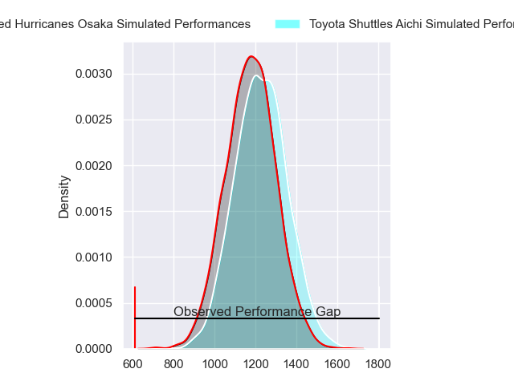
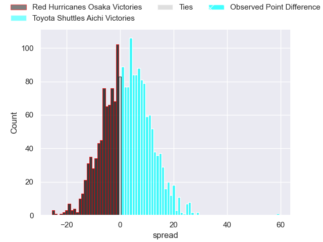
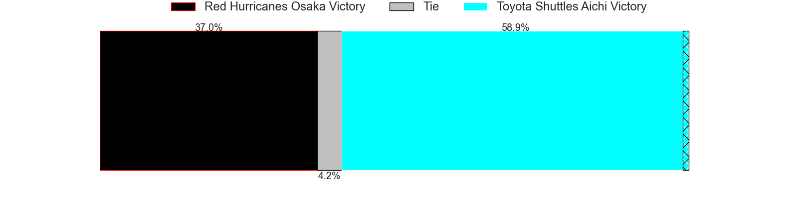
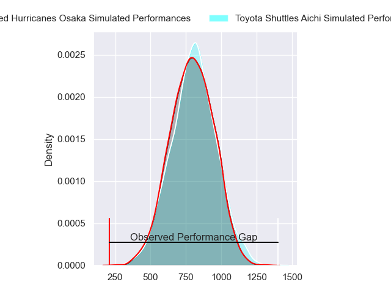
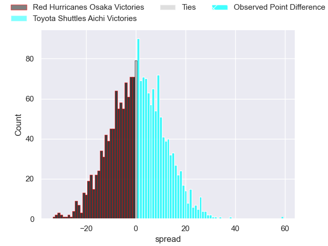
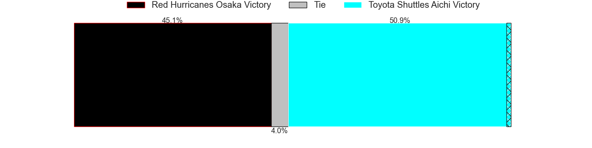
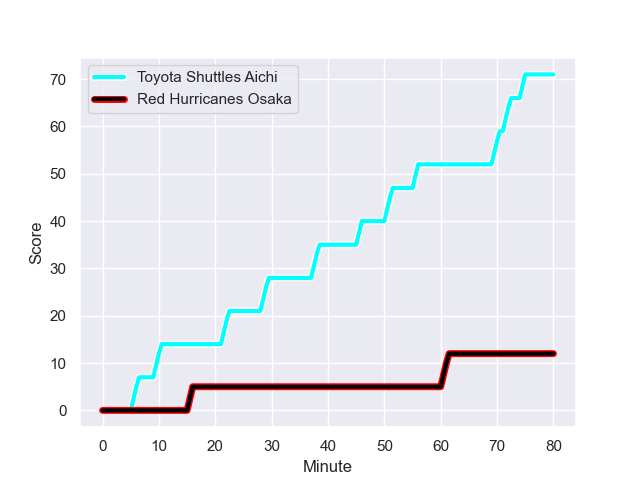
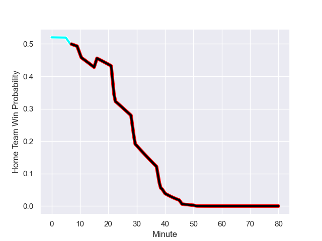

---  
layout: page  
title: Red Hurricanes Osaka at Toyota Shuttles Aichi; 12-71  
date: 2023-12-24 18:00:00 -0500  
categories: "Japan Rugby League One D2 2023" match review  
---
# Red Hurricanes Osaka at Toyota Shuttles Aichi; 12-71

# Club Level Predictions

The first set of predictions treats a club as the smallest object, as the club develops its members, organizes a gameplan, and deploys its players as needed for each match. This club model has a prediction of 0.567, which translates to predicting Toyota Shuttles Aichi to win by 2.5.

Each club has a rating and a rating deviation (similar to a Glicko rating), and expected performances can be generated. This allows for simulated matches and spreads like the ones below.
## Projected Performances - Club Model

## Projected Spreads - Club Model

## Projected Results - Club Model

# Player Level Predictions - Version 2

Treating teams instead as an entity made up of the currently active players, I have ratings for each player in an altogether different system. These can be combined to form team ratings once teamsheets are announced, weighting starters a bit higher than the reserves. After the match is played, players can be weighted by their minutes on the field, allowing for an accurate measure of the team's composition. With these compiled team ratings, we can make predictions, measure inaccuracy, and update the individual player ratings.
## Prediction with Player Minutes: Toyota Shuttles Aichi by 0.9

Red Hurricanes Osaka by 2.4 on a neutral field
## Prediction without Player Minutes: Red Hurricanes Osaka by 0.6

Red Hurricanes Osaka by 3.8 on a neutral pitch

## Projected Performances - Player Model

## Projected Spreads - Player Model

## Projected Results - Player Model

## Scores over Time

## Win Probability over Time

There were 4 large changes in win probability in this match

|   Away Minutes | Away Player          |   Away elo |   Number |   Home elo | Home Player          |   Home Minutes |
|---------------:|:---------------------|-----------:|---------:|-----------:|:---------------------|---------------:|
|             40 | Takai Shota          |      45.88 |        1 |      49.92 | Hyosuke Watanabe     |             52 |
|             40 | Hisamitsu Shimada    |      64.82 |        2 |      47.65 | Kei Sato             |             52 |
|             40 | Yuichiro Hosono      |      56.44 |        3 |      32.32 | Ryota Fukamura       |             52 |
|             80 | Michael Allardice    |      54.32 |        4 |      30.74 | Shoma Makinouchi     |             70 |
|             80 | Tom Jeffries         |      71.85 |        5 |      48.19 | James Gaskell        |             68 |
|             80 | Tatsunari Fujita     |      40.92 |        6 |      48.83 | Kavaia Tagivetaua    |             80 |
|             40 | Hiroki Hanada        |      61.27 |        7 |      39.12 | Yamato Matsuoka      |             57 |
|             80 | Josh Fenner          |      40.25 |        8 |      79.89 | Taleni Seu           |             80 |
|             63 | Toshihiro Yamamouchi |      63.17 |        9 |      73    | Keita Fujiwara       |             80 |
|             80 | Bryce Hegarty        |      37.53 |       10 |      74.56 | Freddie Burns        |             80 |
|             80 | Michael Zakhia       |      44.58 |       11 |      60.46 | Josua Kerevi         |             80 |
|             48 | Mifiposeti Paea      |      28.3  |       12 |      10.6  | James Mollentze      |             80 |
|             80 | Daisuke Iba          |      54.26 |       13 |      49.87 | Hitoshi Matsumoto    |             80 |
|             80 | Ryo Tsuruda          |      90.28 |       14 |      14.38 | Hiroaki Saito        |             22 |
|             48 | Dobashi Fumiya       |      46.65 |       15 |      46.65 | Takumi Suzuki        |             80 |
|             40 | Hiromichi Sakamoto   |      46.74 |       16 |      46.65 | Viliame Suwawa       |             30 |
|             40 | Yo Sato              |      31.75 |       17 |      54.9  | Takumi Sue           |             28 |
|             40 | Sione Afemui         |      46.65 |       18 |      49.68 | Takuya Tsushida      |             28 |
|             31 | Taro Sato            |      68.41 |       19 |      28.35 | Akito Fujinami       |             28 |
|             32 | Kaoru Tsuruta        |      46.65 |       20 |      44.16 | Harumoto Kodera      |             28 |
|             32 | Kenta Komura         |      52.68 |       21 |      44.3  | Talifolofola Tangipa |             23 |
|             17 | Tatsuya Hamano       |      53.28 |       22 |      32.84 | Shoichi Yura         |             12 |
|              9 | Hibiki Noda          |      49.2  |       23 |      49.45 | Tama Kapene          |             10 |

