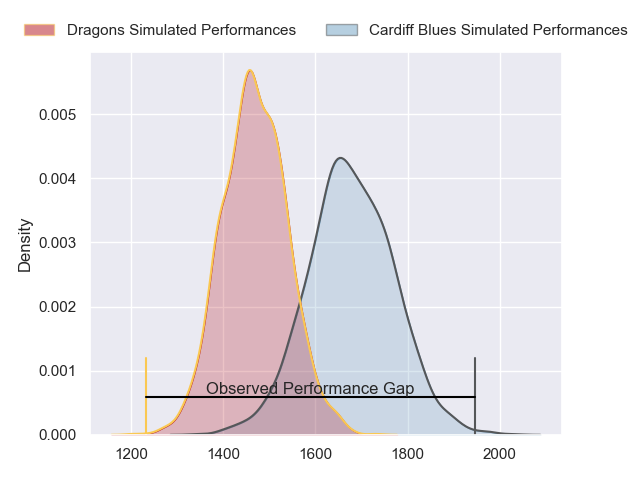
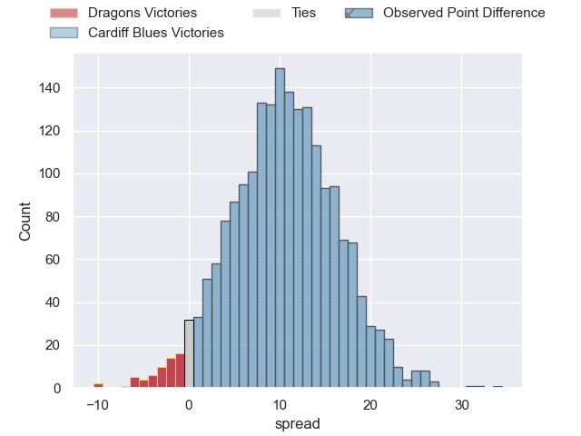
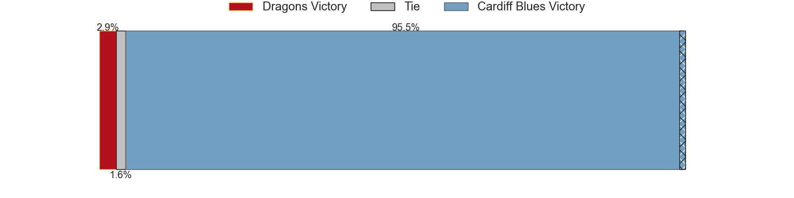
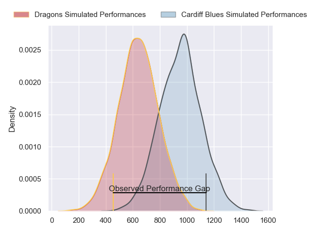
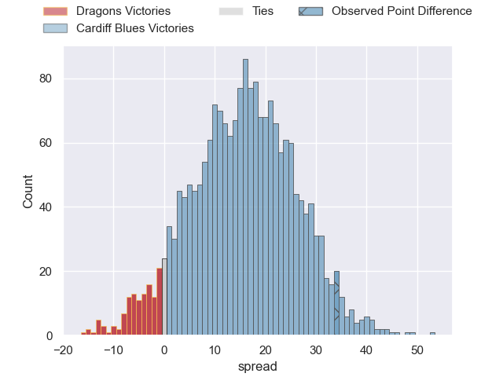
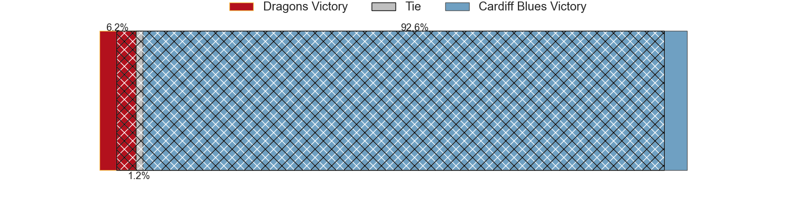
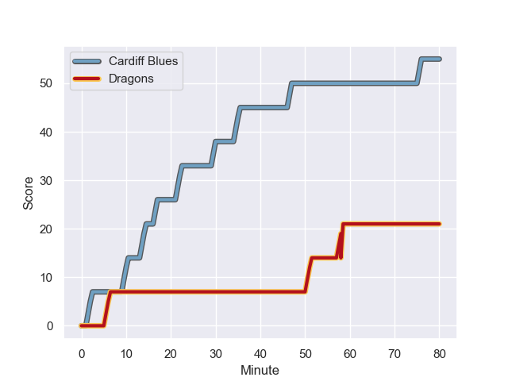
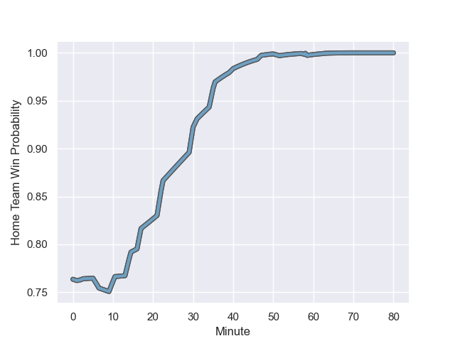

---  
layout: page  
title: Dragons at Cardiff Blues; 21-55  
date: 2023-12-26 18:00:00 -0500  
categories: "United Rugby Championship 2023" match review  
---
# Dragons at Cardiff Blues; 21-55

# Club Level Predictions

The first set of predictions treats a club as the smallest object, as the club develops its members, organizes a gameplan, and deploys its players as needed for each match. This club model has a prediction of 0.764, which translates to predicting Cardiff Blues to win by 10.4.

Each club has a rating and a rating deviation (similar to a Glicko rating), and expected performances can be generated. This allows for simulated matches and spreads like the ones below.
## Projected Performances - Club Model

## Projected Spreads - Club Model

## Projected Results - Club Model

# Player Level Predictions - Version 2

Treating teams instead as an entity made up of the currently active players, I have ratings for each player in an altogether different system. These can be combined to form team ratings once teamsheets are announced, weighting starters a bit higher than the reserves. After the match is played, players can be weighted by their minutes on the field, allowing for an accurate measure of the team's composition. With these compiled team ratings, we can make predictions, measure inaccuracy, and update the individual player ratings.
## Prediction with Player Minutes: Cardiff Blues by 12.8

Cardiff Blues by 8.4 on a neutral field
## Prediction without Player Minutes: Cardiff Blues by 12.7

Cardiff Blues by 8.3 on a neutral pitch

## Projected Performances - Player Model

## Projected Spreads - Player Model

## Projected Results - Player Model

## Scores over Time

## Win Probability over Time

There were 2 large changes in win probability in this match

|   Away Minutes | Away Player       |   Away elo |   Number |   Home elo | Home Player        |   Home Minutes |
|---------------:|:------------------|-----------:|---------:|-----------:|:-------------------|---------------:|
|             65 | Rhodri Jones      |      25.27 |        1 |      32.72 | Rhys Carré         |             49 |
|             49 | Bradley Roberts   |      41.16 |        2 |      57.95 | Liam Belcher       |             49 |
|             49 | Lloyd Fairbrother |      28.54 |        3 |      43.86 | Keiron Assiratti   |             49 |
|             40 | Joseph Davies     |      29.84 |        4 |      27.59 | Rory Thornton      |             80 |
|             80 | George Nott       |      37.9  |        5 |      49.28 | Teddy Williams     |             80 |
|             80 | Harrison Keddie   |      -5.02 |        6 |      41.7  | Alex Mann          |             80 |
|             40 | Taine Basham      |      41.94 |        7 |      64.71 | James Botham       |             62 |
|             80 | Aaron Wainwright  |      80.36 |        8 |      48.96 | Mackenzie Martin   |             80 |
|             49 | Rhodri Williams   |      72.25 |        9 |      85.31 | Tomos Williams     |             63 |
|             80 | Cai Evans         |      33.4  |       10 |      63.4  | Tinus de Beer      |             80 |
|             80 | Ashton Hewitt     |      62.35 |       11 |      73.29 | Mason Grady        |             80 |
|             80 | Aneurin Owen      |      54.97 |       12 |      52.97 | Ben Thomas         |             80 |
|             31 | Steffan Hughes    |      63.95 |       13 |     105.35 | Rey Lee-Lo         |             49 |
|             80 | Rio Dyer          |      26.57 |       14 |      65.55 | Josh Adams         |             62 |
|             40 | Jordan Williams   |      64.15 |       15 |      32.11 | Cam Winnett        |             80 |
|             49 | Ewan Rosser       |      47.39 |       16 |      58.65 | Corey Domachowski  |             31 |
|             40 | Will Reed         |      40.5  |       17 |      47.32 | Evan Lloyd         |             31 |
|             40 | Dan Lydiate       |      54.84 |       18 |      45.43 | Rhys Litterick     |             31 |
|             40 | Sean Lonsdale     |      40.83 |       19 |     104.01 | Uilisi Halaholo    |             31 |
|             31 | James Benjamin    |      42.79 |       20 |      78.45 | Gabriel Hamer-Webb |             18 |
|             31 | Leon Brown        |      47.41 |       21 |      46.4  | Lucas De la Rua    |             18 |
|             31 | Dane Blacker      |      27.25 |       22 |      45.64 | Ellis Bevan        |             17 |
|             15 | Aki Seiuli        |      28.68 |       23 |     nan    | nan                |            nan |

