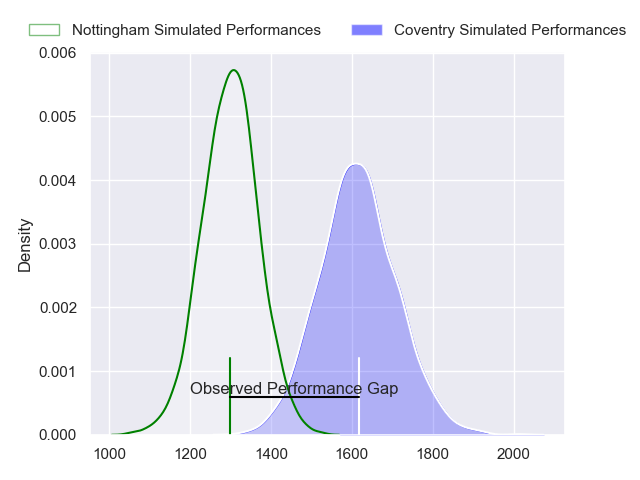
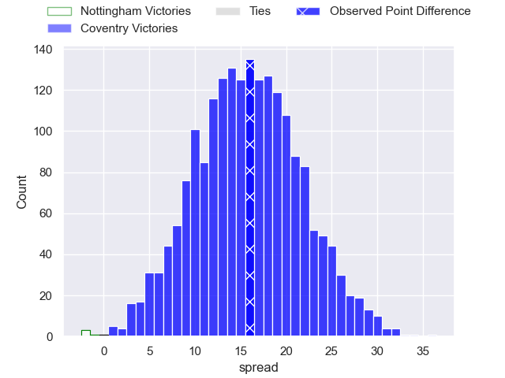
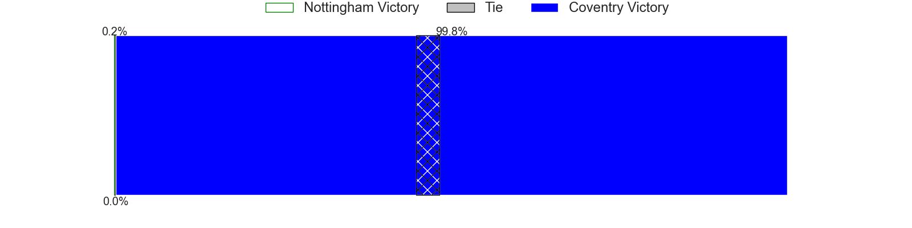
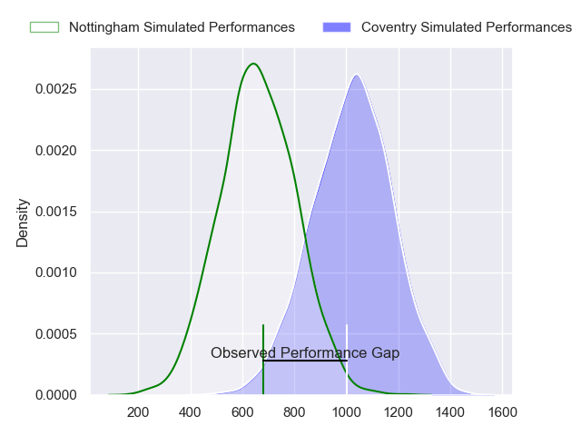
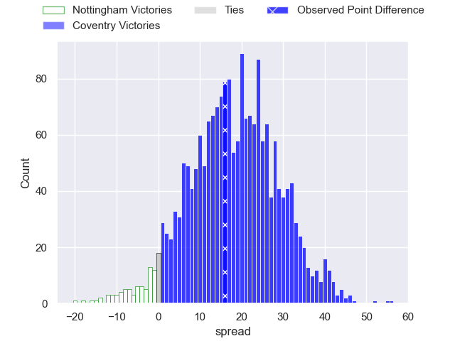
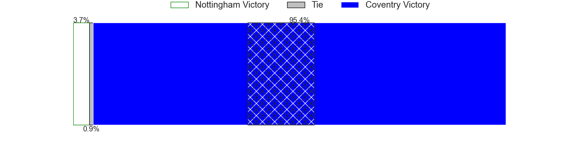
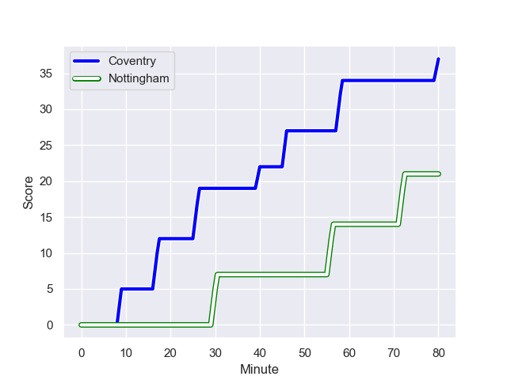
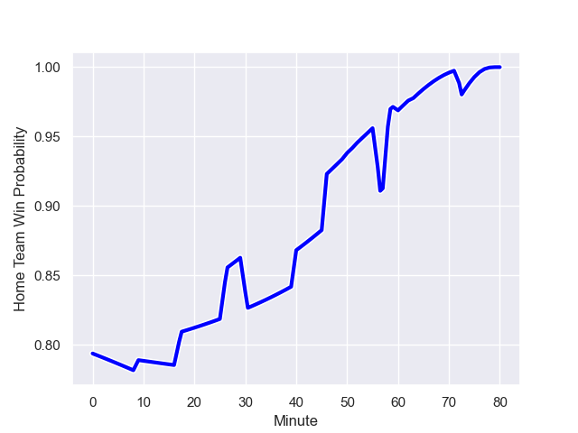

---  
layout: page  
title: Nottingham at Coventry; 21-37  
date: 2023-12-26 18:00:00 -0500  
categories: "RFU Championship 2023" match review  
---
# Nottingham at Coventry; 21-37

# Club Level Predictions

The first set of predictions treats a club as the smallest object, as the club develops its members, organizes a gameplan, and deploys its players as needed for each match. This club model has a prediction of 0.857, which translates to predicting Coventry to win by 15.9.

Each club has a rating and a rating deviation (similar to a Glicko rating), and expected performances can be generated. This allows for simulated matches and spreads like the ones below.
## Projected Performances - Club Model

## Projected Spreads - Club Model

## Projected Results - Club Model

# Player Level Predictions - Version 2

Treating teams instead as an entity made up of the currently active players, I have ratings for each player in an altogether different system. These can be combined to form team ratings once teamsheets are announced, weighting starters a bit higher than the reserves. After the match is played, players can be weighted by their minutes on the field, allowing for an accurate measure of the team's composition. With these compiled team ratings, we can make predictions, measure inaccuracy, and update the individual player ratings.
## Prediction with Player Minutes: Coventry by 14.8

Coventry by 11.5 on a neutral field
## Prediction without Player Minutes: Coventry by 14.5

Coventry by 11.2 on a neutral pitch

## Projected Performances - Player Model

## Projected Spreads - Player Model

## Projected Results - Player Model

## Scores over Time

## Win Probability over Time

There were 5 large changes in win probability in this match

|   Away Minutes | Away Player               |   Away elo |   Number |   Home elo | Home Player        |   Home Minutes |
|---------------:|:--------------------------|-----------:|---------:|-----------:|:-------------------|---------------:|
|             54 | Kai Owen                  |      53.4  |        1 |      46.53 | Elliott Chilvers   |             52 |
|             54 | Antonio TJ Harris         |      59.33 |        2 |      71.69 | Jordon Poole       |             63 |
|             54 | Dan Richardson            |      53.92 |        3 |      47.67 | Eliot Salt         |             52 |
|             58 | Sebastien Ferreira        |       4.42 |        4 |      43.82 | James Tyas         |             80 |
|             80 | Come Clayver Joussain     |      51.44 |        5 |      41.34 | Obinna Nkwocha     |             60 |
|             80 | Iosefa Danny Wayne Fiaola |      59.84 |        6 |      51.36 | Paddy Ryan         |             80 |
|             50 | James Cherry              |      53.64 |        7 |      46.56 | Matt Kvesic        |             57 |
|             80 | Scott Hall                |      25.21 |        8 |      91.74 | Senitiki Nayalo    |             57 |
|             60 | Micheal Stronge           |      40.79 |        9 |     137.76 | Will Chudley       |             60 |
|             56 | Sam Hollingsworth         |      59.84 |       10 |      77.22 | Patrick Pellegrini |             80 |
|             80 | Jack Stapley              |      -6.35 |       11 |      79.11 | James Martin       |             80 |
|             80 | Dafydd-Rhys Tiueti        |      49.99 |       12 |      88.89 | Will Rigg          |             80 |
|             80 | Marcus Alexander Ramage   |      43.88 |       13 |      56.12 | Will Wand          |             80 |
|             80 | David Williams            |      54.93 |       14 |      41.93 | Ryan Hutler        |             75 |
|             53 | Ellis Mee                 |      61.31 |       15 |      51.68 | Tobi Wilson        |             80 |
|             30 | Jay Ecclesfield           |      47.54 |       16 |      50.7  | Danny Southworth   |             28 |
|             27 | Jordan Olowofela          |      56.95 |       17 |      46.65 | Vilikesa Nairau    |             28 |
|             26 | Archie Van der Flier      |      53.21 |       18 |      74.01 | Tom Ball           |             23 |
|             26 | Xavier Valentine          |      53.66 |       19 |      51.3  | Jack Bartlett      |             23 |
|             26 | Jack Dickinson            |      52.45 |       20 |      47.24 | Rhys Anstey        |             20 |
|             24 | Morgan Bunting            |      35.85 |       21 |      59.11 | Will Lane          |             20 |
|             22 | Jack Shine                |      53.4  |       22 |      41.1  | Evan Mitchell      |              5 |
|             20 | Josh Goodwin              |      47.03 |       23 |      42.47 | Ethan Caine        |             17 |

