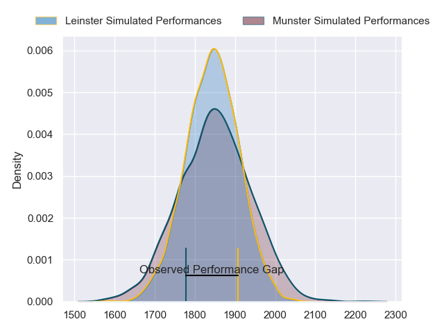
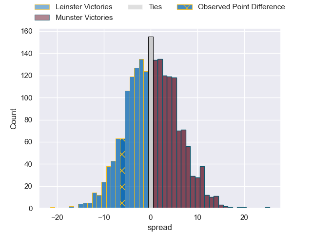
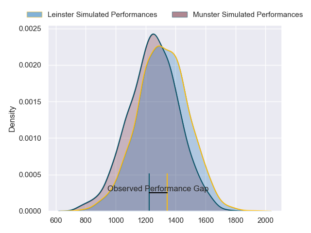
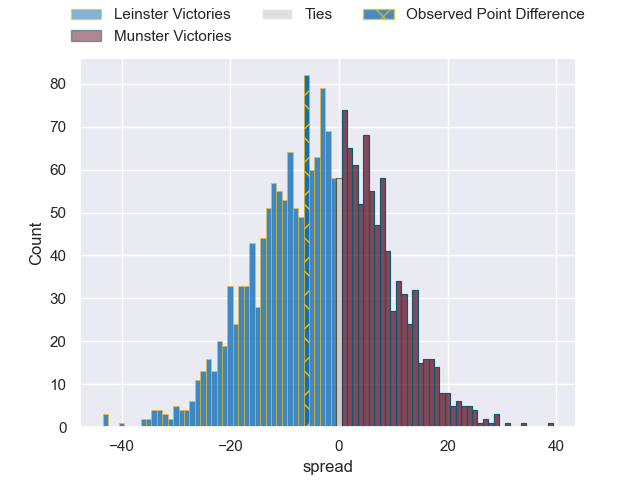
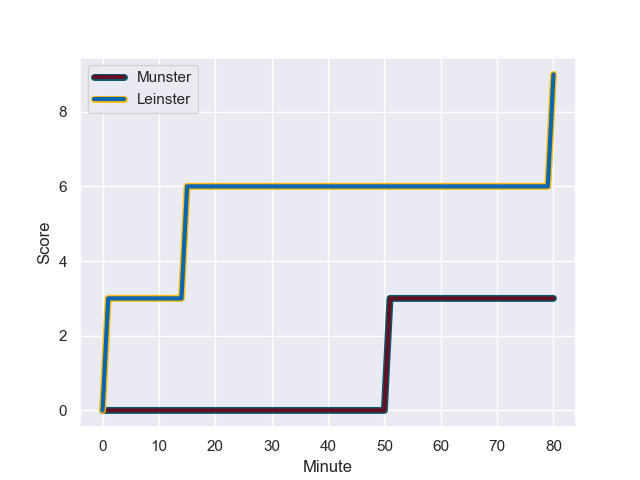
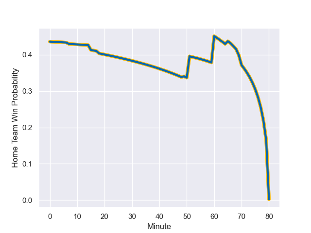

---  
layout: page  
title: Leinster at Munster; 9-3  
date: 2023-12-26 18:00:00 -0500  
categories: "United Rugby Championship 2023" match review  
---
# Leinster at Munster; 9-3

# Club Level Predictions

The first set of predictions treats a club as the smallest object, as the club develops its members, organizes a gameplan, and deploys its players as needed for each match. This club model has a prediction of 0.507, which translates to predicting Munster to win by 0.2.

Each club has a rating and a rating deviation (similar to a Glicko rating), and expected performances can be generated. This allows for simulated matches and spreads like the ones below.
## Projected Performances - Club Model

## Projected Spreads - Club Model

## Projected Results - Club Model

# Player Level Predictions - Version 2

Treating teams instead as an entity made up of the currently active players, I have ratings for each player in an altogether different system. These can be combined to form team ratings once teamsheets are announced, weighting starters a bit higher than the reserves. After the match is played, players can be weighted by their minutes on the field, allowing for an accurate measure of the team's composition. With these compiled team ratings, we can make predictions, measure inaccuracy, and update the individual player ratings.
## Prediction with Player Minutes: Leinster by 2.8

Leinster by 7.1 on a neutral field
## Prediction without Player Minutes: Leinster by 2.4

Leinster by 6.7 on a neutral pitch

## Projected Performances - Player Model

## Projected Spreads - Player Model

## Projected Results - Player Model

## Scores over Time

## Win Probability over Time

There were 7 large changes in win probability in this match

|   Away Minutes | Away Player        |   Away elo |   Number |   Home elo | Home Player     |   Home Minutes |
|---------------:|:-------------------|-----------:|---------:|-----------:|:----------------|---------------:|
|             74 | Andrew Porter      |      83.77 |        1 |      94.74 | Dave Kilcoyne   |             18 |
|             57 | Ronan Kelleher     |      86.38 |        2 |      79.93 | Diarmuid Barron |              7 |
|             74 | Michael Ala'alatoa |      84.58 |        3 |      76.46 | Oli Jager       |             65 |
|             57 | Ross Molony        |      91.47 |        4 |      44.45 | Edwin Edogbo    |             49 |
|             80 | Joe McCarthy       |      64.2  |        5 |      77.98 | Gavin Coombes   |             80 |
|             49 | Max Deegan         |      89.27 |        6 |      57.05 | Thomas Ahern    |             80 |
|             66 | Scott Penny        |      70.95 |        7 |      75.66 | John Hodnett    |             69 |
|             80 | Jack Conan         |     119.65 |        8 |      80.95 | Jack O'Donoghue |             80 |
|             80 | Luke McGrath       |     119.97 |        9 |      70.51 | Craig Casey     |             60 |
|             80 | Harry Byrne        |      76.66 |       10 |      52.87 | Jack Crowley    |             80 |
|             80 | Rob Russell        |      58.81 |       11 |      95.73 | Shane Daly      |             80 |
|             80 | Ciaran Frawley     |      68.53 |       12 |      85.7  | Alex Nankivell  |             70 |
|             80 | Garry Ringrose     |     122.03 |       13 |      74.03 | Antoine Frisch  |             80 |
|             80 | Jordan Larmour     |      84.21 |       14 |      90.15 | Calvin Nash     |             80 |
|             80 | Hugo Keenan        |     118.88 |       15 |     106.86 | Simon Zebo      |             80 |
|             31 | Ryan Baird         |      80.84 |       16 |      88.08 | Jeremy Loughman |             62 |
|             23 | Jason Jenkins      |      68.95 |       17 |      75.74 | Eoghan Clarke   |             73 |
|             23 | Dan Sheehan        |      56.55 |       18 |      46.29 | Brian Gleeson   |             31 |
|             14 | Will Connors       |      66.13 |       19 |      50.98 | Paddy Patterson |             20 |
|              6 | Thomas Clarkson    |      64.11 |       20 |     105.71 | Stephen Archer  |             15 |
|              6 | Ed Byrne           |      72.92 |       21 |      52.93 | Alex Kendellen  |             11 |
|            nan | nan                |     nan    |       22 |      29.1  | Sean O'Brien    |             10 |

