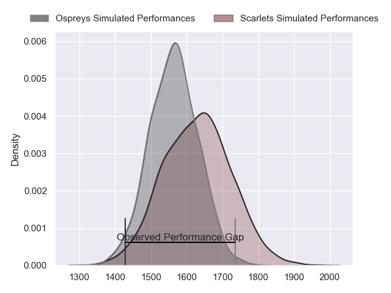
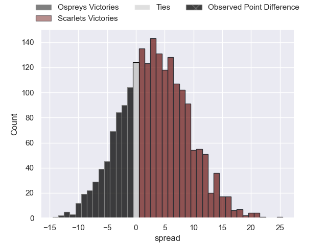
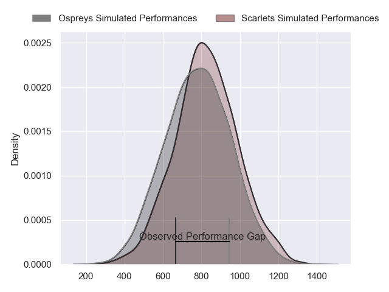
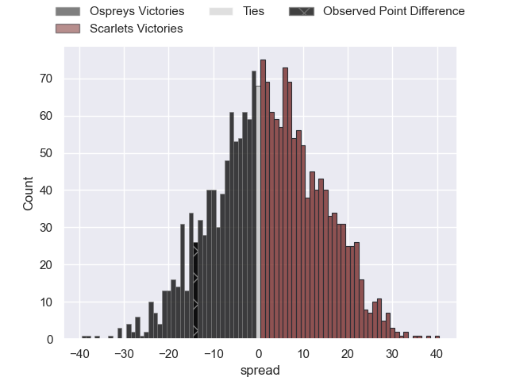
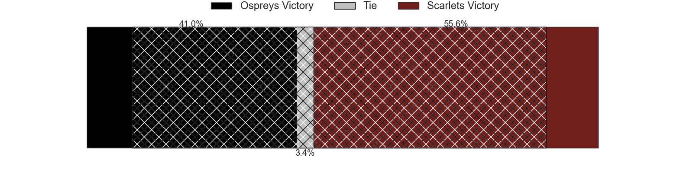
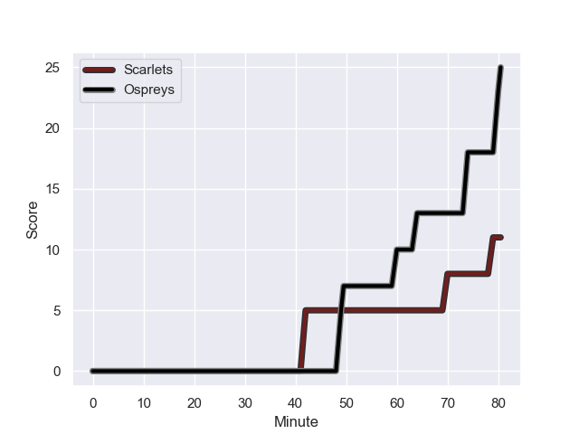
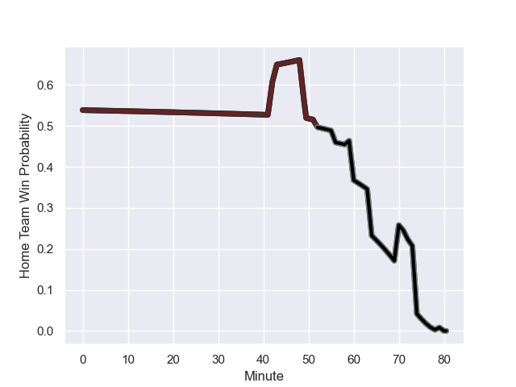

---  
layout: page  
title: Ospreys at Scarlets; 25-11  
date: 2023-12-26 18:00:00 -0500  
categories: "United Rugby Championship 2023" match review  
---
# Ospreys at Scarlets; 25-11

# Club Level Predictions

The first set of predictions treats a club as the smallest object, as the club develops its members, organizes a gameplan, and deploys its players as needed for each match. This club model has a prediction of 0.595, which translates to predicting Scarlets to win by 3.4.

Each club has a rating and a rating deviation (similar to a Glicko rating), and expected performances can be generated. This allows for simulated matches and spreads like the ones below.
## Projected Performances - Club Model

## Projected Spreads - Club Model

## Projected Results - Club Model

# Player Level Predictions - Version 2

Treating teams instead as an entity made up of the currently active players, I have ratings for each player in an altogether different system. These can be combined to form team ratings once teamsheets are announced, weighting starters a bit higher than the reserves. After the match is played, players can be weighted by their minutes on the field, allowing for an accurate measure of the team's composition. With these compiled team ratings, we can make predictions, measure inaccuracy, and update the individual player ratings.
## Prediction with Player Minutes: Scarlets by 1.7

Ospreys by 2.5 on a neutral field
## Prediction without Player Minutes: Scarlets by 1.8

Ospreys by 2.4 on a neutral pitch

## Projected Performances - Player Model

## Projected Spreads - Player Model

## Projected Results - Player Model

## Scores over Time

## Win Probability over Time

There were 9 large changes in win probability in this match

|   Away Minutes | Away Player            |   Away elo |   Number |   Home elo | Home Player         |   Home Minutes |
|---------------:|:-----------------------|-----------:|---------:|-----------:|:--------------------|---------------:|
|             64 | Gareth Thomas          |      40.7  |        1 |      61.93 | Kemsley Mathias     |             56 |
|             64 | Dewi Lake              |      38.2  |        2 |      75.54 | Ryan Elias          |             72 |
|             64 | Tom Botha              |      39.75 |        3 |      50.4  | Sam Wainwright      |             70 |
|             80 | James Fender           |      49.37 |        4 |      46.35 | Alex Craig          |             80 |
|             80 | Adam Beard             |      60.91 |        5 |      21.18 | Jac Price           |             56 |
|             80 | Rhys Davies            |      62.97 |        6 |      68.13 | Sam Lousi           |             52 |
|             80 | Harri Deaves           |      48.47 |        7 |      37.17 | Teddy Leatherbarrow |             80 |
|             80 | Morgan Morris          |       8.63 |        8 |      52.12 | Josh MacLeod        |             80 |
|             70 | Reuben Morgan-Williams |      38.91 |        9 |      41.17 | Gareth Davies       |             59 |
|             80 | Owen Williams          |      83.84 |       10 |      25.5  | Ioan Lloyd          |             80 |
|             80 | Keelan Giles           |       0.62 |       11 |      51.21 | Ryan Conbeer        |             80 |
|             80 | Owen Watkin            |      89.6  |       12 |      75.66 | Johnny Williams     |             80 |
|             80 | George North           |     114.05 |       13 |      55.73 | Joe Roberts         |             70 |
|             43 | Matt Protheroe         |      77.45 |       14 |      38.22 | Tom Rogers          |             80 |
|             80 | Jack Walsh             |      55.8  |       15 |      49.34 | Ioan Nicholas       |             80 |
|             10 | Luke Davies            |      44.53 |       16 |      38.51 | Ben Williams        |             28 |
|             37 | Luke Morgan            |       9.75 |       17 |       3.9  | Morgan Jones        |             24 |
|             16 | Garyn Phillips         |      52.47 |       18 |      26.55 | Shaun Evans         |             24 |
|             16 | Ben Warren             |      48.91 |       19 |      66.08 | Kieran Hardy        |             21 |
|             16 | Sam Parry              |      44.15 |       20 |      47.55 | Jonathan Davies     |             10 |
|            nan | nan                    |     nan    |       21 |      32.1  | Joe Jones           |             10 |
|            nan | nan                    |     nan    |       22 |      42.42 | Wyn Jones           |              8 |

