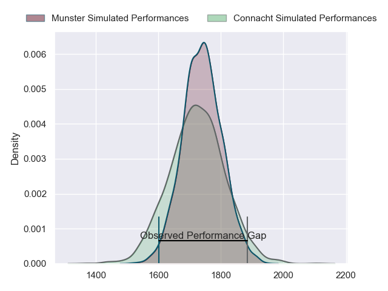
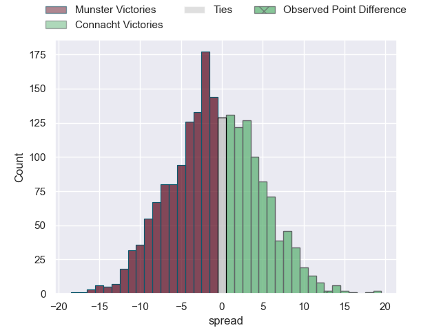
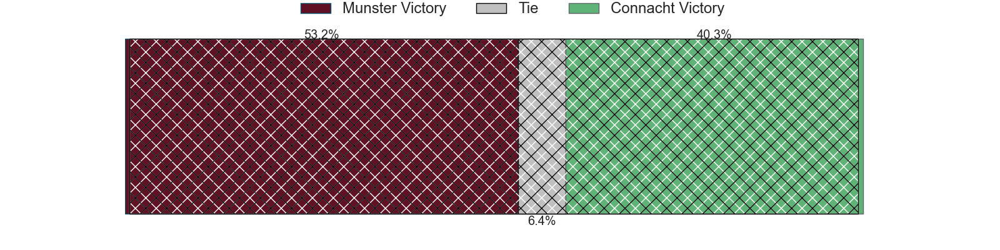
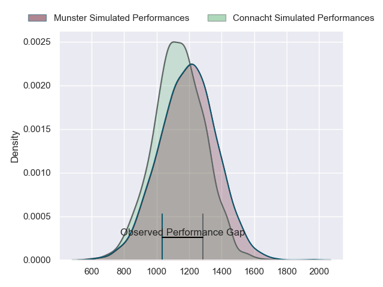
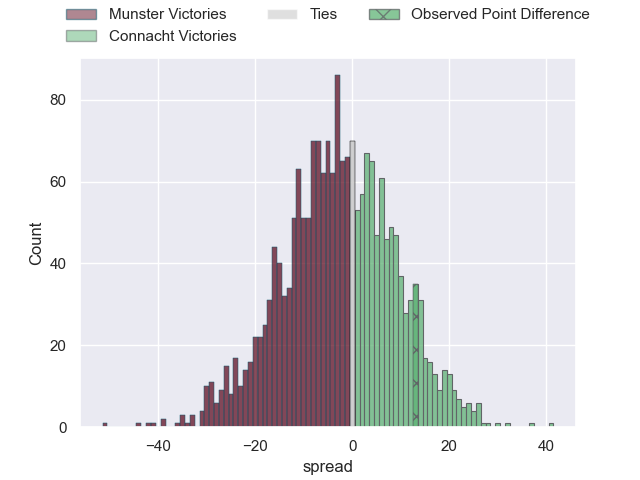
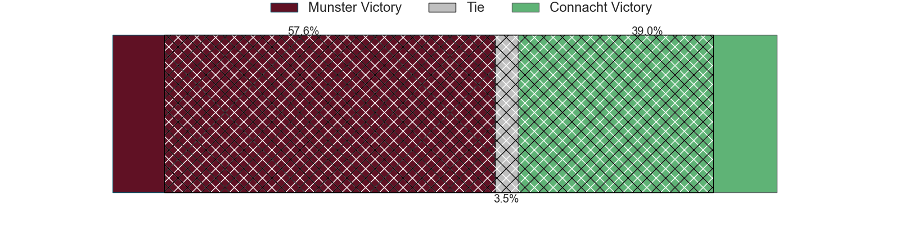
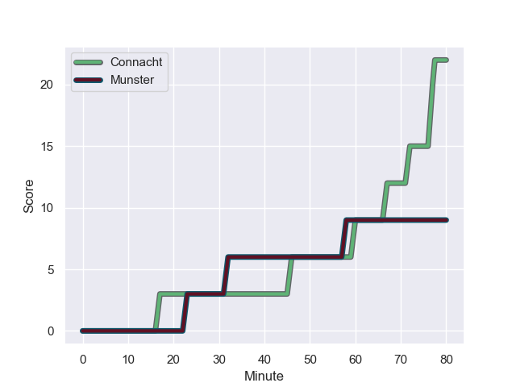
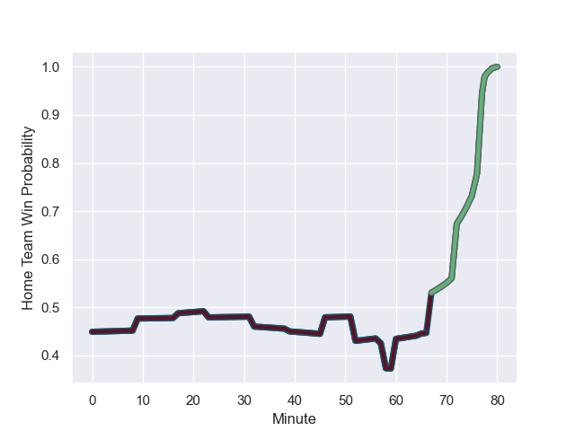

---  
layout: page  
title: Munster at Connacht; 9-22  
date: 2024-01-01 18:00:00 -0500  
categories: "United Rugby Championship 2023" match review  
---
# Munster at Connacht; 9-22

# Club Level Predictions

The first set of predictions treats a club as the smallest object, as the club develops its members, organizes a gameplan, and deploys its players as needed for each match. This club model has a prediction of 0.474, which translates to predicting Munster to win by 0.9.

Our Over/Under is 36.5 - and combined with the spread above, we have a predicted scoreline of 19 to 18

Each club has a rating and a rating deviation (similar to a Glicko rating), and expected performances can be generated. This allows for simulated matches and spreads like the ones below.
## Projected Performances - Club Model

## Projected Spreads - Club Model

## Projected Results - Club Model

# Player Level Predictions - Version 2

Treating teams instead as an entity made up of the currently active players, I have ratings for each player in an altogether different system. These can be combined to form team ratings once teamsheets are announced, weighting starters a bit higher than the reserves. After the match is played, players can be weighted by their minutes on the field, allowing for an accurate measure of the team's composition. With these compiled team ratings, we can make predictions, measure inaccuracy, and update the individual player ratings.
## Prediction with Player Minutes: Munster by 2.3

Munster by 7.7 on a neutral field
## Prediction without Player Minutes: Munster by 1.6

Munster by 7.0 on a neutral pitch

## Projected Performances - Player Model

## Projected Spreads - Player Model

## Projected Results - Player Model

## Scores over Time

## Win Probability over Time

There were 10 large changes in win probability in this match

|   Away Minutes | Away Player     |   Away elo |   Number |   Home elo | Home Player           |   Home Minutes |
|---------------:|:----------------|-----------:|---------:|-----------:|:----------------------|---------------:|
|             76 | Jeremy Loughman |      82.25 |        1 |     111.12 | Peter Dooley          |             52 |
|             80 | Scott Buckley   |      40.66 |        2 |      28.64 | Dave Heffernan        |             64 |
|             10 | Oli Jager       |      82.77 |        3 |      92.94 | Finlay Bealham        |             57 |
|             80 | Gavin Coombes   |      66.51 |        4 |      50.59 | Darragh Murray        |             52 |
|             80 | Tadhg Beirne    |     158.75 |        5 |     119.56 | Joe Joyce             |             71 |
|             80 | Thomas Ahern    |      45.47 |        6 |      33.5  | Cian Prendergast      |             80 |
|             76 | John Hodnett    |      65.74 |        7 |      52.02 | Shamus Hurley-Langton |             60 |
|             39 | Jack O'Donoghue |      62.06 |        8 |      60.33 | Jarrad Butler         |             80 |
|             76 | Conor Murray    |     126.71 |        9 |      46.05 | Caolin Blade          |             65 |
|             71 | Tony Butler     |      46.49 |       10 |      78.88 | JJ Hanrahan           |             80 |
|             80 | Shane Daly      |     106.69 |       11 |      45.6  | Shayne Bolton         |             80 |
|             80 | Rory Scannell   |      89.89 |       12 |     124.52 | Bundee Aki            |             80 |
|             80 | Antoine Frisch  |      70.72 |       13 |      40.76 | Cathal Forde          |              9 |
|             80 | Calvin Nash     |      86.05 |       14 |      27.82 | Byron Ralston         |             80 |
|             80 | Simon Zebo      |      81.13 |       15 |      78.37 | Mack Hansen           |             80 |
|             70 | John Ryan       |      74.18 |       16 |      87.24 | Jack Carty            |             71 |
|             41 | Alex Kendellen  |      61.37 |       17 |      49.52 | Denis Buckley         |             28 |
|              9 | Sean O'Brien    |      10.66 |       18 |      72.12 | Niall Murray          |             28 |
|              4 | Brian Gleeson   |      44.39 |       19 |      55.83 | Jack Aungier          |             23 |
|              4 | Josh Wycherley  |      37.05 |       20 |      67.6  | Conor Oliver          |             20 |
|              4 | Paddy Patterson |      49.78 |       21 |      56.32 | Dylan Tierney-Martin  |             16 |
|            nan | nan             |     nan    |       22 |      38.84 | Michael McDonald      |             15 |
|            nan | nan             |     nan    |       23 |      41.2  | Oisin Dowling         |              9 |

