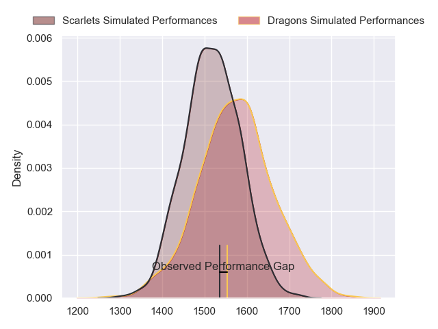
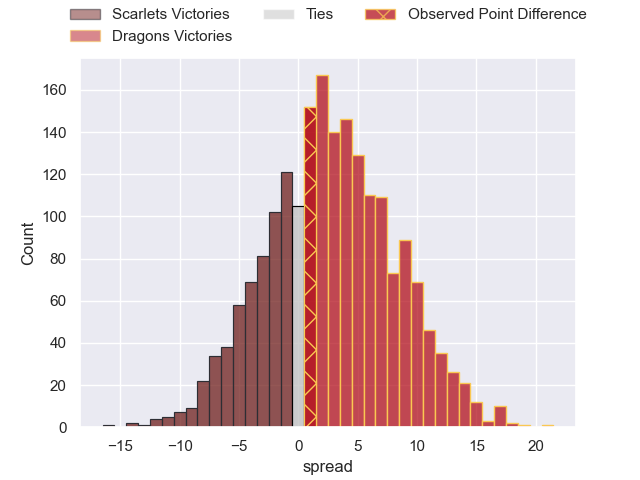
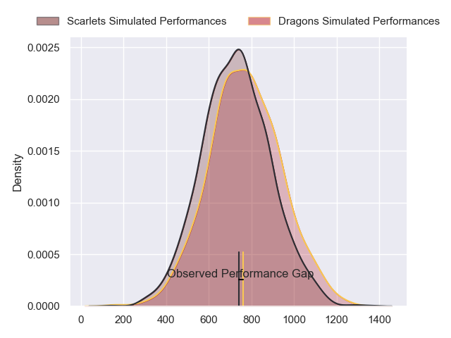
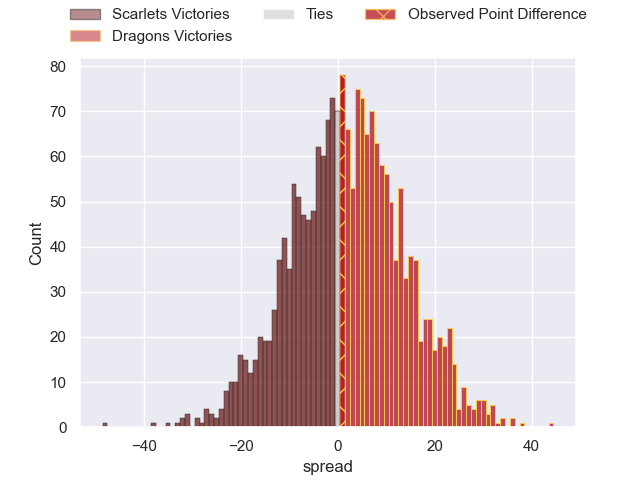
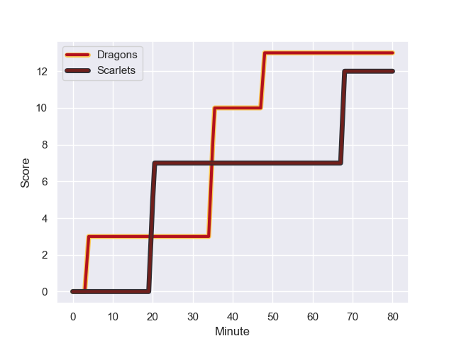
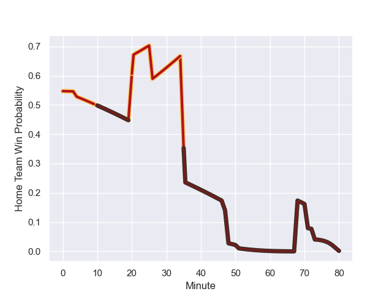

---  
layout: page  
title: Scarlets at Dragons; 12-13  
date: 2024-01-01 18:00:00 -0500  
categories: "United Rugby Championship 2023" match review  
---
# Scarlets at Dragons; 12-13

# Club Level Predictions

The first set of predictions treats a club as the smallest object, as the club develops its members, organizes a gameplan, and deploys its players as needed for each match. This club model has a prediction of 0.577, which translates to predicting Dragons to win by 2.7.

Our Over/Under is 37.5 - and combined with the spread above, we have a predicted scoreline of 17 to 20

Each club has a rating and a rating deviation (similar to a Glicko rating), and expected performances can be generated. This allows for simulated matches and spreads like the ones below.
## Projected Performances - Club Model

## Projected Spreads - Club Model

## Projected Results - Club Model

# Player Level Predictions - Version 2

Treating teams instead as an entity made up of the currently active players, I have ratings for each player in an altogether different system. These can be combined to form team ratings once teamsheets are announced, weighting starters a bit higher than the reserves. After the match is played, players can be weighted by their minutes on the field, allowing for an accurate measure of the team's composition. With these compiled team ratings, we can make predictions, measure inaccuracy, and update the individual player ratings.
## Prediction with Player Minutes: Dragons by 2.1

Scarlets by 3.9 on a neutral field
## Prediction without Player Minutes: Dragons by 1.3

Scarlets by 4.7 on a neutral pitch

## Projected Performances - Player Model

## Projected Spreads - Player Model

## Projected Results - Player Model

## Scores over Time

## Win Probability over Time

There were 10 large changes in win probability in this match

|   Away Minutes | Away Player     |   Away elo |   Number |   Home elo | Home Player       |   Home Minutes |
|---------------:|:----------------|-----------:|---------:|-----------:|:------------------|---------------:|
|             47 | Kemsley Mathias |      69.67 |        1 |      58.87 | Rodrigo Martinez  |             49 |
|             80 | Ryan Elias      |      95.54 |        2 |      32.95 | James Benjamin    |             80 |
|             59 | Sam Wainwright  |      43.53 |        3 |      17.38 | Lloyd Fairbrother |             57 |
|             80 | Alex Craig      |      35.72 |        4 |      35.57 | Sean Lonsdale     |             80 |
|             51 | Morgan Jones    |     -18.78 |        5 |      28.96 | George Nott       |             49 |
|             80 | Ben Williams    |      35.76 |        6 |      64.24 | Dan Lydiate       |             80 |
|             80 | Josh MacLeod    |      49.11 |        7 |     -29.63 | Harrison Keddie   |             57 |
|             73 | Vaea Fifita     |     116.19 |        8 |      80.94 | Aaron Wainwright  |             80 |
|             59 | Gareth Davies   |      37.64 |        9 |      78.92 | Rhodri Williams   |             69 |
|             80 | Sam Costelow    |      37.6  |       10 |      45.53 | Will Reed         |             80 |
|             26 | Steffan Evans   |      75.85 |       11 |      47.85 | Ewan Rosser       |             80 |
|             80 | Johnny Williams |      76.4  |       12 |      47.15 | Harri Ackerman    |             80 |
|             71 | Joe Roberts     |      58.98 |       13 |      54.32 | Aneurin Owen      |             80 |
|             80 | Tom Rogers      |      37.99 |       14 |      14.85 | Jared Rosser      |             80 |
|             80 | Ioan Lloyd      |       8.79 |       15 |      27.3  | Cai Evans         |             80 |
|             54 | Ioan Nicholas   |      42.98 |       16 |      27.4  | Rhodri Jones      |             31 |
|             33 | Wyn Jones       |      55.05 |       17 |      50.59 | Ryan Woodman      |             31 |
|             29 | Jac Price       |       5.19 |       18 |      37.1  | Leon Brown        |             23 |
|             21 | Kieran Hardy    |      49.73 |       19 |      86.17 | Ollie Griffiths   |             23 |
|             21 | Joe Jones       |      19.53 |       20 |      17.76 | Dane Blacker      |             11 |
|              9 | Jonathan Davies |      38.37 |       21 |     nan    | nan               |            nan |
|              7 | Shaun Evans     |      14.93 |       22 |     nan    | nan               |            nan |

