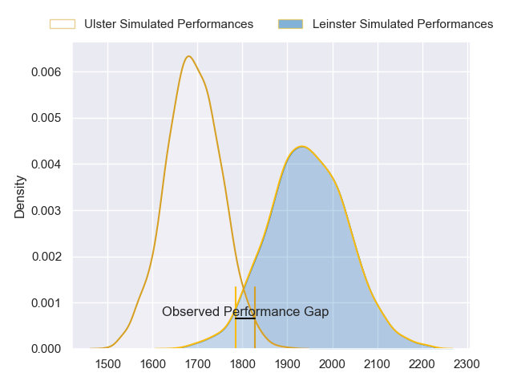
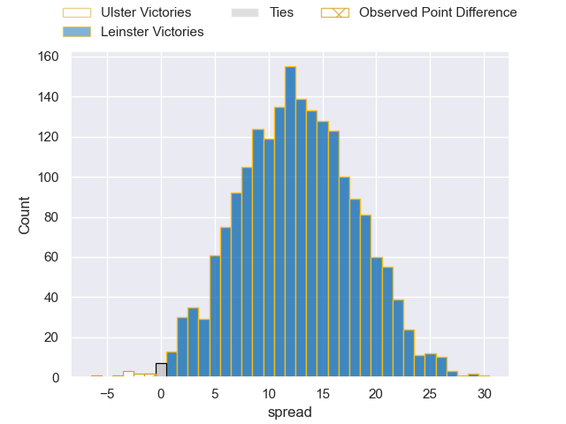
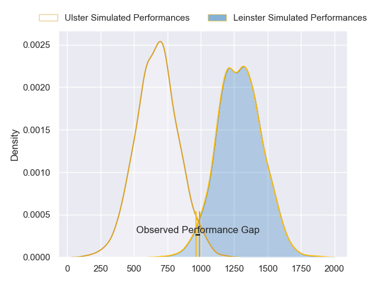
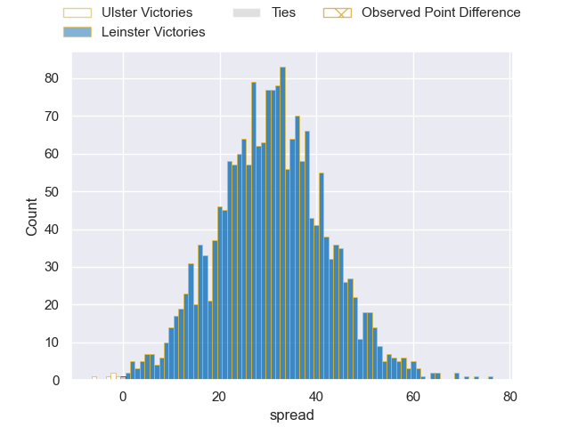
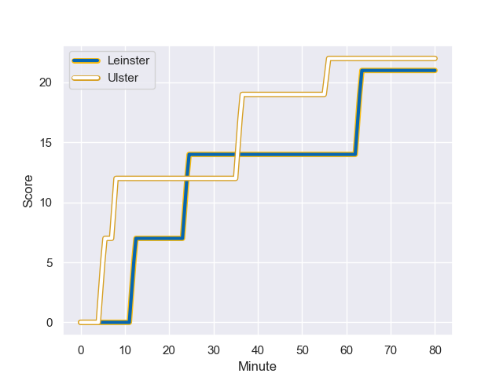
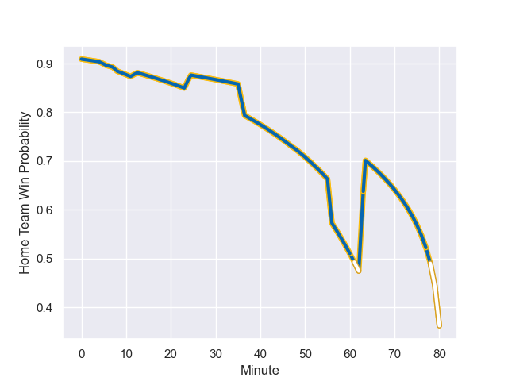

---  
layout: page  
title: Ulster at Leinster; 22-21  
date: 2024-01-01 18:00:00 -0500  
categories: "United Rugby Championship 2023" match review  
---
# Ulster at Leinster; 22-21

# Club Level Predictions

The first set of predictions treats a club as the smallest object, as the club develops its members, organizes a gameplan, and deploys its players as needed for each match. This club model has a prediction of 0.808, which translates to predicting Leinster to win by 12.7.

Our Over/Under is 51.5 - and combined with the spread above, we have a predicted scoreline of 19 to 32

Each club has a rating and a rating deviation (similar to a Glicko rating), and expected performances can be generated. This allows for simulated matches and spreads like the ones below.
## Projected Performances - Club Model

## Projected Spreads - Club Model

## Projected Results - Club Model

# Player Level Predictions - Version 2

Treating teams instead as an entity made up of the currently active players, I have ratings for each player in an altogether different system. These can be combined to form team ratings once teamsheets are announced, weighting starters a bit higher than the reserves. After the match is played, players can be weighted by their minutes on the field, allowing for an accurate measure of the team's composition. With these compiled team ratings, we can make predictions, measure inaccuracy, and update the individual player ratings.
## Prediction with Player Minutes: Leinster by 25.4

Leinster by 19.3 on a neutral field
## Prediction without Player Minutes: Leinster by 25.3

Leinster by 19.1 on a neutral pitch

## Projected Performances - Player Model

## Projected Spreads - Player Model

## Projected Results - Player Model

## Scores over Time

## Win Probability over Time

There were 8 large changes in win probability in this match

|   Away Minutes | Away Player       |   Away elo |   Number |   Home elo | Home Player         |   Home Minutes |
|---------------:|:------------------|-----------:|---------:|-----------:|:--------------------|---------------:|
|             63 | Steven Kitshoff   |      65.12 |        1 |      71.98 | Cian Healy          |             48 |
|             49 | Rob Herring       |      73.62 |        2 |      68.06 | Dan Sheehan         |             80 |
|             63 | Tom O'Toole       |      28.08 |        3 |      74.7  | Thomas Clarkson     |             48 |
|             80 | Kieran Treadwell  |      26.77 |        4 |      66.55 | Joe McCarthy        |             80 |
|             63 | Iain Henderson    |      76.17 |        5 |      54.85 | Jason Jenkins       |             61 |
|             80 | Matthew Rea       |      19.47 |        6 |      87.37 | Ryan Baird          |             80 |
|             63 | Sean Reffell      |      57.81 |        7 |      69.22 | Will Connors        |             48 |
|             80 | Nick Timoney      |      41.49 |        8 |     125.48 | Caelan Doris        |             67 |
|             80 | John Cooney       |      59.47 |        9 |     106.22 | Jamison Gibson-Park |             78 |
|             74 | Billy Burns       |      38.71 |       10 |      35.71 | Sam Prendergast     |             61 |
|             80 | Jacob Stockdale   |      32.21 |       11 |      64.73 | Rob Russell         |             80 |
|             80 | Stuart McCloskey  |      34.39 |       12 |      83.04 | Robbie Henshaw      |             80 |
|             80 | Luke Marshall     |      83.06 |       13 |      70.39 | Liam Turner         |             80 |
|             50 | Robert Baloucoune |       1.24 |       14 |      61.7  | Tommy O'Brien       |             80 |
|             80 | Will Addison      |      44.99 |       15 |      66.99 | Ciaran Frawley      |             80 |
|             31 | Tom Stewart       |       0.3  |       16 |      53.22 | Jack Boyle          |             32 |
|             30 | Michael Lowry     |      50.75 |       17 |      89.96 | Michael Ala'alatoa  |             32 |
|             17 | Alan O'Connor     |      64.68 |       18 |     117    | Josh van der Flier  |             32 |
|             17 | Andrew Warwick    |      32.95 |       19 |      71.65 | Ross Molony         |             19 |
|             17 | Dave Ewers        |      89.13 |       20 |      95.56 | Harry Byrne         |             19 |
|             17 | Scott Wilson      |      41.98 |       21 |     100.88 | Jack Conan          |             13 |
|              6 | Nathan Doak       |      29.34 |       22 |     123.48 | Luke McGrath        |              2 |

